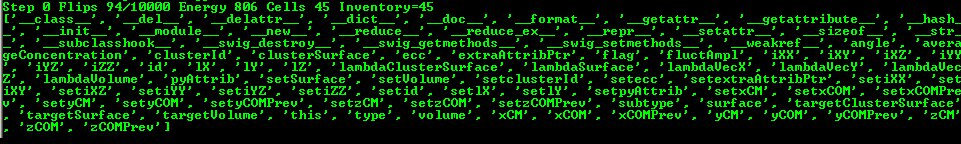
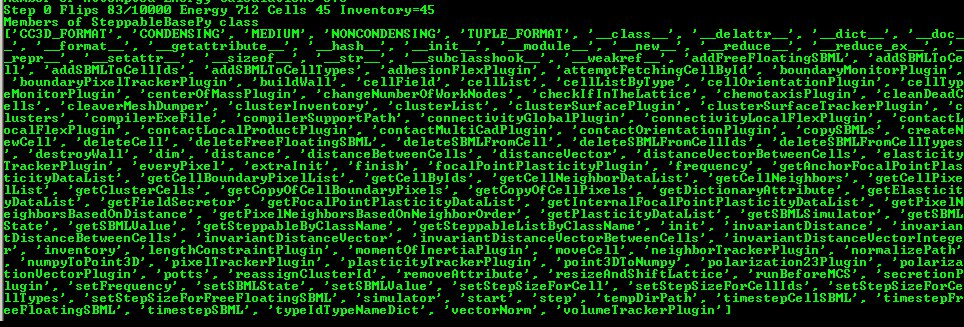

SteppableBasePy class
=====================

In the example above you may wonder how it is possible that it is
sufficient to type:

.. code-block:: python

        for cell in self.cellList:

to iterate over a list of all cells in the simulation. Where does
self.cellList come from and how it acceses/stores information about all
cells? The full answer to this question is beyond the scope of this
manual so we will give you only a hint what happens here. The
self.cellList is a member of a SteppableBasePy class. All CC3D Python
steppable inherit this class and consequently self.cellList is a member
of all steppables (please see a chapter on class inheritance from any
Python manual if this looks unfamiliar). Under the hood the
self.cellList is a handle, or a “pointer”, if you prefer this
terminology, to the C++ object that stores all cells in the simulation.
The content of cell inventory, and cell ordering of cells there is fully
managed by C++ code. We use self.cellList to access C++ cell objects
usually iterating over entire list of cells. The cell in the

.. code-block:: python

        for cell in self.cellList:

is a pointer to C++ cell object. You can easily see what members C++
cell object has by modifying the step function as follows:

.. code-block:: python

        def step(self,mcs):
            for cell in self.cellList:
                print dir(cell)
                break

The result looks as follows:

|image5|

*Figure 6 Checking out properties of a cell C++ object*

The dir built-in Python function prints out names of members of any
Python object. Here it printed out members of ``CellG`` class which
represents CC3D cells. We will go over these properties later.

The simplicity of the above code snippets is mainly due to underlying
implementation of ``SteppableBasePy`` class. You can find this class in
``<CC3D\_installation\_dir>/pythonSetupScripts/PySteppables.py``. The
definition of this class goes on for several hundreds lines of code
(clearly a bit too much to present it here). If you are interested in
checking out what members this class has use the dir Python function
again:

.. code-block:: python

    def step(self,mcs):
        print 'Members of SteppableBasePy class'
        print dir(self)

You should know from Python programing manual that ``self`` refers to the
class object. Therefore by printing ``dir(self)`` we are actually printing
Python list of all members of cellsortingSteppable class. Because
``cellsortingSteppable`` class contains all the functions of ``SteppableBasePy``
class we can inspect this way base class ``SteppableBasePy``. The output of
the above simulation should look as follows:

|image6|

*Figure 7 Printing all members of SteppableBasePy class*

If you look carefully, you can see that cellList is a member of
``SteppabeBasePy`` class. Alternatively you can study source code of
``SteppablBasePy``.

One of the goals of this manual is to teach you how to effectively use
features of ``SteppableBasePy`` class to create complex biological
simulations. This class is very powerful and has many constructs which
make coding simple.

