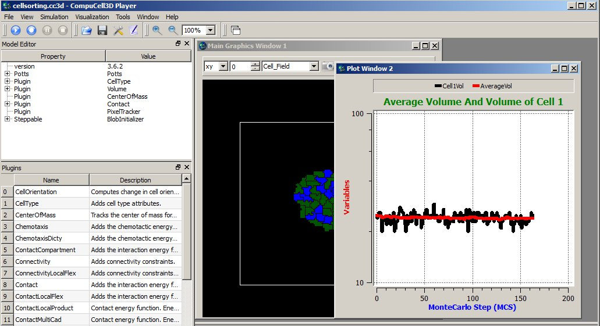

Adding plots to the simulation
==============================

Some modelers like to monitor simulation progress by displaying “live”
plots that characterize current state of the simulation. In CC3D it is
very easy to add to the Player windows. The best way to add plots is via
Twedit++ CC3D Python->Scientific Plots menu. Take a look at example code
to get a flavor of what is involved when you want to work with plots in
CC3D:

.. code-block:: python

    class cellsortingSteppable(SteppableBasePy):
        def __init__(self, frequency=1):
            SteppableBasePy.__init__(self, frequency)

        def start(self):
            self.plot_win = self.add_new_plot_window(
                title='Average Volume And Volume of Cell 1',
                x_axis_title='MonteCarlo Step (MCS)',
                y_axis_title='Variables',
                x_scale_type='linear',
                y_scale_type='log',
                grid=True # only in 3.7.6 or higher
            )

            self.plot_win.add_plot("AverageVol", style='Dots', color='red', size=5)
            self.plot_win.add_plot('Cell1Vol', style='Steps', color='black', size=5)

        def step(self, mcs):

            avg_vol = 0.0
            number_of_cells = 0

            for cell in self.cell_list:
                avg_vol += cell.volume
                number_of_cells += 1

            avg_vol /= float(number_of_cells)

            cell1 = self.fetch_cell_by_id(1)
            print(cell1)

            # name of the data series, x, y
            self.plot_win.add_data_point('AverageVol', mcs, avg_vol)
            # name of the data series, x, y
            self.plot_win.add_data_point('Cell1Vol', mcs, cell1.volume)

In the ``start`` function we create plot window (``self.plot_win``) – the arguments of
this function are self-explanatory. After we have plot windows object
(``self.plot_win``) we are adding actual plots to it. Here, we will plot two
time-series data, one showing average volume of all cells and one
showing instantaneous volume of cell with id 1:

.. code-block:: python

      self.plot_win.add_plot('AverageVol', style='Dots', color='red', size=5)
      self.plot_win.add_plot('Cell1Vol', style='Steps', color='black', size=5)

We are specifying here plot symbol types (``Dots``, ``Steps``), their sizes and
colors. The first argument is then name of the data series. This name
has two purposes – **1.** It is used in the legend to identify data points
and **2.** It is used as an identifier when appending new data. We can also
specify logarithmic axis by using ``y_scale_type='log'`` as in the example
above.

In the ``step`` function we are calculating average volume of all cells and
extract instantaneous volume of cell with id ``1``. After we are done with
calculations we are adding our results to the time series:

.. code-block:: python

      # name of the data series, x, y
      self.plot_win.add_data_point('AverageVol', mcs, avg_vol)
      # name of the data series, x, y
      self.plot_win.add_data_point('Cell1Vol', mcs, cell1.volume)

Notice that we are using data series identifiers (``AverageVol`` and
``Cell1Vol``) to add new data. The second argument in the above function
calls is current Monte Carlo Step (mcs) whereas the third is actual
quantity that we want to plot on Y axis. We are done at this point

The results of the above code may look something like:

|image12|

Figure 13 Displaying plot window in the CC3D Player with 2 time-series
data.

Notice that the code is fairly simple and, for the most parts,
self-explanatory. However, the plots are not particularly pretty and
they all have same style. This is because this simple code creates plots
based on same template. The plots are usable but if you need high
quality plots you should save your data in the text data-file and use
stand-alone plotting programs. Plots provided in CC3D are used mainly as
a convenience feature and used to monitor current state of the
simulation.

Histograms
----------

Adding histograms to CC3D player is a bit more complex than adding
simple plots. This is because you need to first process data to produce
histogram data. Fortunately Numpy has the tools to make this task
relatively simple. An example ``scientificHistBarPlots`` in
CompuCellPythonTutorial demonstrates the use of histogram. Let us look
at the example steppable (you can also find relevant code snippets in
``CC3D Python-> Scientific Plots`` menu):

.. code-block:: python

   from cc3d.core.PySteppables import *
   import random
   import numpy as np
   from pathlib import Path

   class HistPlotSteppable(SteppableBasePy):
       def __init__(self, frequency=1):
           SteppableBasePy.__init__(self, frequency)
           self.plot_win = None

       def start(self):

           # initialize setting for Histogram
           self.plot_win = self.add_new_plot_window(title='Histogram of Cell Volumes', x_axis_title='Number of Cells',
                                                    y_axis_title='Volume Size in Pixels')
           # alpha is transparency 0 is transparent, 255 is opaque
           self.plot_win.add_histogram_plot(plot_name='Hist 1', color='green', alpha=100)
           self.plot_win.add_histogram_plot(plot_name='Hist 2', color='red', alpha=100)
           self.plot_win.add_histogram_plot(plot_name='Hist 3', color='blue')

       def step(self, mcs):

           vol_list = []
           for cell in self.cell_list:
               vol_list.append(cell.volume)

           gauss = np.random.normal(0.0, 1.0, size=(100,))

           self.plot_win.add_histogram(plot_name='Hist 1', value_array=gauss, number_of_bins=10)
           self.plot_win.add_histogram(plot_name='Hist 2', value_array=vol_list, number_of_bins=10)
           self.plot_win.add_histogram(plot_name='Hist 3', value_array=vol_list, number_of_bins=50)

           if self.output_dir is not None:
               output_path = Path(self.output_dir).joinpath("HistPlots_" + str(mcs) + ".txt")
               self.plot_win.save_plot_as_data(output_path, CSV_FORMAT)

               png_output_path = Path(self.output_dir).joinpath("HistPlots_" + str(mcs) + ".png")

               # here we specify size of the image saved - default is 400 x 400
               self.plot_win.save_plot_as_png(png_output_path, 1000, 1000)

In the start function we call ``self.add_new_plot_window`` to add new plot
window -``self.plot_win``- to the Player. Subsequently we specify display
properties of different data series (histograms). Notice that we can
specify opacity using ``alpha`` parameter.

In the step function we first iterate over each cell and append their
volumes to Python list. Later plot histogram of the array using a very
simple call:

.. code-block:: python

    self.plot_win.add_histogram(plot_name='Hist 2', value_array=vol_list, number_of_bins=10)

that takes an array of values and the number of bins and adds histogram
to the plot window.

The following snippet:

.. code-block:: python

        gauss = []
        for i in  range(100):
            gauss.append(random.gauss(0,1))

        (n2, bins2) = numpy.histogram(gauss, bins=10)

declares gauss as Python list and appends to it 100 random numbers which
are taken from Gaussian distribution centered at 0.0 and having standard
deviation equal to 1.0. We histogram those values using the following
code:

.. code-block:: python

    self.pW.addHistogram(plot_name='Hist 1' , value_array = gauss ,number_of_bins=10)

When we look at the code in the ``start`` function we will see that this
data series will be displayed using green bars.

At the end of the steppable we output histogram plot as a png image file
using:

.. code-block:: python

    self.plot_win.save_plot_as_png(png_output_path,1000, 1000)

two last arguments of this function represent ``x`` and ``y`` sizes of the
image.

.. note::

   As of writing this manual we do not support scaling of the plot image output. This might change in the future releases, however we strongly recommend that you save all the data you plot in a separate file and post-process it in the full-featured plotting program

We construct ``file_name`` in such a way that it contains MCS in it.
The image file will be written in the simulation outpt directory.
Finally, for any plot we can output plotted data in the form of a text
file. All we need to do is to call ``save_plot_as_data`` from the plot windows
object:

.. code-block:: python

    outout_path = "HistPlots_"+str(mcs)+".txt"
    self.plot_win.save_plot_as_data(output_path, CSV_FORMAT)

This file will be written in the simulation output directory. You can
use it later to post process plot data using external plotting software.

