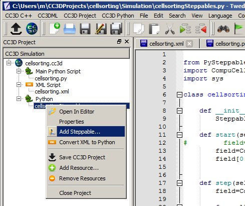
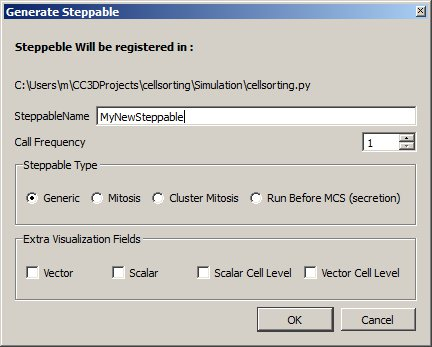

Adding Steppable to Simulation using Twedit++
=============================================

In the CC3D Project Panel of Twedit++, right-click on a Steppable Python file and choose the 'Add Steppable' option:

|image7|

*Figure 8 Adding steppable using Twedit++*

A dialog will pop up where you can specify the name and type of the new
Steppable as well as its call frequency. 
Click ``OK``, and a new steppable gets added to your code.

|image8|

Figure 9 Configuring basic steppable properties in Twedit++.

Notice that Twedit++ takes care of adding steppable registration code in
the main Python script:

.. code-block:: python

   from cellsortingSteppables import MyNewSteppable
   CompuCellSetup.register_steppable(steppable=MyNewSteppable(frequency=1))

