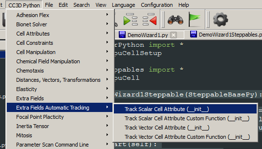
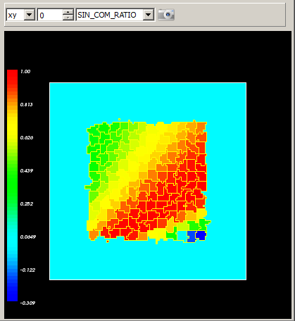

Automatic Tracking of Cells’ Attributes
=======================================

Sometimes you would like to color-code cells based on the value (scalar
or vector) of one of the cellular attributes. You can use the techniques
presented above to display cell-level scalar or vector field or you can
take advantage of a very convenient shortcut that using one line of code
allows you to setup up visualization field that tracks cellular
attributes. Here is a simple example:

.. code-block:: python

    class DemoVisSteppable(SteppableBasePy):
        def __init__(self, _simulator, _frequency=1):
            SteppableBasePy.__init__(self, _simulator, _frequency)
            self.track_cell_level_scalar_attribute(field_name='COM_RATIO',attribute_name='ratio')

        def start(self):
            for cell in self.cellList:
                cell.dict['ratio'] = cell.xCOM / cell.yCOM

        def step(self, mcs):
            for cell in self.cellList:
                cell.dict['ratio'] = cell.xCOM / cell.yCOM

In the start and step functions we iterate over all cells and attach a
cell attribute ``ratio`` that is equal to the ration of x and y center-of
mass coordinates for each cell. In the init function we setup automatic
tracking of this attribute i.e. we create a cell-level scalar field
(called ``COM_RATIO``) where cells are colored according to the value of
their 'ratio' attribute:

.. code-block:: python

    self.track_cell_level_scalar_attribute (field_name='COM_RATIO',attribute_name='ratio')

The syntax of this function can be found in Twedit Python helper menu:
``CC3D Python->Extra Fields Automatic Tracking -> Track Scalar Cell``

Attribute (``__init__``) :

|image14|

Figure 15 Setting up automatic tracking of cells’ scalar attribute using
Twedit++

Sometimes instead of tracking the actual attribute we would lie to
color-code cells according to the user-specified function of the
attribute. For example instead of color-coding cells according to ration
of ``x`` and ``y`` center-of-mass coordinates we would lie to color-code them
according to a ``sinus`` of the ratio:

.. code-block:: python

    class DemoVisSteppable(SteppableBasePy):
        def __init__(self, _simulator, _frequency=1):
            SteppableBasePy.__init__(self, _simulator, _frequency)
            self.track_cell_level_scalar_attribute(field_name='COM_RATIO',
                                                   attribute_name='ratio')

            import math
            self.track_cell_level_scalar_attribute(field_name='SIN_COM_RATIO',
                                                   attribute_name='ratio',
                                                   function=lambda attr_val: math.sin(attr_val))

        def start(self):
            for cell in self.cellList:
                cell.dict['ratio'] = cell.xCOM / cell.yCOM

        def step(self, mcs):
            for cell in self.cellList:
                cell.dict['ratio'] = cell.xCOM / cell.yCOM

All we did in the snippet above was to add new field ``SIN_COM_RATIO`` using
the ``track_cell_level_scalar_attribute`` function.
The call to this function almost identical as before except now we also used function argument:

.. code-block:: python

    function = lambda attr_val: math.sin(attr_val)

The meaning of this is the following: for each attribute ``ratio``
attached to a cell a function ``math.sin(attr_val)`` will be evaluated
where attr_val will assume same value as 'ratio' cell attribute for a
given cell. If you are puzzled about lambda Python key word don’t be.
Python lambda’s are a convenient way to define inline functions For
example:

.. code-block:: python

    f = lambda x: x**2

defines function f that takes one argument ``x`` and returns its square.
Thus, ``f(2)`` will return ``4`` and ``f(4)`` would return ``16``.

Lambda function can be replaced by a regular function f as follows:

.. code-block:: python

    def f(x):
        return x**2

When we run the simulation above the output may look like in the figure
below:

|image15|

Figure 16. Automatic labeling of cells according to scala cell’s
attribute

Now that we learned how to color-code cells according to the custom
attribute we can use analogous approach to label cells using vector
attribute. **Important:** vector quantity must be a list, tuple or numpy
array with 3 elements.

The steppable code below demonstrates how we can enable
auto-visualization of the cell’s vector attribute:

.. code-block:: python

    class DemoVisSteppable(SteppableBasePy):

        def __init__(self,_simulator,_frequency=1):
            SteppableBasePy.__init__(self,_simulator,_frequency)
            self.track_cell_level_vector_attribute (field_name = 'COM_VECTOR',\
            attribute_name = 'com_vector')
            import math
            self.track_cell_level_vector_attribute (field_name = 'SIN_COM_VECTOR',\
            attribute_name = 'com_vector',\
            function = lambda attr_val: [ math.sin(attr_val[0]), math.sin(attr_val[1]), 0] )

        def start(self):
            for cell in self.cellList:
                cell.dict['com_vector'] = [cell.xCOM, cell.yCOM, 0.0]

        def step(self,mcs):
            for cell in self.cellList:
                cell.dict['com_vector'] = [cell.xCOM, cell.yCOM, 0.0]

There are few differences as compared to the code that used scalar quantities:
**1)** we used ``self.track_cell_level_vector_attribute`` in the ``__init__`` constructor,
**2)** our attributes are vectors:

.. code-block:: python

    cell.dict['com_vector'] = [cell.xCOM, cell.yCOM, 0.0]

**3)** the lambda function we use takes a single argument which is this case
is a vector (i.e. it has 3 elements) and also returns 3 element vector.

