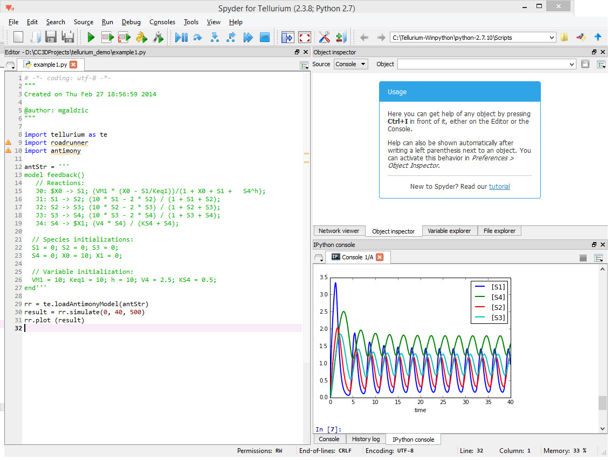

Building SBML models using Tellurium
====================================

In the previous section we showed you how to attach reaction-kinetics
models to each cell and how to obtain solve them on-the-fly inside CC3D
simulation. Once we have up-to-date solution to these models we could
parameterize cell behavior in terms of the underlying chemical species.
But, how do we construct those reaction-kinetics models and how do we
save them in the SBML format. There are many packages that will do this
for you – Cell Designer, Copasi, Virtual Cell, Systems Biology Workbench
(that includes Jarnac, and JDesigner apps), Pathway Designer and many
more. All of those excellent apps will do the job. Some are easier to
use than others but in most cases some training will be required. For
this reason we decided to focus on Tellurium which appears to be the
easiest to use. Tellurium, similarly to CC3D uses Python to describe
reaction-kinetics models which is an added bonus for CC3D users who are
already well versed in Python. First thing you need to do is to install
tellurium on your machine – go to their download site
https://sourceforge.net/projects/pytellurium/ and get the installer
package. The installation is straight-forward. Once installed, open up
Tellurium and it will display ready-to-run example. Hit play button
(green triangle at the top toolbar) and the results of the simulation
will be displayed in the bottom right subwindow:

|image18|

Hopefully this was easy. Now let’s build our own model. We start
creating our new reaction-kinetics model by pressing “New File” button -
the first button on the left in the main toolbar:

|image19|

Pressing ``New File`` button opens up a Tellurium template for
reaction-kinetics model. All we need to do is to define the model and
add few statements that will export it in the SBML format.

Let’s start by defining the model. The model definition uses language
called Antimony. To learn more about Antimony please visit its tutorial
page http://tellurium.analogmachine.org/documentation/antimony-tutorial/
. Antimony is quite intuitive and allows to specify system of chemical
reaction in a way that is very natural to anybody who has basic
understanding of chemical reaction notation. In our case we will define
a simple relaxation oscillator that consists of two floating species (``S1``
and ``S2``) and two boundary species (``X0``, ``X3``). Boundary species serve as
sources/sinks of the reaction and their concentrations remain
constant.Concentration of floating species change with time. The
presented example has been developed by Herbert Sauro (University of
Washington) - one of the three “founding fathers” of SBML, author of
many books on reaction kinetics and lead contributor to the Tellurium
and Systems Biology Workbench packages. Let’s look at the reaction
schematics we are about to implement:

|image20|

Qualitatively, ``X0`` is being kept at a constant concentration of 1.0 (we
assume arbitrary units here) and ``S1`` accumulates at the constant rate ``v1``.
``S1`` also gets "transformed`` to ``S2`` at the rate ``v2`` which depends on
concentration of S1 and S2 in such a way that when S1 and S2 are at
relatively high values the reaction "speeds up" depleting quickly
concentration of ``S1``. Once ``S1`` concentration is low reaction ``S1 -> S2``
slows down allowing ``S1`` to build up again. As you may suspect, when
properly tuned this type of reaction produces oscillations. Let us
formalize the description and present rate laws and parameters that
result in oscillatory behavior. Using Antimony we would write the
following set of reactions corresponding to the reaction schematics
above:

.. code-block:: c++

    $X0 -> S1 ; k1*X0;
    S1 -> S2 ; k2*S1*S2^h/(10 + S2^h) + k3*S1;
    S2 -> $X3 ; k4*S2;

``$X0`` and ``$X4`` are “boundary species”. ``$X0`` serves as a source and ``X3`` is a
sink .

In the line

.. code-block:: c++

    $X0 -> S1 ; k1*X0;

part ``$X0 -> S1`` represents reaction and ``k1*X0`` is a rate law that
describes the speed at which species ``X0`` transform to ``S1``.

The interesting part that leads to oscillatory behavior is the rate law
in the second reaction. It involves Hill-type kinetics. Finally the
third reaction defines first order kinetics that transfers ``S2`` into ``X3``.
We are not going to discuss the theory of reaction kinetics here but
rather focus on the mechanics of how to define and solve RK models using
Tellurium. If you are interested in learning more about modeling of
biochemical pathways please see books by Herbert Sauro.

Assuming we have our Antimony definition of RK model we put it into
Tellurium’s Python code:

.. code-block:: python

    import tellurium as te
    import roadrunner

    r = te.loada("""
        $X0 -> S1 ; k1*X0;
        S1 -> S2 ; k2*S1*S2^h/(10 + S2^h) + k3*S1;
        S2 -> $X3 ; k4*S2;

        h=2;
        k1 =1.0;
        k2 = 2.0;
        k3 = 0.02;
        k4 = 1.0;
        X0 = 1;
    """)

As you can see, all we need to do is to copy the description of
reactions and define constants that are used in the rate laws. When we
run this model inside tellurium we will get the following result:

|image21|

Notice that we need to add two lines of code - one to actually solve the
model

.. code-block:: python

    r.simulate(0,100,100)

And another one to plot the results

.. code-block:: python

    r.plot()

The general philosophy of Tellurium is that you define reaction-kinetics
model that is represented as object r inside Python code. To solve the
model we invoke r’s function simulate and to plot the results we call
``r’s`` function plot.

Finally, to export our model defined in Antimony/Tellurium as SBML we
write simple export code at the end of our code:

.. code-block:: python

    sbml_file = open('d:\CC3DProjects\oscilator_relax.sbml','w')
    print(sbml_file,r.getSBML())
    sbml_file.close()

The function that "does the trick" is ``getSBML`` function belonging to
object r. At this point you can take the SBML model and use SBML solver
described in the section above to link reaction-kinetics to cellular
behaviors

You may also find the following youtube video by Herbert Sauro useful.

https://www.youtube.com/watch?v=pEWxfIKE18c

