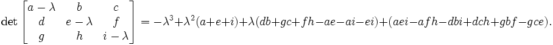

Calculating the Shape Constraint of a Cell – the Elongation Term
------------------------------------------------------------------

Related: `Calculating Inertia Tensor in CC3D <inertia_tensor.html>`_ and `MomentOfInertia Plugin <moment_of_inertia.html>`_

Learning Objectives:
   - Learn how CC3D leverages inertia tensors to elongate cells

*****************************************************

The shape of a single cell immersed in medium and not subject to too
drastic surface or surface constraints will be spherical (circular in
2D). However, in certain situations, we may want to use cells that are
elongated along one of their body axes. To facilitate, this we can place
constraints on the principal lengths of the cell. In 2D, it is sufficient to
constrain one of the principal lengths of the cell. However, in 3D, we need
to constrain 2 out of 3 principal lengths. 

Our first task is to diagonalize the inertia tensor 
(i.e. find a coordinate frame transformation
which brings the inertia tensor to a diagonal form)

Diagonalizing inertia tensor
~~~~~~~~~~~~~~~~~~~~~~~~~~~~

We will consider here a more difficult 3D case. The 2D case is described
in detail in M. Zajac, G.L. Jones, and J.A. Glazier in "*Simulating convergent
extension by way of anisotropic differential adhesion*" Journal of
Theoretical Biology **222** (2003) 247–259.

In order to diagonalize the inertia tensor, 
we need to solve the following eigenvalue equation:

.. math::
   :nowrap:

   \begin{eqnarray}
      det(I-\lambda) = 0
   \end{eqnarray}

or in full form

.. math::
   :nowrap:

   \begin{eqnarray}

    0 = \begin{vmatrix}
    \sum_i y_i^2+z_i^2 - \lambda & -\sum_i x_i y_i & -\sum_i x_i z_i \\
    -\sum_i x_i y_i & \sum_i x_i^2+z_i^2 - \lambda & -\sum_i y_i z_i \\
    -\sum_i x_i z_i & -\sum_i  y_i z_i & \sum_i x_i^2+y_i^2 - \lambda \\
    \end{vmatrix} = \begin{vmatrix}
     I_{xx} - \lambda & I_{xy} & I_xz \\
     I_{xy}  & I_{yy} - \lambda & I_yz \\
     I_{xz}  & I_{yz} & I_zz - \lambda
      \end{vmatrix}
   \end{eqnarray}

The eigenvalue equation will be in the form of 3\ :sup:`rd` order
polynomial. The roots of it are guaranteed to be real. The polynomial
itself can be found either by explicit derivation, using symbolic
calculation, or simply in Wikipedia ( http://en.wikipedia.org/wiki/Eigenvalue_algorithm )

|eigenvalue_formula_wiki|

so in our case, the eigenvalue equation takes the form:

.. math::
   :nowrap:

   \begin{eqnarray}
      -L^2+L^2(I_{xx}+I_{yy}+I_{zz})+L(I_{xy}^2+I_{yz}^2+I_{xz}^2-I_{xx}I_{yy}-I_{yy}I_{zz}-I_{xx}I_{zz}) \\
      +I_{xx}I_{yy}I_{zz} - I_{xx}I_{yz}^2 -I_{yy}I_{zz}^2 I_{zz}I_{xy}^2 + 2I_{xy}I_{yz}I_{zx}
   \end{eqnarray}

This equation can be solved analytically, again we may use Wikipedia (
http://en.wikipedia.org/wiki/Cubic_function )

Now, the eigenvalues found that way are the principal moments of inertia of
a cell. That is they are components of the inertia tensor in a coordinate
frame rotated in such a way that off-diagonal elements of the inertia tensor
are 0:

.. math::
   :nowrap:

   I = \begin{eqnarray}
      \begin{vmatrix}
        I_{xx} & 0 & 0 \\
        0 & I_{yy} & 0 \\
        0 & 0 & I_zz
      \end{vmatrix}
   \end{eqnarray}

In our cell shape constraint, we will want to obtain ellipsoidal cells.
Therefore the target tensor of inertia for the cell should be the tensor if
inertia for the ellipsoid:

.. math::
   :nowrap:

   I = \begin{eqnarray}
      \begin{vmatrix}
        \frac{1}{5}(b^2+c^2) & 0 & 0 \\
        0 & \frac{1}{5}(a^2+c^2) & 0 \\
        0 & 0 & \frac{1}{5}(a^2+b^2)
      \end{vmatrix}
   \end{eqnarray}

where ``a``, ``b``, ``c`` are parameters describing the surface of an ellipsoid:

.. math::
   :nowrap:

   \begin{eqnarray}
      \frac{x^2}{a^2} + \frac{y^2}{b^2} + \frac{z^2}{c^2} = 1
   \end{eqnarray}

In other words ``a``, ``b``, ``c`` are half lengths of principal axes (they are
analogues of the circle's radius).

Now we can determine semi axes lengths in terms of principal moments of
inertia by inverting the following set of equations:

.. math::
   :nowrap:

   \begin{eqnarray}
     I_{xx} = \frac{1}{5}(b^2+c^2) \\
     I_{yy} = \frac{1}{5}(a^2+c^2) \\
     I_{zz} = \frac{1}{5}(a^2+b^2)
   \end{eqnarray}

Once we have calculated semiaxes lengths in terms of moments of inertia,
we can plug in actual numbers for moment of inertia (the ones for
actual cell) and obtain lengths of semiaxes. 

Next, we apply a quadratic
constraint on largest (semimajor) and smallest (semiminor axes). This is
what the elongation plugin does.

