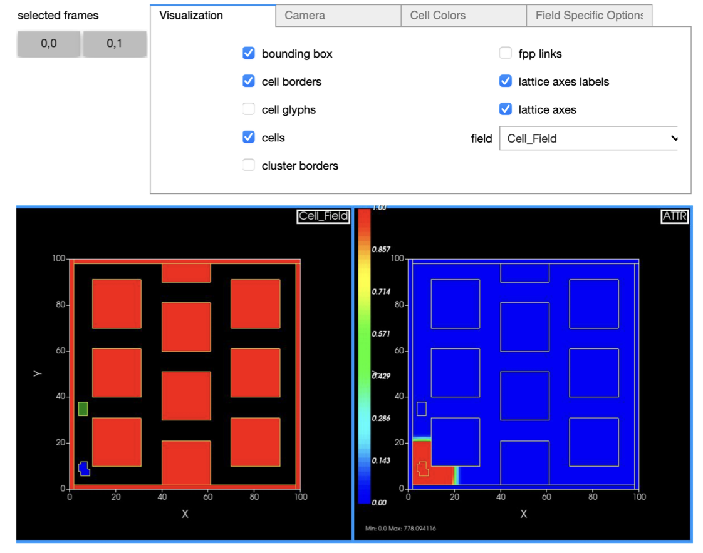

How to programmatically control every aspect of the simulation
===============================================================

.. note::

    The features described in this section are available as of CompuCell3D version 4.4.0.

Most new users start learning CompuCell3D by configuring and editing simulations in `Twedit GUI <https://github.com/CompuCell3D/cc3d-twedit5>`_
and then running them via `Player GUI <https://github.com/CompuCell3D/cc3d-player5>`_.
Starting from version 4.4.0, CompuCell3D is shipped with an upgraded Python API that allows modelers to bypass
both Player and Twedit and configure simulations
- or even an ensemble of multiple simulations running in parallel and informing each other - directly from a
single Python script. This way of constructing simulations gives users full control over every aspect of the simulation.
The material presented in this section explains:

* how to configure the entire simulation in pure Python (*i.e.*, without XML)
* how to write and control the main CC3D loop where, at every step, we call the `Potts algorithm <potts.html>`_
* how to run multiple concurrent and interacting simulations
* how to specify and control visualization
* how to use Jupyter notebook.

In a sense, this tutorial shows an alternative way of specifying and running simulations that bypasses legacy tools like
Twedit++ and Player. It gives you full programmatic control of the CC3D simulation.

We recommend that you use PyCharm or VS Code if you decide to work with the API presented in this section

Overview
--------

CC3D Projects vs. Python Projects
---------------------------------

The `Twedit <https://github.com/CompuCell3D/cc3d-twedit5>`_ and
`Player <https://github.com/CompuCell3D/cc3d-player5>`_ GUIs facilitate the generation, development,
execution and sharing of simulations in a project structure that can consist of
Python and `CC3DML <index.html>`_ source
code, auxiliary resources (*e.g.*,
`PIF files <steppable_section.html#pif-initializer>`_)
and a ``.cc3d`` project file that describes the contents of a CC3D project.
This structure is the officially supported CC3D project structure that the complete
distribution of CC3D packages supports.
However, arbitrary Python projects, which can consist of one or hundreds of Python
source files, can also integrate CC3D to support biological modeling and simulation
in integrated applications. CC3D provides basic support for such applications through an
extensive Python API that makes available all built-in plugins and steppables for model specification,
as well as interactive control over simulation execution through memory-safe objects that contain
simulation instances.

In general, the ``cc3d`` python module contains the entire CC3D Python runtime API.
CC3D projects typically define plugins and steppables in
`CC3DML <index.html>`_ and custom
steppables in a single Python script, the complete project of which can be loaded in the
`Player <https://github.com/CompuCell3D/cc3d-player5>`_ GUI.
In Python projects, model and simulation specification through the Python API requires
Python instructions to create a simulation object, create plugin and steppable objects,
register the plugins and steppables with the simulation object, and then execute the simulation
along with optional instructions for real-time visualization. As such, Python projects
tend to require more startup work to accomplish tasks that are performed by the
`Player <https://github.com/CompuCell3D/cc3d-player5>`_ GUI but can develop and support more
advanced and specific functionality.

CC3D Python Interactive Simulation
----------------------------------

The new CC3D Python API gives users a direct access to a live, interactive CC3D simulation via
``CC3DSimService`` object. Executing a simulation using
``CC3DSimService`` consists of creating a ``CC3DSimService`` instance, loading it with
model and simulation specification, performing simulation startup routines,
executing simulation steps, performing what interactions may be appropriate for an
application (*e.g.*, steering), and ultimately performing simulation shutdown routines.

.. code-block:: python

    from cc3d.CompuCellSetup.CC3DCaller import CC3DSimService

    cc3d_sim = CC3DSimService()     # Create a simulation
    # Load specification here...
    cc3d_sim.run()                  # Start the underlying process of the simulation
    cc3d_sim.init()                 # Execute the simulation initialization stage
    cc3d_sim.start()                # Execute the simulation startup stage (e.g., steppable `start` is called)
    cc3d_sim.step()                 # Execute one simulation step
    cc3d_sim.finish()               # Execute the simulation finalization stage (e.g., steppable `finish` is called)

``CC3DSimService`` supports executing an arbitrary number of custom steppables during
simulation through a registration method ``register_steppable``.
Passing a steppable class to ``register_steppable`` registers a
steppable to be called at specified step intervals, and the ``CC3DSimService``
instance will instantiate the steppable during simulation startup.
Custom Python steppables with the Python API provide a straightforward way to
perform manipulations to simulation data during execution of a simulation, even
by simple module-level variables,

.. code-block:: python

    from cc3d.CompuCellSetup.CC3DCaller import CC3DSimService
    from cc3d.core.PySteppables import SteppableBasePy

    # Define volume parameters
    target_volume_init = 25             # Initial target volume
    lambda_volume = 2                   # Volume constraint parameter
    target_volume = target_volume_init  # Current target volume; varies during simulation

    class GrowthSteppable(SteppableBasePy):
        """
        A custom steppable that uniformly applies a volume constraint
        """

        def start(self):
            """Applies initial volume parameters to all cells during startup"""
            for cell in self.cell_list:
                cell.targetVolume = target_volume_init
                cell.lambdaVolume = lambda_volume

        def step(self, mcs):
            """Updates the target volume of all cells every 100 steps"""
            if mcs % 100 == 0:
                # Whatever the value of the variable `target_volume`, apply it to all cells
                for cell in self.cell_list:
                    cell.targetVolume = target_volume

    # Launch a simulation and register GrowthSteppable
    cc3d_sim = CC3DSimService()
    # Load specification here...
    cc3d_sim.register_steppable(steppable=GrowthSteppable, frequency=1)
    cc3d_sim.run()
    cc3d_sim.init()
    cc3d_sim.start()

    # Execute 10k steps and update the target volume along the way
    num_steps = 10000
    while cc3d_sim.current_step < num_steps:
        target_volume = target_volume_init * (1.0 + cc3d_sim.current_step / num_steps)
        cc3d_sim.step()

``CC3DSimService.register_steppable`` also supports registering a steppable instance,
which can be used to perform operations with both the steppable and its interface to
simulation core objects and convenience features,

.. code-block:: python

    from cc3d.CompuCellSetup.CC3DCaller import CC3DSimService
    from cc3d.core.PySteppables import SteppableBasePy

    # Define volume parameters
    target_volume_init = 25             # Initial target volume
    lambda_volume = 2                   # Volume constraint parameter
    target_volume = target_volume_init  # Current target volume; varies during simulation

    # Launch a simulation and register a generic steppable instance
    cc3d_sim = CC3DSimService()
    # Load specification here...
    steppable = SteppableBasePy()
    cc3d_sim.register_steppable(steppable=steppable)
    cc3d_sim.run()
    cc3d_sim.init()
    cc3d_sim.start()

    for cell in steppable.cell_list:
        cell.targetVolume = target_volume_init
        cell.lambdaVolume = lambda_volume

    # Execute 10k steps and update the target volume along the way using the steppable interface
    num_steps = 10000
    while cc3d_sim.current_step < num_steps:
        if cc3d_sim.current_step % 100 == 0:
            target_volume = target_volume_init * (1.0 + cc3d_sim.current_step / num_steps)
            for cell in steppable.cell_list:
                cell.targetVolume = target_volume
        cc3d_sim.step()

Python Built-In Plugins and Steppables
--------------------------------------

.. note::

    All features described in this section can also be employed in CC3D projects.
    In such cases, an all-Python CC3D project can be generated in the
    `Twedit <https://github.com/CompuCell3D/cc3d-twedit5>`_ GUI, and all plugins and
    steppables can be specified using the Python API described in this section.

The CC3D Python module ``cc3d.core.PyCoreSpecs`` provides an interactive object for
using each built-in plugin and steppable in simulation. Each interactive object
in the ``cc3d.core.PyCoreSpecs`` module contains all internal data necessary to create
a corresponding built-in plugin or steppable, which can be manipulated through the
interface of each interactive object.
For example, a typical simulation specification consists of the
`Potts specification <potts_and_lattice.html#potts-section>`_,
`CellType <cell_type_plugin.html>`_,
`Volume <volume_and_surface_flex_plugins.html>`_ and
`Contact <plugins_section.html#contact-plugin>`_
plugins and a
`BlobInitializer steppable <steppable_section.html#blobinitializer-steppable>`_
to initialize a cell distribution, which can look like the following when using the Python API,

.. code-block:: python

    from cc3d.CompuCellSetup.CC3DCaller import CC3DSimService
    from cc3d.core.PyCoreSpecs import PottsCore, CellTypePlugin, VolumePlugin, ContactPlugin

    # Specify a two-dimensional simulation with a 100x100 lattice and second-order Potts neighborhood.
    potts_specs = PottsCore(dim_x=100, dim_y=100, neighbor_order=2)
    # Define two cell types called "Condensing" and "NonCondensing".
    cell_type_specs = CellTypePlugin("Condensing", "NonCondensing")
    # Assign a volume constraint to both cell types.
    volume_specs = VolumePlugin()
    volume_specs.param_new("Condensing",    target_volume=25, lambda_volume=2)
    volume_specs.param_new("NonCondensing", target_volume=25, lambda_volume=2)
    # Assign adhesion between cells by type.
    contact_specs = ContactPlugin(neighbor_order=2)
    contact_specs.param_new(type_1="Medium",        type_2="Condensing",    energy=20)
    contact_specs.param_new(type_1="Medium",        type_2="NonCondensing", energy=20)
    contact_specs.param_new(type_1="Condensing",    type_2="Condensing",    energy=2)
    contact_specs.param_new(type_1="Condensing",    type_2="NonCondensing", energy=11)
    contact_specs.param_new(type_1="NonCondensing", type_2="NonCondensing", energy=16)
    # Initialize cells as a blob with a random distribution by type.
    blob_init_specs = BlobInitializer()
    blob_init_specs.region_new(width=5, radius=20, center=(50, 50, 0), cell_types=("Condensing", "NonCondensing"))

A built-in plugin or steppable specification in the Python API consists of
creating an instance of its corresponding class, setting the internal data of the
instance and registering the instance with a ``CC3DSimService`` instance through
the method ``register_specs``. Like in typical CC3D projects, every built-in plugin
and steppable that is registered with a ``CC3DSimService`` instance will automatically
function within the underlying simulation of the ``CC3DSimService`` instance for the
entire duration of the simulation,

.. code-block:: python

    # Launch a simulation and register all specifications
    cc3d_sim = CC3DSimService()
    cc3d_sim.register_specs([potts_specs, cell_type_specs, volume_specs, contact_specs, blob_init_specs])
    cc3d_sim.run()
    cc3d_sim.init()
    cc3d_sim.start()
    # Execution proceeds here...

For applications using a single ``CC3DSimService`` instance, instances of classes from the
``cc3d.core.PyCoreSpecs`` module that correspond to built-in plugins and steppables that support
`steering <https://pythonscriptingmanual.readthedocs.io/en/latest/steering_changing_cc3dml_parameters_on-the-fly.html>`_
provide a method ``steer``. When ``steer`` is called on a registered ``cc3d.core.PyCoreSpecs``
instance, the underlying built-in plugin or steppable is updated according to the internal data of the
``cc3d.core.PyCoreSpecs`` instance,

.. code-block:: python

    from cc3d.CompuCellSetup.CC3DCaller import CC3DSimService
    from cc3d.core.PyCoreSpecs import PottsCore, CellTypePlugin, VolumePlugin, LengthConstraintPlugin

    # Previous specifications for Potts, Volume, etc.,  here...

    # Specify a length constraint for the NonCondensing cell type
    length_specs = LengthConstraintPlugin()
    length_specs.params_new("NonCondensing", target_length=5, lambda_length=10)
    # Launch a simulation and register all specifications
    cc3d_sim = CC3DSimService()
    cc3d_sim.register_specs([potts_specs, cell_type_specs, volume_specs, contact_specs, blob_init_specs, length_specs])
    cc3d_sim.run()
    cc3d_sim.init()
    cc3d_sim.start()
    # Execute 10k steps and update target length for the NonCondensing cell type along the way
    num_steps = 10000
    target_length_init = length_specs["NonCondensing"].target_length
    while cc3d_sim.current_step < num_steps:
        if cc3d_sim.current_step % 100 == 0:
            target_length = target_length_init * (1.0 + cc3d_sim.current_step / num_steps)  # Calculate new length
            length_specs["NonCondensing"].target_length = target_length                     # Apply new length
            length_specs.steer()                                                            # Update the backend
        cc3d_sim.step()

.. warning::

    Not every built-in plugin and steppable supports steering. Calling ``steer`` on a
    ``cc3d.core.PyCoreSpecs`` module instance that does not support steering results in
    a ``cc3d.core.PyCoreSpecs.SteerableError``.

CC3D projects can also use ``cc3d.core.PyCoreSpecs`` objects to specify a simulation, and in the same
way. The single difference between their deployment in CC3D and Python projects is the process of
registration, which in CC3D projects is done through the ``CompuCellSetup.register_specs`` method in
the same way as through the ``CC3DSimService.register_specs`` method in Python projects.
Specification cannot mix ``cc3d.core.PyCoreSpecs`` objects and
`CC3DML <index.html>`_.
However, passing a list of ``cc3d.core.PyCoreSpecs`` objects to the method
``cc3d.core.PyCoreSpecs.build_xml`` generates CC3DML data, and likewise
passing the absolute path to a ``.xml`` file containing a CC3DML specification, or
to a ``.cc3d`` file of a project that uses a CC3DML specification, to the method
``cc3d.core.PyCoreSpecs.from_file`` generates a list of populated
``cc3d.core.PyCoreSpecs`` objects.

Visualization in Python
-----------------------

The CC3D Python API provides support for real-time simulation data visualization. The
``CC3DSimService`` method ``visualize`` creates a visualization frame that updates
according to simulation data updates and configurable options.

.. code-block:: python

    # Launch a simulation and register all specifications
    cc3d_sim = CC3DSimService()
    cc3d_sim.register_specs(specs)  # `specs` includes specifications for diffusion fields "F1" and "F2"
    cc3d_sim.run()
    cc3d_sim.init()
    cc3d_sim.start()
    # Show a frame of the cell field
    cc3d_sim.visualize()

By default, ``CC3DSimService.visualize`` creates a frame that renders a two-dimensional
view of the cell field. However, ``CC3DSimService.visualize`` returns a reference to the
created frame that provides methods and properties to configure the frame, save an
image to file, etc.,

.. code-block:: python

    # Show another frame of the field "F1" and plot every 10 steps
    frame_f1 = cc3d_sim.visualize(plot_freq=10)
    frame_f1.field_name = "F1"
    # Show a third frame of the field "F2", limit the frames per second to 60 and label the window
    frame_f2 = cc3d_sim.visualize(fps=60, name="Field F2")
    frame_f2.field_name = "F2"
    # Set limits on the frame for F1
    frame_f1.min_range_fixed = frame_f1.max_range_fixed = True
    frame_f1.min_range = 0.0
    frame_f1.max_range = 1.0
    # Show another cell field frame, but visualize cluster borders instead of cell borders
    frame_clusters = cc3d_sim.visualize(name="Clusters")
    frame_clusters.cell_borders_on = False
    frame_clusters.cluster_borders_on = True
    # Save an image of the initial cluster configuration
    frame_clusters.save_img(file_path="clusters.png")

Concurrent Interactive Simulations
----------------------------------

The CC3D Python API supports execution of concurrent, interactive (and interacting) simulations.
While CC3D simulations are stateful in that creating two ``CC3DSimService`` instances in the same
process results in undefined behavior, the method ``service_cc3d`` creates a ``CC3DSimService``
instance in a new, memory-isolated process using the `SimService <https://github.com/tjsego/simservice>`_
Python package and returns a proxy to the ``CC3DSimService`` instance.
When using ``CC3DSimService`` proxies, applications can dynamically instantiate and simultaneously
orchestrate an arbitrary number of simulations.

.. code-block:: python

    from cc3d.core.simservice import service_cc3d

    # Proxies of CC3DSimService instances, but memory-safe
    cc3d_sim1 = service_cc3d()
    cc3d_sim2 = service_cc3d()

Proxies returned by ``service_cc3d`` start with the same interface as their underlying
``CC3DSimService`` instance and provide the same capability, though with some particularities
related to support for concurrent simulation.
In general, ``service_cc3d`` sets up a server-client architecture and relays information
between a ``CC3DSimService`` instance (server side) and its corresponding proxy
(client side) using a message passing interface.
The client-side process that calls ``service_cc3d`` receives a proxy as the returned value,
and the server-side ``CC3DSimService`` instance persists for as long as the proxy exists.
This architecture allows multiple simulations to execute the same core specification and custom
steppables, however the core specifications and custom steppables executed by a
``CC3DSimService`` instance are not directly accessible (*e.g.*, for steering) on the client side
to prevent memory conflicts between concurrent simulation.
Rather, the CC3D Python API provides alternative features to establish data pipelines with an
interactive simulation launched from ``service_cc3d``.

``CC3DSimService`` proxies have properties ``sim_input`` and ``sim_output``
for basic data passing between the client side and the custom steppables executing in a
simulation on the server side.
When an object (*e.g.*, a dictionary) is set on ``sim_input``, the object is copied and
accessible to all custom steppables via the property ``external_input``.
Likewise, any custom steppable can set an object on the steppable
property ``external_output``, which is copied and forwarded when the ``CC3DSimService``
proxy instance property ``sim_output`` is read.
For example, this data pipeline suffices to launch multiple concurrent simulations,
specify the initial location of cells, and report their final location,

.. code-block:: python

    from cc3d.core.simservice import service_cc3d
    from cc3d.core.PySteppables import SteppableBasePy

    class TrackerSteppable(SteppableBasePy):
        """
        Simple steppable that initializes a cell at an externally specified location,
        and reports the location of the cell back to the external environment whenever the simulation finishes.
        """
        def __init__(self, frequency=1):
            super().__init__(frequency=frequency)
            self.cell_id = None

        def start(self):
            """Initializes a cell at an externally specified location"""
            cell_pos = self.external_input  # Get data on the simulation property `sim_input`
            new_cell = self.new_cell(self.cell_type.CellType)
            self.cell_id = new_cell.id
            for i in range(5):
                for j in range(5):
                    self.cell_field[cell_pos[0] + i, cell_pos[1] + j, cell_pos[2]] = new_cell

        def finish(self):
            """Reports the location of the cell back to the external environment"""
            cell = self.fetch_cell_by_id(self.cell_id)
            self.external_output = cell.xCOM, cell.yCOM, cell.zCOM  # Set data on the simulation property `sim_output`

    def main():
        sims = []       # Container of all running simulations
        locs_init = []  # Container of all initial cell locations
        for i in range(10):             # Instantiate ten concurrent simulations
            loc = i + 10, i + 10, 0     # Initial cell location
            cc3d_sim = service_cc3d()   # Create the simulation instance
            cc3d_sim.register_specs(specs)
            cc3d_sim.register_steppable(steppable=TrackerSteppable)
            cc3d_sim.run()              # Run the process with the simulation; nothing is available until after this
            cc3d_sim.sim_input = loc    # Set data on steppable property `external_input`
            cc3d_sim.init()
            cc3d_sim.start()
            locs_init.append(loc)       # Store the initial location
            sims.append(cc3d_sim)       # Store the simulation
        for _ in range(10000):                      # Execute 10k steps
            [cc3d_sim.step() for cc3d_sim in sims]  # Execute step on each simulation
        [cc3d_sim.finish() for cc3d_sim in sims]                # Finish all simulations
        locs_fin = [cc3d_sim.sim_output for cc3d_sim in sims]   # Collect all final cell locations

    if __name__ == '__main__':  # Guard for multiprocessing
        main()

Steppables have the property ``specs`` for steering capability using the CC3D Python API.
In general, when a simulation is instantiated using objects from the ``cc3d.core.PyCoreSpecs`` module,
each object is available by registered name as a property on the ``specs`` property and functions in
the same way.
The registered name of each ``cc3d.core.PyCoreSpecs`` is defined on the class attribute ``registered_name``.
For example, ``LengthConstraintPlugin`` from ``cc3d.core.PyCoreSpecs`` has the registered name
``length_constraint``, and so any custom steppable executed in a simulation with ``LengthConstraintPlugin``
can access the ``LengthConstraintPlugin`` instance with ``self.specs.length_constraint``,

.. code-block:: python

    from cc3d.core.simservice import service_cc3d
    from cc3d.core.PySteppables import SteppableBasePy

    num_steps = 10000

    class LengthConstraintSteppable(SteppableBasePy):
        """A steppable that increases the target length of a length constraint during simulation"""

        def start(self):
            """Records the initial target length for the "Noncondensing" cell type"""
            self.target_length_init = self.specs.length_constraint["NonCondensing"].target_length

        def step(self, mcs):
            if mcs % 100 == 0:
                target_length = self.target_length_init * (1.0 + mcs / num_steps)               # Calculate new length
                self.specs.length_constraint["NonCondensing"].target_length = target_length     # Apply new length
                self.specs.length_constraint.steer()                                            # Update the backend

The CC3D Python API supports ``CC3DSimService`` proxy interface customization through the
`SimService service function <https://simservice.readthedocs.io/en/latest/api/index.html#simservice.service_function>`_.
A service function is a simulation-specific proxy interface method that passes arguments to
an underlying server-side ``CC3DSimService`` instance method, and returns the returned value
of the server-side ``CC3DSimService`` instance method on the client side.
Conversely, a simulation can add an internal method to its proxy when a ``CC3DSimService``
instance and proxy are created through ``service_cc3d`` by declaring
a method as a service function. When a simulation declares a method as a service function,
a method of the same signature is added to each proxy when a ``CC3DSimService`` instance
and proxy are created through ``service_cc3d``.

.. warning::

    A service function only works when all data passed through the service function can be serialized.

A simulation can declare a method as a service function by passing it to ``service_function``.
For each ``CC3DSimService`` proxy, each service function declared by its simulation is available
immediately after the simulation declares the service function and can be used on the proxy as
if calling the underlying simulation method.
For example, a simulation can add service functions to present an interface for steering by
implementing methods that handle changes to simulation parameter values and then declaring
those methods as service functions,

.. code-block:: python

    from cc3d.core.simservice import service_cc3d, service_function
    from cc3d.core.PySteppables import SteppableBasePy

    # Core specs initializations here, including a LengthConstraintPlugin instance...

    class LengthConstraintControlSteppable(SteppableBasePy):

        def start(self):
            """Adds method `set_parameters` to simulation service interface"""
            service_function(self.set_parameters)

        def set_parameters(self, cell_type_name: str, target_length: int, lambda_length: float):
            """Updates the parameters of the length constraint on demand"""
            self.specs.length_constraint[cell_type_name].target_length = target_length
            self.specs.length_constraint[cell_type_name].lambda_length = lambda_length
            self.specs.length_constraint.steer()

    def main():
        sims = []       # Container of all running simulations
        for i in range(10):                 # Instantiate ten concurrent simulations
            cc3d_sim = service_cc3d()       # Create the simulation instance
            cc3d_sim.register_specs(specs)  # `specs` includes a `LengthConstraintPlugin` instance
            cc3d_sim.register_steppable(steppable=LengthConstraintControlSteppable)
            cc3d_sim.init()
            cc3d_sim.start()                # Service function is added here
            cc3d_sim.set_parameters(i, 2)   # Set the length constraint for this instance with the service function
            sims.append(cc3d_sim)           # Store the simulation

    if __name__ == '__main__':  # Guard for multiprocessing
        main()

CC3D in Jupyter Notebook
------------------------

The CC3D Python API readily supports simulation work in a Jupyter Notebook.
Most aforementioned functionality of the Python API works as described in
a Jupyter Notebook, with a few exceptions and additions.
Concurrent simulation through ``service_cc3d`` is not supported, and so
a Jupyter Notebook can only implement a single simulation at a time.
``CC3DSimService`` also provides an additional method ``jupyter_run_button``,
which returns an ``ipywidgets`` toggle button that pauses and resumes a simulation.

.. code-block:: python

    from cc3d.CompuCellSetup.CC3DCaller import CC3DSimService
    from IPython.display import display

    cc3d_sim = CC3DSimService()
    # Simulation specification here...
    cc3d_sim.visualize()                    # Show a visualization frame
    display(cc3d_sim.jupyter_run_button())  # Show a toggle button to pause/resume simulation

Within Jupyter Notebook, CC3D provides functionality for viewing and controlling  a simulation interactively.
.. The ``CC3DSimService.visualize`` function returns the visualization frame, which can be put into a
The ``CC3DJupyterGraphicsFrameGrid`` can hold any number of visualization frames (returned by the ``visualize`` function).
This FrameGrid is useful for watching multiple different fields as the simulation runs.
Set the position of frames inside FrameGrid using coordinates starting at 0,0 at the top left corner.

+-----+-----+-----+-----+-----+
|    Frame Grid Coordinates   |
+=====+=====+=====+=====+=====+
| 0,0 | 0,1 | 0,2 | ... | 0,n |
+-----+-----+-----+-----+-----+
| 1,1 | 1,1 | 1,2 | ... | 1,n |
+-----+-----+-----+-----+-----+
| 2,0 | 2,1 | 2,2 | ... | 2,n |
+-----+-----+-----+-----+-----+
| ... | ... | ... | ... | ... |
+-----+-----+-----+-----+-----+
| n,0 | n,1 | n,2 | ... | n,n |
+-----+-----+-----+-----+-----+

The FrameGrid also has a method ``control_panel()``, which will display a graphical interface for
controlling simulation settings during runtime.

.. code-block:: python

    from cc3d.core.GraphicsUtils.JupyterGraphicsFrameWidget import CC3DJupyterGraphicsFrameGrid

    frame_field1 = cc3d_sim.visualize()
    frame_field2 = cc3d_sim.visualize()
    frame_field1.set_field_name('MyField1')  # optional; field can also be set through the control panel
    frame_field2.set_field_name('MyField2')  # optional; field can also be set through the control panel

    frame_grid = CC3DJupyterGraphicsFrameGrid(rows=1, cols=2) # 1x2 grid
    frame_grid.set_frame(frame_field1, 0, 0)  #  left frame
    frame_grid.set_frame(frame_field2, 0, 1)  # right frame

    frame_grid.control_panel()  # optional; show graphical interface for interacting with simulation

    frame_grid.show() # show the frame grid widget

Here is an example screenshot of the control panel and frame grid based on the ``bacterium_macrophage`` demo:

The settings on the control panel will only apply to active `selected frames`.
Use the buttons to toggle which frames are active.