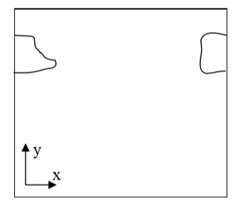

Calculating center of mass when using periodic boundary conditions.
-------------------------------------------------------------------

When you are running calculation with periodic boundary condition you
may end up with situation like in the figure below:

|periodic_bc_com|

**Figure 6** A connected cell in the lattice edge area – periodic boundary conditions are applied

Clearly, what happens is that simply connected cell is wrapped around the
lattice edge so part of it is in the region of high values of x
coordinate and the other is in the region where x coordinates have low
values. Consequently, a naïve calculation of center of mass position
according to:

.. math::
   :nowrap:

   \begin{eqnarray}
      x_{COM} = \frac{\sum_i x_i}{V}
   \end{eqnarray}

or in vector form:

.. math::
   :nowrap:

   \begin{eqnarray}
      \vec{r}_{COM} = \frac{\sum_i \vec{r}_i}{V}
   \end{eqnarray}

would result in being somewhere in the middle of the lattice and
obviously outside the cell. A better procedure could be as follows:

Before calculating center of mass when new pixel is added or lost we
"shift" a cell and new pixel (gained or lost )to the middle of the
lattice do calculations "in the middle of the lattice" and shift back.
Now if after shifting back it turns out that center of mass of a cell
lies outside lattice position it in the center of mass by applygin a
shift equal to the length of the lattice and whose direction should be
such that the center of mass of the cell ends up inside the lattice
(there is only one such shift and it might be be equal to zero vector).

This is how we do it using mathematical formulas:

.. math::
   :nowrap:

   \begin{eqnarray}
      \vec{s} = \vec{r}_{COM} - \vec{c}
   \end{eqnarray}

First we define shift vector :math:`\vec{s}` as a vector difference between vector
pointing to center of mass of the cell :math:`\vec{r}_{COM}` and vector pointing to
(approximately) the middle of the lattice :math:`\vec{c}`.

Next we shift cell to the middle of the lattice using :

.. math::
   :nowrap:

   \begin{eqnarray}
      \vec{r'}_{COM} = \vec{r}_{COM} - \vec{s}
   \end{eqnarray}

where :math:`\vec{r'}_{COM}` denotes center of mass position of a cell after shifting but
before adding or subtracting a pixel.

Next we take into account the new pixel (either gained or lost) and
calculate center of mass position (for the shifted cell):

.. math::
   :nowrap:

   \begin{eqnarray}
      \vec{r'}_{COM}^{new} = \frac{\vec{r'}_{COM}V + \vec{r}_i}{V+1}
   \end{eqnarray}

Above we have assumed that we are adding one pixel.

Now all that we need to do is to shift back :math:`\vec{r'}_{COM}^{new}` by same vector :math:`\vec{s}` that brought
cell to (approximately) center of the lattice:

.. math::
   :nowrap:

   \begin{eqnarray}
      \vec{r}_{COM}^{new} = \vec{r'}_{COM}^{new} + \vec{s}
   \end{eqnarray}

We are almost done. We still have to check if :math:`\vec{r'}_{COM}^{new}` is inside the lattice. If
this is not the case we need to shift it back to the lattice but now we
are allowed to use only a vector :math:`\vec{P}` whose components are multiples of
lattice dimensions (and we can safely restrict to +1 and -1 multiples of
the lattice dimensions) . For example we may have:

.. math::
   :nowrap:

   \begin{eqnarray}
      \vec{P} = (x_{max}, -y_{max}, 0)
   \end{eqnarray}

where :math:`\vec{x}_{max}`, :math:`\vec{y}_{max}`, :math:`\vec{z}_{max}` are dimensions of the lattice.

There is no cheating here. In the lattice with periodic boundary
conditions you are allowed to shift point coordinates a vector whose
components are multiples of lattice dimensions.

All we need to do is to examine new center of mass position and form
suitable vector :math:`\vec{P}`.

