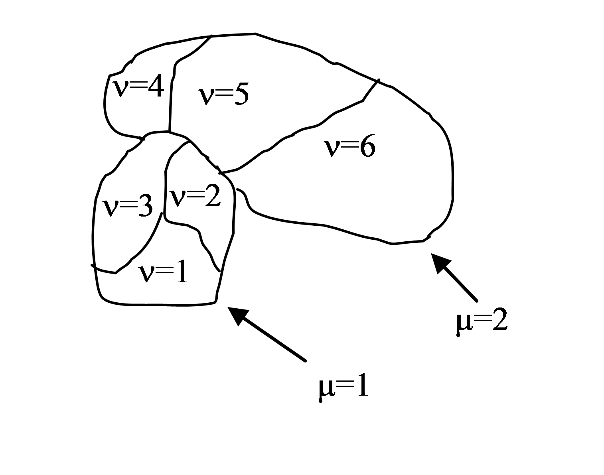

Compartmentalized Cells | ContactInternal Plugin
-------------------------------------------------------

Related: `Dividing Clusters (aka compartmental cells) and Python examples <dividing_clusters.html>`_

**Contact Plugin:** controls how easily cells adhere to one another or themselves. 

**ContactInternal Plugin:** controls how easily sub-cells within the same
compartment adhere to each other. 

In both cases, low energy values "encourage" pixels to stick together whereas
high values cause them to spread apart. 
The ContactInternal Plugin can help to control the shape and arrangement of a compartmentalized cell. 
Usually, the standard Contact Plugin should still be included to control how clusters interact with one another. 

**********************************

Calculating contact energies between compartmentalized cells is
analogous to the non-compartmentalized case. The energy expression takes
the following form:

.. math::
    :nowrap:

    \begin{eqnarray}

        E_{adhesion} = \sum_{i,j,neighbors} J\left ( \sigma (\mu_{i},\nu_{i}),\sigma (\mu_{j},\nu_{j})  \right )

    \end{eqnarray}

where ``i`` and ``j`` denote pixels , ``σ(µ,ν)`` denotes a cell
type of a cell with cluster id *µ* and cell id *ν* . In compartmental
cell models, a cell is a collection of subcells. Each subcell has a
unique id  *ν* (cell id). In addition to that, each subcell will have
an additional attribute, a cluster id (*µ*) that determines to which cluster of
subcells a given subcell belongs. Think of a cluster as a cell with
a non-homogenous cytoskeleton. So a cluster corresponds to a biological cell and
subcells (or compartments) represent parts of a cell, e.g., a nucleus. The core
idea here is to have different contact
energies between subcells belonging to the same cluster and different
energies for cells belonging to different clusters. Technically subcells
of a cluster are "regular" CompuCell3D cells. By giving them an extra
attribute, cluster id (*µ*), we can introduce the concept of compartmental cells.
In our convention, *σ(0,0)* denotes medium. 

|compartments|

Figure 2. Two compartmentalized cells (cluster id :math:`\mu=1` and cluster id :math:`\mu=2`).
Compartmentalized cell :math:`\mu=1` consists of subcells with cell id :math:`\nu=1,2,3` and compartmentalized cell
:math:`\mu=2` consists of subcells with cell id  :math:`\nu=4,5,6`

Introduction of cluster id and cell id are essential for the definition
of :math:`J\left ( \sigma (\mu_{i},\nu_{i}),\sigma (\mu_{j},\nu_{j})  \right )`

Indeed:

.. math::
    :nowrap:

        \begin{cases}
          J\left ( \sigma (\mu_{i},\nu_{i}),\sigma (\mu_{j},\nu_{j})  \right ) =  J^{external}\left ( \sigma (\mu_{i},\nu_{i}),\sigma (\mu_{j},\nu_{j})  \right ) & \text{ if } \mu_i \neq \mu_j \\
          J\left ( \sigma (\mu_{i},\nu_{i}),\sigma (\mu_{j},\nu_{j})  \right ) =  J^{internal}\left ( \sigma (\mu_{i},\nu_{i}),\sigma (\mu_{j},\nu_{j})  \right ) & \text{ if } \mu_i = \mu_j
        \end{cases}

As we can see above, there are two hierarchies of contact energies –
external and internal. To describe adhesive interactions between
different compartmentalized cells, we use two plugins: ``Contact`` and
``ContactInternal``. ``Contact`` plugin calculates energy between two cells
belonging to different clusters and ``ContactInternal`` **calculates energies
between cells belonging to the same cluster**. An example syntax is shown
below

.. code-block:: xml

    <Plugin Name="Contact">

        <Energy Type1="Base" Type2="Base">0</Energy>
        <Energy Type1="Top" Type2="Base">25</Energy>
        <Energy Type1="Center" Type2="Base">30</Energy>
        <Energy Type1="Bottom" Type2="Base">-2</Energy>
        <Energy Type1="Side1" Type2="Base">25</Energy>
        <Energy Type1="Side2" Type2="Base">25</Energy>
        <Energy Type1="Medium" Type2="Base">0</Energy>

        <Energy Type1="Medium" Type2="Medium">0</Energy>
        <Energy Type1="Top" Type2="Medium">30</Energy>
        <Energy Type1="Bottom" Type2="Medium">20</Energy>
        <Energy Type1="Side1" Type2="Medium">30</Energy>
        <Energy Type1="Side2" Type2="Medium">30</Energy>
        <Energy Type1="Center" Type2="Medium">45</Energy>

        <Energy Type1="Top" Type2="Top">2</Energy>
        <Energy Type1="Top" Type2="Bottom">100</Energy>
        <Energy Type1="Top" Type2="Side1">25</Energy>
        <Energy Type1="Top" Type2="Side2">25</Energy>
        <Energy Type1="Top" Type2="Center">35</Energy>

        <Energy Type1="Bottom" Type2="Bottom">10</Energy>
        <Energy Type1="Bottom" Type2="Side1">25</Energy>
        <Energy Type1="Bottom" Type2="Side2">25</Energy>
        <Energy Type1="Bottom" Type2="Center">35</Energy>

        <Energy Type1="Side1" Type2="Side1">25</Energy>
        <Energy Type1="Side1" Type2="Center">25</Energy>
        <Energy Type1="Side2" Type2="Side2">25</Energy>
        <Energy Type1="Side2" Type2="Center">25</Energy>
        <Energy Type1="Side1" Type2="Side2">15</Energy>

        <Energy Type1="Center" Type2="Center">20</Energy>

        <NeighborOrder>2</NeighborOrder>
    </Plugin>

and

.. code-block:: xml

    <Plugin Name="ContactInternal">

        <Energy Type1="Base" Type2="Base">0</Energy>
        <Energy Type1="Base" Type2="Bottom">0</Energy>
        <Energy Type1="Base" Type2="Side1">0</Energy>
        <Energy Type1="Base" Type2="Side2">0</Energy>
        <Energy Type1="Base" Type2="Center">0</Energy>

        <Energy Type1="Top" Type2="Top">4</Energy>
        <Energy Type1="Top" Type2="Bottom">25</Energy>
        <Energy Type1="Top" Type2="Side1">22</Energy>
        <Energy Type1="Top" Type2="Side2">22</Energy>
        <Energy Type1="Top" Type2="Center">15</Energy>

        <Energy Type1="Bottom" Type2="Bottom">4</Energy>
        <Energy Type1="Bottom" Type2="Side1">15</Energy>
        <Energy Type1="Bottom" Type2="Side2">15</Energy>
        <Energy Type1="Bottom" Type2="Center">10</Energy>

        <Energy Type1="Side1" Type2="Side1">11</Energy>
        <Energy Type1="Side2" Type2="Side2">11</Energy>
        <Energy Type1="Side1" Type2="Side2">11</Energy>

        <Energy Type1="Side2" Type2="Center">10</Energy>
        <Energy Type1="Side1" Type2="Center">10</Energy>

        <Energy Type1="Center" Type2="Center">2</Energy>

        <NeighborOrder>2</NeighborOrder>
    </Plugin>

Depending on whether or not the pixels for which we calculate contact energies belong
to the same cluster, we will use internal or external contact
energies, respectively.

