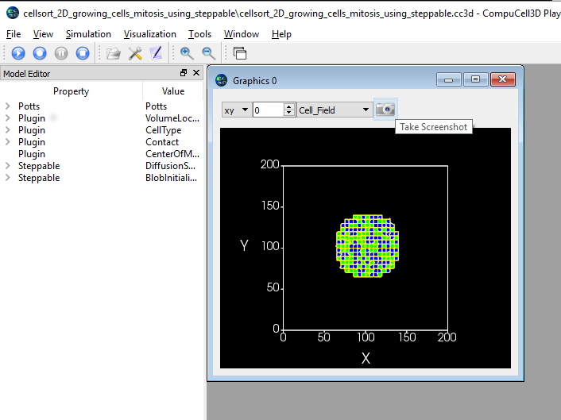
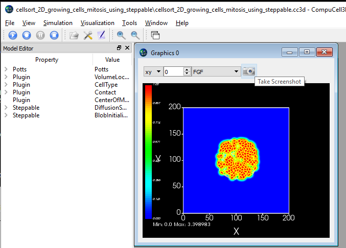
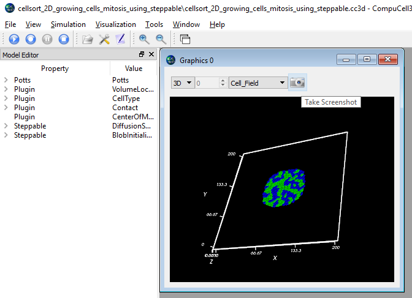
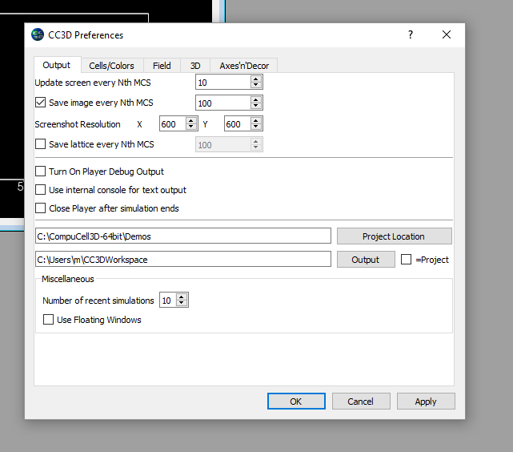
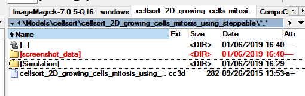
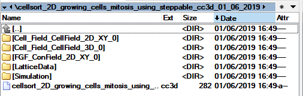
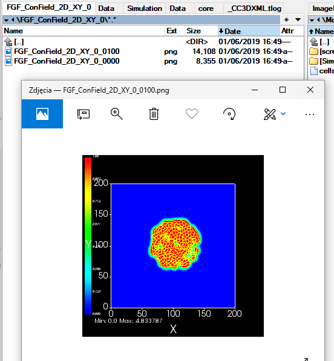

Configuring Multiple Screenshots
================================

Starting with CompuCell3d version 3.7.9 users have an option to save multiple screenshots directly from simulation running
in GUI or GUI-less mode. Keep in mind that there sia already another way of producing simulation screenshots that requires
users to first save complete snapshots (VTK-files) and then replaying them in the player and at that time users would take
screenshots.

The feature we present here is a very straightforward way to generate multiple screenshots with, literally, few clicks.

The process is very simple - you open up a simulation in the Player and use "camera button" on lattice configurations
you want to save. In doing so CompuCell3D will generate .json screenshot description file that will be saved with along
the simulation code som that from now on every run of the simulation will generate the same set of screenshots. Obviously
we can delete this file if we no longer wish to generate the screenshots.

Let's review all the steps necessary to configure multiple screenshots. First we need to enable screenshot output from
the configuration page:

|screenshots_config_4_conf|

**Fig 1.** Enable screenshot output - check box next to ``Save image every Nth MCS`` and choose screenshot output frequency

|screenshots_config_1|

**Fig 2.** Open up simulation and start running it. Press ``Pause`` and click ``camera button`` (the button next to
``Take screenshot`` tool-tip) on the graphics configuration you would like to save.

|screenshots_config_2|

|screenshots_config_2|

**Fig 3.** Repeat the sam process on other graphics configurations you would like to output as screenshots. Here we are
adding screenshots for FGF field and for the cell field in 3D. See pictures above

The screenshot configuration data folder is stored along the simulation code in the original ``.cc3d`` project location:

|screenshots_config_5|

**Fig 4.** When you click camera button , CC3D will store screenshot configuration data in the ``screenshot data`` folder
and it will become integral part od ``.cc3d`` project. Every time you run a simulation screenshots described there will
be output to the CC3DWorkspace folder - unless you disable taking of the screenshots via configuration dialog or by removing
the ``screenshot_data`` folder

The screenshots are written in the ``CC3DWorkspace`` folder. Simpy go the the subfolder of the ``CC3DWorkspace`` directory
and search for folders with screenshots. In our case there are 3 folders that have the screenshots we configured:
``Cell_Field_CellField_2D_XY_0``, ``Cell_Field_CellField_3D_0``, ``FGF_ConField_2D_XY_0`` - see figures below:

|screenshots_config_6|

|screenshots_config_7|

**Fig 5.** Screenshots are written to simulation output folder (*i.e.* subfolder of ``CC3DWorkspace``)

