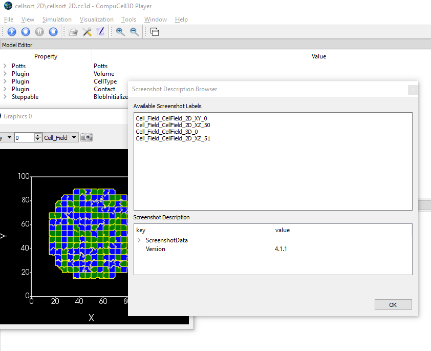

Configuring Multiple Screenshots
================================

Starting with CompuCell3d version 3.7.9 users have an option to save multiple screenshots directly from simulation running
in GUI or GUI-less mode. Keep in mind that there sia already another way of producing simulation screenshots that requires
users to first save complete snapshots (VTK-files) and then replaying them in the player and at that time users would take
screenshots.

The feature we present here is a very straightforward way to generate multiple screenshots with, literally, few clicks.

The process is very simple - you open up a simulation in the Player and use "camera button" on lattice configurations
you want to save. In doing so CompuCell3D will generate .json screenshot description file that will be saved with along
the simulation code som that from now on every run of the simulation will generate the same set of screenshots. Obviously
we can delete this file if we no longer wish to generate the screenshots.

Let's review all the steps necessary to configure multiple screenshots. First we need to enable screenshot output from
the configuration page:

|screenshots_config_4_conf|

**Fig 1.** Enable screenshot output - check box next to ``Save image every Nth MCS`` and choose screenshot output frequency

|screenshots_config_1|

**Fig 2.** Open up simulation and start running it. Press ``Pause`` and click ``camera button`` (the button next to
``Take screenshot`` tool-tip) on the graphics configuration you would like to save.

|screenshots_config_2|

|screenshots_config_2|

**Fig 3.** Repeat the sam process on other graphics configurations you would like to output as screenshots. Here we are
adding screenshots for FGF field and for the cell field in 3D. See pictures above

The screenshot configuration data folder is stored along the simulation code in the original ``.cc3d`` project location:

|screenshots_config_5|

**Fig 4.** When you click camera button , CC3D will store screenshot configuration data in the ``screenshot data`` folder
and it will become integral part od ``.cc3d`` project. Every time you run a simulation screenshots described there will
be output to the CC3DWorkspace folder - unless you disable taking of the screenshots via configuration dialog or by removing
the ``screenshot_data`` folder

The screenshots are written in the ``CC3DWorkspace`` folder. Simpy go the the subfolder of the ``CC3DWorkspace`` directory
and search for folders with screenshots. In our case there are 3 folders that have the screenshots we configured:
``Cell_Field_CellField_2D_XY_0``, ``Cell_Field_CellField_3D_0``, ``FGF_ConField_2D_XY_0`` - see figures below:

|screenshots_config_6|

|screenshots_config_7|

**Fig 5.** Screenshots are written to simulation output folder (*i.e.* subfolder of ``CC3DWorkspace``)

Taking screenshots from inside steppable
~~~~~~~~~~~~~~~~~~~~~~~~~~~~~~~~~~~~~~~~

Starting with 4.1.2 version of CC3D users can take screenshots at arbitrary Monte Carlo Step
directly from the steppable code. The ``PySteppableBase`` class has new API:

.. code-block:: python

    request_screenshot(mcs, screenshot_label)

that directs CC3D to take screenshot immediately. The first argument labeled as ``mcs`` serves
as a label that will be added to screenshot filename to record Monte Carlo Step at
which screenshot is to be taken. If you are at MCS 10 but specify ``mcs=1200``
in the function signature the screenshot will be taken immediately at MCS=10 but the file name
will contain label 1200. In other words the ``mcs`` argument does not schedule screenshot to be taken
at a particular mcs but is simply a label. ``screenshot_label`` is the name of the screenshot
configuration as specified in the json screenshot description file. We will show you how to easily
find which screenshot configurations are available using screenshot description file browser.

To find the parameters, and more importantly labels of screenshot configurations we can either
directly inspect ``screenshot_data/screenshots.json`` file that is stored in your simulation folder
once you press at least once camera button to define screenshot configuration or we can use
Screenshot Description File Browser - accessible directly from ``Tools`` menu of the Player.

To access Screenshot Description File Browser first start the simulation and pause it. Next,
go to ``Tools->Open Screenshot Description Browser`` and the following window will open:

|screenshot_browser_1|

**Fig** Screenshots configurations can be viewed using simple browser accessible via
``Tools->Open Screenshot Description Browser``

In the upper window we see 4 names of screenshot configurations. We will have to use exactly those names
as ``screenshot_label`` arguments in ``request_screenshot``.

Let us present a simple example of a steppable where we take *ad-hoc* screenshots for ``Cell_Field_CellField_2D_XY_0``
configuration:

.. code-block:: python

    from cc3d.core.PySteppables import *
    from cc3d import CompuCellSetup
    from random import random

    class CellsortSteppable(SteppableBasePy):
        def __init__(self, frequency=10):
            SteppableBasePy.__init__(self, frequency)

        def step(self, mcs):

            if mcs in [3, 5, 19,20, 23, 29, 31]:
                self.request_screenshot(mcs=mcs, screenshot_label='Cell_Field_CellField_2D_XY_0')

In the code above we will take screenshot for configuration that labeled ``Cell_Field_CellField_2D_XY_0``
in the ``screenshot_data/screenshots.json`` file. The screenshots will be taken at mcs= 3, 5, 19 etc...

As you can see the label ``Cell_Field_CellField_2D_XY_0`` can be copied directly from Screenshot Description Browser
as shown in the figure above and request in a screenshot is a matter of writing one extra function
in your steppable code. Do not worry if you request same screenshot multiple times. CC3D will process only first
request and ignore the other identical requests. You can safely call this function from anywhere in the steppable

.. |screenshots_config_1| image:: images/screenshots_config_1.png
   :width: 3.5000in
   :height: 2.5526in

.. |screenshots_config_2| image:: images/screenshots_config_2.png
   :width: 3.5000in
   :height: 2.5526in

.. |screenshots_config_3| image:: images/screenshots_config_3.png
   :width: 3.5000in
   :height: 2.5526in

.. |screenshots_config_4_conf| image:: images/screenshots_config_4_conf.png
   :width: 3.5000in
   :height: 2.5526in

.. |screenshots_config_5| image:: images/screenshots_config_5.png
   :width: 2.5000in
   :height: 0.9526in

.. |screenshots_config_6| image:: images/screenshots_config_6.png
   :width: 2.5000in
   :height: 0.9526in

.. |screenshots_config_7| image:: images/screenshots_config_7.png
   :width: 2.7in
   :height: 2.85in

