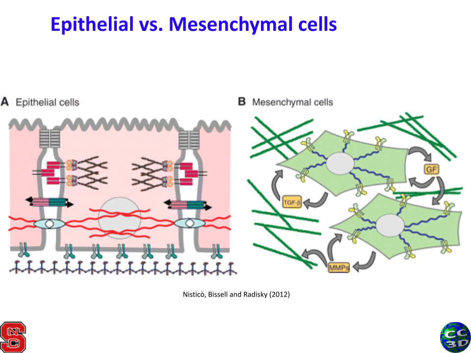

Surface and Cell Contact
=======================================

TODO: add more details about how to control surface with targetSurface and lambdaSurface as well
as how to visit neighboring cells 
as well as how to detect when cells first touch using dict keys.

Always add the Contact plugin when creating a new simulation (unless you are completely sure that it is not needed!).

Properties
****************************

**cell.targetSurface**: the "goal" surface that a cell tries to reshape itself to whenever possible

**cell.lambdaSurface**: the strength of the surface constraint; that is, how fast a cell will reshape itself to meet its targetSurface

**********************************************

Example: Epithelial-Mesenchymal Transition (EMT)
^^^^^^^^^^^^^^^^^^^^^^^^^^^^^^^^^^^^^^^^^^^^^^^^^^^^^^

When a cell transitions from an epithelial cell to a mesenchymal cell, it is a hallmark of cancer.
The cell loses its orderly, cube-like shape from its epithelial phenotype to a mesenchymal cell that has increased migrational capacity.
The mesenchymal cell may be elongated and fragment away from its neighbors to prepare for intravasation. 

    

`Download the sample code here <https://drive.google.com/file/d/1GIk6VyTcZnwZ8_LgCClAxUYzb-clhbTY/view?usp=drive_link>`_, 
then watch the video from the latest workshop to follow along:

`Get the slides here <https://docs.google.com/presentation/d/1KNnXN1p7J81UrFxDw6c6yc0o0NmDl3sa/edit#slide=id.p24>`_.

.. image:: https://img.youtube.com/vi/PsidmqgQppc/maxresdefault.jpg
    :alt: Workshop Tutorial Video
    :target: https://www.youtube.com/watch?v=PsidmqgQppc&list=PLiEtieOeWbMKTIF2mekBc9cABFPEDwCdj&index=18&t=513s
    :width: 80%

..
    [Last Updated] October 2023

Key Takeaways:
    * Increasing contact energy between cells of the same type will move the cells apart
    * Decreasing contact energy between the mesenchymal cell and the medium will also help those cells move apart
    * Very high or low contact energy may cause cells to tear apart