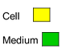
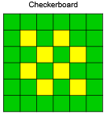
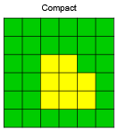

Contact Plugin
--------------

Relevant Examples:
    * `Cell Sorting <example_cell_sorting.html>`_

**********************************************

The contact plugin implements computations of adhesion energy between neighboring cells.

Together with volume constraint, contact energy is one of the most
commonly used plugins. In essence, it
describes how cells "stick" to each other.

Contact energy is contrived. 
It is merely a way to replicate the properties of a cell's membrane, the bindings of the nano-structures on its surface, and its environment (the Medium). 

Two cell types that have *high* contact energy will not "want to" adhere to each other. 
If possible, those cells may separate, effectively reducing the total energy to stay in that position. 
Conversely, *low* contact energy "encourages" cell types to bind. 
As contact energy is lowered, it also increases the surface of the contact. 

Contact energy is constantly re-calculated each time a cell's surface changes.

We define contact energy as a matrix that compares each cell type against each other cell type. 
In CC3DML, try changing the contact energy between CellA and CellB to ``2``. 
Keep everything else the same, then click Play |Play|  to see the result. 

.. code-block:: xml

    <Plugin Name="Contact">
        <Plugin Name="Contact">
        <Energy Type1="CellA" Type2="CellA">10</Energy>
        <Energy Type1="CellB" Type2="CellB">10</Energy>
        <Energy Type1="CellA" Type2="CellB">2</Energy> <!--Here!-->
        <Energy Type1="CellA" Type2="Medium">10</Energy>
        <Energy Type1="CellB" Type2="Medium">10</Energy>
        <Energy Type1="Medium" Type2="Medium">10</Energy> <!--Medium-Medium energy doesn't really matter-->
        <NeighborOrder>2</NeighborOrder>
    </Plugin>

This should stimulate cell mixing, the opposite of `cell Sorting <example_cell_sorting.html>`_. 

What Does Energy Mean?
-------------------------------------------------

When tweaking your parameters, it's most important to pay attention to their **relative values**. 

However, the actual value of each parameter—whether you set ``10`` or ``1``—affects the contact behaviors, too, because of *temperature*. 

Each time a cell flexes its surface, a decision is made about which pixels in the lattice will be copied over to new lattice sites. 
We discussed this in the `Potts page <potts.html>`_. 

The probability of accepting a lattice site copy is:

.. math::
    :nowrap:

    \begin{eqnarray}
        P = e^{-\bigtriangleup H/T}
    \end{eqnarray}

where :math:`\bigtriangleup H = H_f - H_i`. 
:math:`H_f` is the new energy after a potential lattice site copy. 
:math:`H_i` is the current energy of the system at step *i*. 
The new energy, :math:`H_i`, may be higher, lower, or the same after a site copy. 
Meanwhile, :math:`T` is the temperature (or fluctuation amplitude *or* membrane fluctuation level *or* noise level).
A high temperature lowers the probability that site copy attempts will be made. 

Calculating Contact Energy
-------------------------------------------------

The explicit formula for contact energy is:

.. math::
    :nowrap:

    \begin{eqnarray}
        E_{contact} = \sum_{i,j,neighbors} J\left ( \tau_{\sigma(i)},\tau_{\sigma(j)} \right )\left ( 1-\delta_{\sigma(i), \sigma(j)} \right )
    \end{eqnarray}

where ``i`` and ``j`` label two neighboring lattice sites :math:`\sigma`'s denote cell
IDs, and each :math:`\tau` denotes a cell type. 
Note that ``i`` and ``j`` are are at separate coordinates; for example, ``i = (0,4)`` and ``j = (1,4)``. 

In the above formula, we need to differentiate between cell types and
cell IDs. This formula shows that cell types and cell IDs **are not the
same**. The ``Contact`` plugin in the ``.xml`` file, defines the energy per unit
area of contact between cells of different types (:math:`J\left ( \tau_{\sigma(i)},\tau_{\sigma(j)} \right )`) and the interaction
range ``NeighborOrder`` of the contact:

.. code-block:: xml

    <Plugin Name="Contact">
        <Energy Type1="Foam" Type2="Foam">3</Energy>
        <Energy Type1="Medium" Type2="Medium">0</Energy>
        <Energy Type1="Medium" Type2="Foam">0</Energy>
        <NeighborOrder>2</NeighborOrder>
    </Plugin>

In this case, the interaction range is ``2``. Thus, only up to second-nearest
neighbor pixels of a given pixel undergoing a change will be used to calculate
contact energy change. ``Foam`` cells have contact energy per unit area of ``3``
and ``Foam`` and ``Medium`` as well as Medium and Medium have contact energy of
``0`` per unit area. 

----------------------------------------------------

Suppose we have **8 cells** on the checkboard and **4 sides each**. 
If the cells are in a checkerboard pattern, they have the most possible contact energy with the Medium. 

So, the total contact energy is: 

.. math::
    :nowrap:

    \begin{eqnarray}
        H_{contact} = 4 \times 8 \times J_{Cell-to-Medium}
    \end{eqnarray}

where :math:`J_{Cell-to-Medium}` denotes the contact energy between the base cell type, ``Cell``, and the Medium. 

How would you calculate the contact energy if all the cells were touching the medium as little as possible?

.. math::
    :nowrap:

    \begin{eqnarray}
        H_{contact} = 12 \times J_{Cell-to-Medium} + 10 \times J_{Cell-to-Cell}
    \end{eqnarray}

Again, count the number of contact surfaces and multiply them by the respective contact energies for those cell types. 

