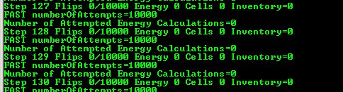
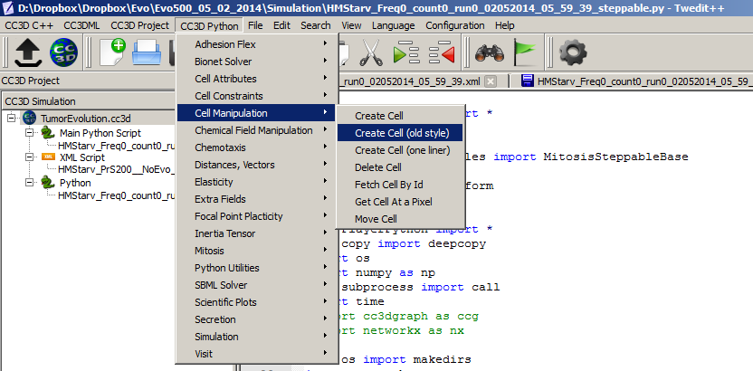

Creating and Deleting Cells. Cell-Type Names
============================================

The simulation that Twedit++ Simulation Wizard generates contains some
kind of initial cell layout. Sometimes however we want to be able to
either create cells as simulation runs or delete some cells. CC3D makes
such operations very easy and Twedit++ is of great help. Let us first
start with a simulation that has no cells. All we have to do is to
comment out BlobInitializer section in the CC3DML code in our
cellsorting simulation:

File: ``C:\\CC3DProjects\\cellsorting\\Simulation\\cellsorting.xml``

.. code-block:: xml

    <CompuCell3D version="3.6.2">
      <Potts>
        <Dimensions x="100" y="100" z="1"/>
        <Steps>10000</Steps>
        <Temperature>10.0</Temperature>
        <NeighborOrder>2</NeighborOrder>
      </Potts>

      <Plugin Name="CellType">
        <CellType TypeId="0" TypeName="Medium"/>
        <CellType TypeId="1" TypeName="Condensing"/>
        <CellType TypeId="2" TypeName="NonCondensing"/>
      </Plugin>

      <Plugin Name="Volume">
        <VolumeEnergyParameters CellType="Condensing" LambdaVolume="2.0"
        TargetVolume="25"/>
        <VolumeEnergyParameters CellType="NonCondensing" LambdaVolume="2.0"
        TargetVolume="25"/>
      </Plugin>

      <Plugin Name="CenterOfMass">
      </Plugin>

      <Plugin Name="Contact">

        <Energy Type1="Medium" Type2="Medium">10.0</Energy>
        <Energy Type1="Medium" Type2="Condensing">10.0</Energy>
        <Energy Type1="Medium" Type2="NonCondensing">10.0</Energy>
        <Energy Type1="Condensing" Type2="Condensing">10.0</Energy>
        <Energy Type1="Condensing" Type2="NonCondensing">10.0</Energy>
        <Energy Type1="NonCondensing" Type2="NonCondensing">10.0</Energy>
        <NeighborOrder>1</NeighborOrder>
      </Plugin>

    </CompuCell3D>

When we run this simulation and try to iterate over list of all cells
(see earlier example) we won’t see any cells:

|image9|

Figure 10 Output from simulation that has no cells

To create a single cell in CC3D we type the following code snippet:

.. code-block:: python

    def start(self):
        self.cell_field[10:14,10:14,0] = self.new_cell(self.CONDENSING)

.. note::

   ``self.cellField`` still works. We can also access this field via ``self.field.cell_field`` although ``self.cell_field`` looks much simpler

In Twedit++ go to CC3D Python->Cell Manipulation->Create Cell:

|image10|

Figure 11 Inserting code snippet in Twedit++ to create cells. Notice
that this is a generic code that usualy needs minor customizations.

Notice that we create cell in the start function. We can create cells in
step functions as well. We create a C++ cell object using the following
statement:

.. code-block:: python

    self.new_cell(self.CONDENSING)

We initialize its type using ``self.CONDENSING`` class variable that
corresponds to an integer assigned to type Condensing. Cell type is an
integer value from 1 to 255 and CompuCell3D automatically creates class
variables corresponding to each type. By looking at the definition of
the CellType plugin in CC3DML for cellsorting simulation you can easily
infer that number 1 denotes cells of type Condensing and 2 denotes cells
of type NonCondensing. Because it is much easier to remember names of
cell types than keeping track which cell type corresponds to which
number ``SteppableBasePy`` provides very convenient member variables
denoting cell type numbers. The name of such variable is obtained by
capitalizing all letters in the name of the cell type and prepending if
with self. In our example we will have 3 such variables ``self.MEDIUM``,
``self.CONDENSING``, ``self.NONCONDENSING`` with values ``0``, ``1``, ``2`` respectively.

.. note::

   To ensure that cell type names are correctly translated into Python class variables avoid using spaces in cell type name.

Consequently,

.. code-block:: python

    cell.type = self.CONDENSING

is equivalent to

.. code-block:: python

    cell.type = 1

but the former makes the code more readable. After assigning cell type
all that remains is to initialize lattice sites using newly created cell
object so that atleast one lattice site points to this cell object.

The syntax which assigns cell object to 25 lattice sites

.. code-block:: python

    self.cell_field[10:14, 10:14, 0] = cell

is based on Numpy syntax. ``self.cell_field`` is a pointer to a C++ lattice
which stores pointers to cell objects. In this example our cell is a ``5x5``
square collection of pixels. Notice that the ``10:14`` has 5 elements because
the both the lower and the upper limits are included in the range. As
you can probably tell, ``self.cellField`` is member of ``SteppableBasePy``. To
access cell object occupying lattice site, ``x``, ``y``, ``z``, we type:

.. code-block:: python

    cell=self.cell_field[x,y,z]

The way we access cell field is very convenient and should look familiar
to anybody who has used Matlab, Octave or Numpy.

Deleting CC3D cell is easier than creating one. The only thing we have
to remember is that we have to add PixelTracker Plugin to CC3DML (in
case you forget this CC3D will throw error message informing you that you
need to add this plugin).

The following snippet will erase all cells of type ``Condensing``:

.. code-block:: python

    def step(self, mcs):
        for cell in self.cell_list:
            if cell.type == self.CONDENSING:
                self.delete_cell(cell)

We use member function of ``SteppableBasePy`` – ``deleteCell`` where the first
argument is a pointer to cell object.

