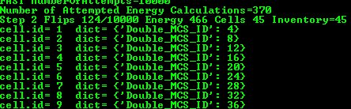

Custom Cell Attributes in Python
================================

As you have already seen, each cell object has a several attributes
describing properties of model cell (e.g. volume, surface, target
surface, type, id *etc...*). However, in almost every simulation that you
develop, you need to associate additional attributes with the cell
objects. For example, you may want every cell to have a countdown clock
that will be recharged once its value reaches zero. One way to
accomplish this task is to add a line:

.. code-block:: c++

    int clock

to ``Cell.h`` file and recompile entire CompuCell3D package. ``Cell.h`` is a C++
header file that defines basic properties of the CompuCell3D cells and
it happened so that almost every C++ file in the CC3D source code
depends on it. Consequently, any modification of this file will mean
that you would need to recompile almost entire CC3D from scratch. This
is inefficient. Even worse, you will not be able to share your
simulation using this extra attribute, unless the other person also
recompiled her/his code using your tweak. Fortunately CC3D let’s you
easily attach any type of Python object as cell attribute. Each cell, by
default, has a Python dictionary attached to it. This allows you to
store any object that has Python interface as a cell attribute. Let’s
take a look at the following implementation of the step function:

.. code-block:: python

    def step(self,mcs):

        for cell in self.cell_list:
            cell.dict["Double_MCS_ID"] = mcs*2*cell.id

        for cell in self.cell_list:
            print('cell.id=', cell.id,' dict=', cell.dict)

We have two loops that iterate over list of all cells. In the first loop
we access dictionary that is attached to each cell:

.. code-block:: python

    cell.dict

and then insert into a dictionary a product of 2, mcs and cell id:

.. code-block:: python

    cell.dict["Double_MCS_ID"] = mcs*2*cell.id

In the second loop we access the dictionary and print its content to the
screen. The result will look something like:

|image13|

Figure 14 Simple simulation demonstrating the usage of custom cell
attributes.

If you would like attach a Python list to the cell all you do it insert
Python list as one of the elements of the dictionary e.g.:

.. code-block:: python

    for cell in self.cell_list:
        cell.dict["MyList"] = list()

Thus all you really need to store additional cell attributes is the
dictionary.

