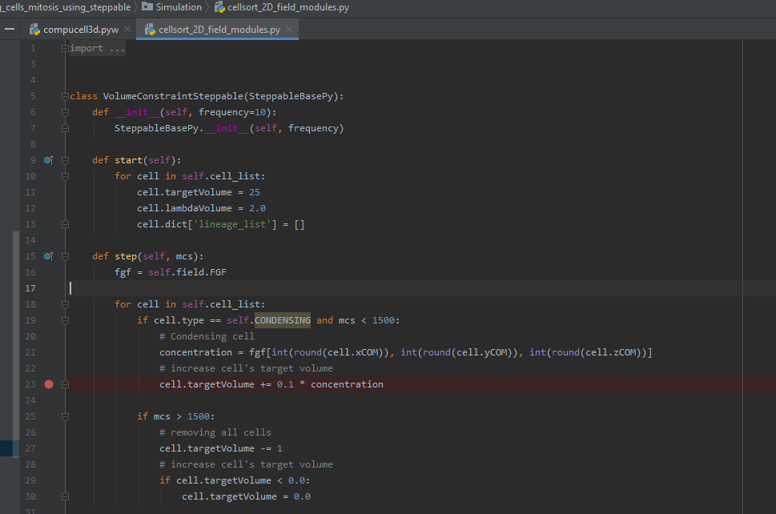

Running and Debugging CC3D Simulations Using PyCharm
=====================================================

Twedit++ provides many convenience tools when it comes to setting up simulation and also quickly modifying the
content of the simulation using provided code helpers (see Twedit's CC3D Python and CC3D XML menus). Twedit also
allows rapid creation of CC3D C++ plugins and steppables (something we cover in a separate developer's manual).
However, as of current version, Twedit++ is just a code editor not an Integrated Development Environment (**IDE**).
A real development environment offers many convenience features that make development faster. In this chapter we will
teach you how to set up and use PyCharm to debug and quickly develope CC3D simulations. The ability of stepping up
through simulation code is essential during simulation development. There you can inspect every single variable
without using pesky **print** statements. You can literally see how your simulation is executed ,
statement-by-statement. In addition PyCharm provides nice context-based syntax completion so that by typing
few characters from e.g. steppable method name (they do not need to be beginning characters) PyCharm will display
available options, freeing you from memorizing every single method in CompuCell3D API.

First thing we need to do is to download and install PyCharm. Because PyCharm is written in Java
it is available for every single platform. Visit https://www.jetbrains.com/pycharm/download/
and get Community version of PyCharm for your operating system. YOu can also get professional version but you need to
pay for this one so depending on your needs you have to make a choice here. We are using Community version because it
is feature-rich and unless you do a lot of specialized Python development you will be fine with the free option.

After installing and doing basic configuration of PyCharm you are ready to open and configure CC3D to be executed from
the IDE.

Step 1 - opening CC3D code in PyCharm and configuring Python environment
------------------------------------------------------------------------

To open CC3D code in Pycharm,  navigate to ``File->Open...`` and go to the folder where you installed CC3D and
open the following subfolder <CC3D_install_folder>/lib/site-packages. In my case CC3D is installed in ``c:\CompuCell3D-py3-64bit\``
so I am opening ``c:\CompuCell3D-py3-64bit\lib\site-packages\``

After you choose ``site-packages`` folder to open you may get another prompt that will ask you whether to open this
folder in new window or attach to current window. Choose ``New Window`` option:

Next, you should see the following window

In order to be able to debug CC3D simulations it is best if the ``Demos`` folder (or any folder where you keep your
simulations) also resides under ``site-packages``. Simply copy ``Demos`` folder to ``site-packages`` folder
so that your you PyCharm Project Explorer looks as follows (left panel in PyCharm) - see ``Demos`` directory listed under ``cc3d``:

Step 2 - running CC3D simulation from PyCharm. Configuring Python Environment and PREFIX_CC3D
----------------------------------------------------------------------------------------------

At this point we may attempt to run Player from PyCharm. To do so we expand ``cc3d`` folder in the left PyCharm
panel and navigate to ``cc3d->player5->compucell3d.pyw`` and first we double-click to open ``compucell3d.pyw``
script in the editor and then ``right-click`` to open up a context menu and from there we choose
``Run "compucell3d.pyw"`` as shown below:

After we choose this option most likely we will get an error that will indicate that we need to set up Python
environment to run CC3D in PyCharm.

.. figure:: images/pycharm_win_06.png
    :alt: Error indicating the need to set up Python environment

The actual error message might look different from the one shown below but regardless of it we need to setup
proper Python environment inside Pycharm that we will use to run CC3D.
Note, setting up environment is a task that you do only once because PyCharm remembers the environments
you set up and it also remembers settings with which you ran particular projects and scripts. Setting up
Python environment is actually quite easy because CompuCell3D ships with fully functional Python environment and
in fact all we need to do is to point PyCharm where Python executable that CC3D uses is located. To do so we
open up PyCharm Settings by going to ``File->Settings`` (or ``PyCharm->Preferences...`` if you are on Mac) and in
the the search box of the Preferences dialog we type interpreter and select ``Project Interpreter`` option
in the left panel:

.. figure:: images/pycharm_win_07.png
    :alt: Settings, Python Interpreter

Next we click Gear box in the top right and the pop-up mini-dialog with ``Add..`` option opens up:

.. figure:: images/pycharm_win_08.png
    :alt: Settings, Add Python Interepreter

We select ``Add..`` and this brings us to the dialog where we configure point PyCharm to the Python executable
we would like to use to run CC3D:

.. figure:: images/pycharm_win_08.png
    :alt: Settings, Add Python Interepreter

In this dialog we make sure to select options ``Virtualenv Enviropnment`` and check ``Existing Environment``
radio-box and then select correct Python interpreter executable. In my case it is located in
``c:\CompuCell3D-py3-64bit\python36\python.exe`` and if you are on e.g. osx or linux you will need to navigate to
``<COMPUCELL3D_INSTALL_FOLDER>/Python3.x/bin/python`` :

.. figure:: images/pycharm_win_09.png
    :alt: Selecting Python interpreter

After we make a selection of the interpreter your ``Add Python Interpreter`` dialog should look as follows:

after we click ``OK`` PyCharm will scan the intepreter content for installed packages and display those packages in the
dialog window:

.. figure:: images/pycharm_win_11.png
    :alt: Selecting Python interpreter - done

Note, scanning may take a while so be patient. PyCharm will display progress bar below

and after it is done we may rerun ``compucell3d.pyw`` main script again. This time we will use PyCharm's
convenience ``Run`` button located in the upper-right corner:

And, yes, we will get an error that tells us that we need to set environment variable ``PREFIX_CC3D``

.. figure:: images/pycharm_win_14.png
    :alt: Need to set up PREFIX_CC3D

The ``PREFIX_CC3D`` is the path to the folder where you installed CC3D to set it up within PyCharm we open
pull-down menu next to the ``Run`` button and choose ``Edit Configurations...``:

and the following dialog will open up:

.. figure:: images/pycharm_win_16.png
    :alt: Edit Configurations continued

We select Environment Variables pull-down menu by clicking the icon in the right-end of the ``Environment Variables``
line and the following dialog will open up:

.. figure:: images/pycharm_win_17.png
    :alt: Environment Variables

We click `+` icon on the right of the dialog and input there ``PREFIX_CC3D`` as the name of the
environment variable and ``c:\CompuCell3D-py3-64bit\`` as its value.

We click ``OK`` buttons and retry running CC3D again. This time Player should open up:

We are done with configuring PyCharm. This section seem a bit long due to number of screenshots we present
but once you perform those tasks 2-3 times they will become a second nature and you will be ready to explore what
PyCharm has to offer and it does offer quite a lot. Time for next section

Configuration of PyCharm on Macs (applies to linux as well)
~~~~~~~~~~~~~~~~~~~~~~~~~~~~~~~~~~~~~~~~~~~~~~~~

Most of the steps outlined above apply to configuring PyCharm on OSX however if we do not set up all
environment variables we might end up with cryptic looking error like the one below:

This happens because besides setting ``PREFIX_CC3D`` we need to set other environment variables within PyCharm.
What are those additional environment variables? To answer this question it is best to look inside run script
that CC3D shipt with. On OSX we open up in editor ``compucell3d.command`` and we see the following code:

.. code-block:: bash

    #!/bin/bash

    # echo " "
    # echo " dollar-zero AKA the first argument to this .command script is: "
    # echo $0
    # echo " "
    export PYTHON_MINOR_VERSION=
    cd "${0%/*}"

    # language settings
    export LANG=en_EN
    export __CF_USER_TEXT_ENCODING=""

    export COMPUCELL3D_MAJOR_VERSION=4
    export COMPUCELL3D_MINOR_VERSION=0
    export COMPUCELL3D_BUILD_VERSION=0

    echo " "
    echo "---- ---- ---- ---- ---- ---- ---- ---- "
    echo "  CompuCell3D version $COMPUCELL3D_MAJOR_VERSION.$COMPUCELL3D_MINOR_VERSION.$COMPUCELL3D_BUILD_VERSION"
    echo "     (OS X 10.8 x86_64 build) "
    echo "---- ---- ---- ---- ---- ---- ---- ---- "

    export PREFIX_CC3D=$(pwd)

    export PYTHON_EXEC_FILE=${PREFIX_CC3D}/python37/bin/python

    export QT_QPA_PLATFORM_PLUGIN_PATH=${PREFIX_CC3D}/python37/plugins

    export CC3D_PYTHON_APP=${PREFIX_CC3D}/python37/compucell3d.app/Contents/MacOS/python

    export DYLD_LIBRARY_PATH=${PREFIX_CC3D}/lib:${DYLD_LIBRARY_PATH}

    ...

All the lines that begin with ``export`` ar used to set local environment variables that are necessary to
to get CC3D to run. in our case we need to set ``PREFIX_CC3D``, ``QT_QPA_PLATFORM_PLUGIN_PATH`` and
``DYLD_LIBRARY_PATH``. For runs within PyCharm we may skip ``PYTHON_EXEC_FILE`` and  ``CC3D_PYTHON_APP``

in my case I had CC3D installed into ``/Users/j/Demo/CC3D_4.1.0`` and therefore the environment variable
configuration screen looks as follows:

where I set :

.. code-block:: bash

    PREFIX_CC3D=/Users/j/Demo/CC3D_4.1.0
    QT_QPA_PLATFORM_PLUGIN_PATH=/Users/j/Demo/CC3D_4.1.0/python37/plugins
    DYLD_LIBRARY_PATH=/Users/j/Demo/CC3D_4.1.0/lib

After making those changes you should be able to open CC3D within PyCharm and start debugging your simulations

**Linux Users:** You may follow analogous process on your linux machines - simply check in the ``compucell3d.sh``
script what are environment variables that are set there and make sure to set them in the PyCharm environment variable
panel.

Step 3 - Debugging (stepping through) CC3D simulation and exploring other PyCharm features
-------------------------------------------------------------------------------------------

All the hard work you have done so far will pay up in this section. We will show you how to step through
simulation, how to inspect variables, how to fix errors, how to quickly type steppable code using
PyCharm syntax completion and autoformat your code. Let us start with debugging first

Debugging Simulation
~~~~~~~~~~~~~~~~~~~~

To Debug a simulation we open CompuCell3D in the debug mode by clicking ``Debug`` located to the right of the
``Run`` button:

The player will open up. You may start the simulation by pressing ``Step`` button on the player. While the
simulation is running we would like to inspect actual variable inside Python steppable. To to so we
open up a simulation script we want to debug. In my case I will open simulation in
``c:\CompuCell3D-py3-64bit\lib\site-packages\Demos\Models\cellsort\cellsort_2D_growing_cells_mitosis_using_steppable\``
and in particular I would like to step through every single line of the steppable. So I open the steppable
``c:\CompuCell3D-py3-64bit\lib\site-packages\Demos\Models\cellsort\cellsort_2D_growing_cells_mitosis_using_steppable\Simulation\cellsort_2D_field_modules.py``
in PyCharm editor.

Next, we put a breakpoint (red circle) by clicking on the left margin of the editor. Breakpoint is the place in the
code where the debugger will stop execution of the code and give you options to examine variables of the simulation:

After we places our breakpoint(s) let's hit ``Step`` button on the player. The execution of the code will resume and will
be stopped exactly at teh place where we placed our breakpoint. The debug console will open up in the PyCharm (see
bottom panel) and the blue line across editor line next to red circle indicates current position of code execution:

Once the code is stopped we typically want to inspect values of variables. To do so we open "Evaluate Expression" by
either clicking the icon or using keyboard shortcut (Alt+F8). note that keyboard shortcuts can be different on
different operating systems:

Once ``Evaluate Expression`` window opens up you can evaluate variables in the current code frame. Let us evaluate
the content of ``cell`` variable by typing ``cell`` in the line of the ``Evaluate Expression`` window:

As you can see this displays attributes of cell object and we can inspect every single attribute of this particular
cell object:

We can advance code execution by one line by hitting F8 or clicking ``Step Over`` from the debug menu. This
will advance us to the next line of steppable. At this point we may open second ``Evaluate Expression`` window and
this time type ``concentration`` to check the value of concentration variable and in another window we type
``cell.targetVolume + 0.1 * concentration`` to show that not only we can check values of single variables but also
evaluate full expressions:

A very important feature of a breakpoint is the ability to enable them if certain condition is met. For example
we want to break when concentration is greater than 0.5. To do so we right-click on the breakpoint red-circle

.. figure:: images/pycharm_win_26.png
    :alt: Conditional Breakpoint

and in the line below we enter ``concentration > 0.5`` and click ``Done`` :

.. figure:: images/pycharm_win_27.png
    :alt: Conditional Breakpoint 1

Next we resume stopped program by clicking Resume program in the lower-left corner:

and we also need to press ``Play` on the Player because the Player code is resumed but the simulation may still be
paused in the Player so by pressing ``Play`` on the player we will resume it.

After a brief moment the PyCharm
debugger will pause the execution of the program and if we inspect the value of the ``concentration`` variable
we will see that indeed its value is greater than 0.5:

This technique of adding conditional breakpoints is quite useful when debugging simulations. If you have a lot of cells
you do not want to step every single line of the loop by hitting F8. you want to press ``Play`` on the player and
then have debugger inspect stop condition and stop once the condition has been satisfied.

This isa brief introduction and tutorial for using PyCharm debugger with CC3D simulation. There is more to debugging
but we will not cover it here. You can find more complete PyCharm Debugging tutorial here:
https://www.jetbrains.com/help/pycharm/debugging-your-first-python-application.html

Step 4 - writing steppable code with PyCharm code auto completion
-----------------------------------------------------------------

While debugging features provide a strong argument for using this IDE in CC3D development, "regular" users can
also benefit a lot by using code auto-completion capabilities. So far we have been showing fairly advanced features
but what if you just want to write CC3D steppable and run your simulation. PyCharm provides excellent auto-completion
capabilities. To motivate why this feature is useful, imagine a simple example where you are inside a steppable
that you are writing and would like to add function that creates new cell. In Twedit++
we know that in such situation we go to CC3D Python menu and search for appropriate function. PyCharm offers actually
on-line auto-completion based on available modules that are installed in the configured Python environment.
This is precisely why we spent a little bit of time at the beginning of this chapter setting up PyCharm, in particular,
setting Python environment. Let us come back to our example of adding new cell. We suspect that a function
that adds new cell has a word "new" and "cell" in it. We will use this knowledge and start typing ``self.cell`` in
the Steppable editor we will get a pop-up selectable options for the most closely matched function candidadates,
a function awe are looking for is ``self.new_cell`` and is listed somewhere in the middle:

When we start typing ``self.new`` we will get different ordering of candidate functions with  ``self.new_cell``
listed at the top of the list:

Finally when we select this  ``self.new_cell`` option from the pop-up list PyCharm will also display a signature
of the function:

The auto-completion pop-up lists have also another benefit. They allow you to check out what other functions are
available and if you see something interesting you can always lookup documentation to see if indeed this function
matches your needs. MOst importantly you can always suggest additional functions to be added to the steppables
The best way to do it is to open up a ticket at https://github.com/CompuCell3D/CompuCell3D/issues. All you need
is github account (those are free) nad you are ready to be part of CC3D development team.

Perspective
------------

In this chapter we presented PyCharm features that make it an ideal IDE for CC3D code and simulation development.
The question that you may have at this point is what is the role of Twedit++. Clearly, if we could port all Twedit++
wizards and helpers to PyCharm would would probably be recommending using PyCharm. However, for the time being Twedit++
still offers a lot of time-saving tools. It can generate a template of functional simulation, it can generate
C++ plugins and steppables (if you are working at the C++ level), it provides XML and Python helpers and overall
it is a functional , rudimentary programmer's editor. We think that it is best to combine Twedit++ and PyCharm when
you are developing your simulation. Ideally you would create simulation in Twedit++, you could manage .cc3d project in
Twedit++ but when you want nice syntax auto-completion, and debugging capabilities you would switch to PyCharm. Obviously,
you can have the two tools open at the same time and choose features from any of them that best fit your programing
style.

.. |pycharm_win_06| image:: images/pycharm_win_06.png
   :width: 6.7n
   :height: 1.8in

.. |pycharm_win_07| image:: images/pycharm_win_07.png
   :width: 6.7n
   :height: 1.8in

.. |pycharm_win_08| image:: images/pycharm_win_08.png
   :width: 5.3n
   :height: 1.3in

.. |pycharm_win_09| image:: images/pycharm_win_09.png
   :width: 5.9n
   :height: 4.8in

.. |pycharm_win_11| image:: images/pycharm_win_11.png
   :width: 5.0n
   :height: 3.5in

.. |pycharm_win_14| image:: images/pycharm_win_14.png
   :width: 5.0n
   :height: 1.5in

.. |pycharm_win_16| image:: images/pycharm_win_16.png
   :width: 9.0n
   :height: 3.4in

.. |pycharm_win_17| image:: images/pycharm_win_17.png
   :width: 6.0n
   :height: 2.1in

.. |pycharm_win_26| image:: images/pycharm_win_26.png
   :width: 2.35n
   :height: 1.35in

.. |pycharm_win_27| image:: images/pycharm_win_27.png
   :width: 2.2n
   :height: 1.1in

