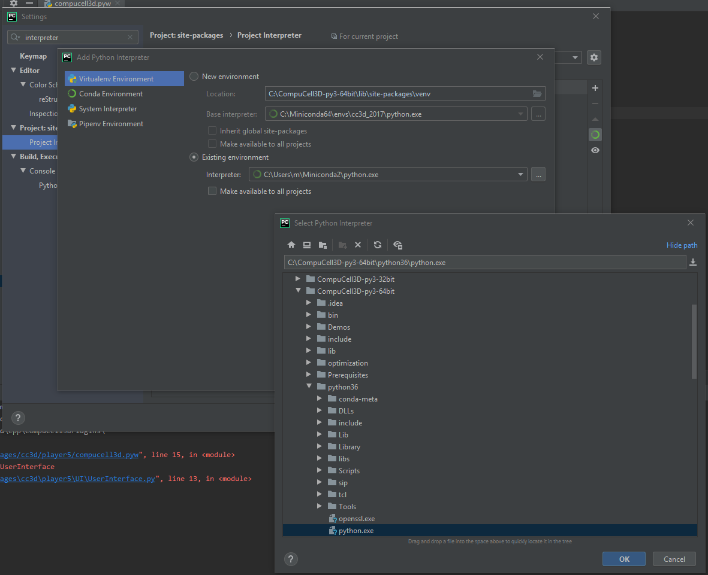

Running and Debugging CC3D Simulations Using PyCharm
=====================================================

Twedit++ provides many convenience tools when it comes to setting up simulation and also quickly modifying the
content of the simulation using provided code helpers (see Twedit's CC3D Python and CC3D XML menus). Twedit also
allows rapid creation of CC3D C++ plugins and steppables (something we cover in a separate developer's manual).
However, as of current version, Twedit++ is just a code editor not an Integrated Development Environment (**IDE**).
A real development environment offers many convenience features that make development faster. In this chapter we will
teach you how to set up and use PyCharm to debug and quickly develope CC3D simulations. The ability of stepping up
through simulation code is essential during simulation development. There you can inspect every single variable
without using pesky **print** statements. You can literally see how your simulation is executed ,
statement-by-statement. In addition PyCharm provides nice context-based syntax completion so that by typing
few characters from e.g. steppable method name (they do not need to be beginning characters) PyCharm will display
available options, freeing you from memorizing every single method in CompuCell3D API.

First thing we need to do is to download and install PyCharm. Because PyCharm is written in Java
it is available for every single platform. Visit https://www.jetbrains.com/pycharm/download/
and get Community version of PyCharm for your operating system. YOu can also get professional version but you need to
pay for this one so depending on your needs you have to make a choice here. We are using Community version because it
is feature-rich and unless you do a lot of specialized Python development you will be fine with the free option.

After installing and doing basic configuration of PyCharm you are ready to open and configure CC3D to be executed from
the IDE.

Step 1 - opening CC3D code in PyCharm and configuring Python environment
------------------------------------------------------------------------

To open CC3D code in Pycharm,  navigate to ``File->Open...`` and go to the folder where you installed CC3D and
open the following subfolder <CC3D_install_folder>/lib/site-packages. In my case CC3D is installed in ``c:\CompuCell3D-py3-64bit\``
so I am opening ``c:\CompuCell3D-py3-64bit\lib\site-packages\``

.. figure:: images/pycharm_win_01.png
    :alt: Opening ``site-packages`` subfolder from CC3D installation directory

After you choose ``site-packages`` folder to open you may get another prompt that will ask you whether to open this
folder in new window or attach to current window. Choose ``New Window`` option:

.. figure:: images/pycharm_win_02.png
    :alt: Opening ``site-packages`` subfolder in New Window

Next, you should see the following window

.. figure:: images/pycharm_win_03.png
    :alt: Opened site-packages folder

In order to be able to debug CC3D simulations it is best if the ``Demos`` folder (or any folder where you keep your
simulations) also resides under ``site-packages``. Simply copy ``Demos`` folder to ``site-packages folder so that your
you PyCharm Project Explorer looks as follows (left panel in PyCharm) - see ``Demos`` directory listed under ``cc3d``:

.. figure:: images/pycharm_win_04.png
    :alt: Copying ``Demos`` folder to ``site-packages``

Step 2 - running CC3D simulation from PyCharm. Configuring Python Environment and PREFIX_CC3D
----------------------------------------------------------------------------------------------

At this point we may attempt to run Player from PyCharm. To do so we expand ``cc3d`` folder in the left PyCharm
panel and navigate to ``cc3d->player5->compucell3d.pyw`` and first we double-click to open ``compucell3d.pyw``
script in the editor and then ``right-click`` to open up a context menu and from there we choose
``Run "compucell3d.pyw"`` as shown below:

.. figure:: images/pycharm_win_05.png
    :alt: Copying ``Demos`` folder to ``site-packages``

After we choose this option most likely we will get an error that will indicate that we need to set up Python
environment to run CC3D in PyCharm.

The actual error message might look different from the one shown below but regardless of it we need to setup
proper Python environment inside Pycharm that we will use to run CC3D.
Note, setting up environment is a task that you do only once because PyCharm remembers the environments
you set up and it also remembers settings with which you ran particular projects and scripts. Setting up
Python environment is actually quite easy because CompuCell3D ships with fully functional Python environment and
in fact all we need to do is to point PyCharm where Python executable that CC3D uses is located. To do so we
open up PyCharm Settings by going to ``File->Settings`` (or ``PyCharm->Preferences...`` if you are on Mac) and in
the the search box of the Preferences dialog we type interpreter and select ``Project Interpreter`` option
in the left panel:

Next we click Gear box in the top right and the pop-up mini-dialog with ``Add..`` option opens up:

We select ``Add..`` and this brings us to the dialog where we configure point PyCharm to the Python executable
we would like to use to run CC3D:

In this dialog we make sure to select options ``Virtualenv Enviropnment`` and check ``Existing Environment``
radio-box and then select correct Python interpreter executable. In my case it is located in
``c:\CompuCell3D-py3-64bit\python36\python.exe`` and if you are on e.g. osx or linux you will need to navigate to
``<COMPUCELL3D_INSTALL_FOLDER>/Python3.x/bin/python`` :

After we make a selection of the interpreter your ``Add Python Interpreter`` dialog should look as follows:

.. figure:: images/pycharm_win_10.png
    :alt: Selecting Python interpreter - done

after we click ``OK`` PyCharm will scan the intepreter content for installed packages and display those packages in the
dialog window:

Note, scanning may take a while so be patient. PyCharm will display progress bar below

.. figure:: images/pycharm_win_12.png
    :alt: Selecting Python interpreter - done

and after it is done we may rerun ``compucell3d.pyw`` main script again. This time we will use PyCharm's
convenience ``Run`` button located in the upper-right corner:

.. figure:: images/pycharm_win_13.png
    :alt: Running cc3d using ``Run`` button

And, yes, we will get an error that tells us that we need to set environment variable ``PREFIX_CC3D``

The ``PREFIX_CC3D`` is the path to the folder where you installed CC3D to set it up within PyCharm we open
pull-down menu next to the ``Run`` button and choose ``Edit Configurations...``:

.. figure:: images/pycharm_win_15.png
    :alt: Edit Configurations...

and the following dialog will open up:

We select Environment Variables pull-down menu by clicking the icon in the right-end of the ``Environment Variables``
line and the following dialog will open up:

We click `+` icon on the right of the dialog and input there ``PREFIX_CC3D`` as the name of the
environment variable and ``c:\CompuCell3D-py3-64bit\`` as its value.

.. figure:: images/pycharm_win_18.png
    :alt: Environment Variables Editing

We click ``OK`` buttons and retry running CC3D again. This time Player should open up:

.. figure:: images/pycharm_win_18.png
    :alt: Player opens up

We are done with configuring PyCharm. This section seem a bit long due to number of screenshots we present
but once you perform those tasks 2-3 times they will become a second nature and you will be ready to explore what
PyCharm has to offer and it does offer quite a lot. Time for next section

Step 3 - Debugging (stepping through) CC3D simulation and exploring other PyCharm features
-------------------------------------------------------------------------------------------

All the hard work you have done so far will pay up in this section. We will show you how to step through
simulation, how to inspect variables, how to fix errors, how to quickly type steppable code using
PyCharm syntax completion and autoformat your code. Let us start with debugging first

Debugging Simulation
~~~~~~~~~~~~~~~~~~~~

To Debug a simulation we open CompuCell3D in the debug mode by clicking ``Debug`` located to the right of the
``Run`` button:

.. figure:: images/pycharm_win_13.png
    :alt: Player opens in the debug mode

The player will open up. You may start the simulation by pressing ``Step`` button on the player. While the
simulation is running we would like to inspect actual variable inside Python steppable. To to so we
open up a simulation script we want to debug. In my case I will open simulation in
``c:\CompuCell3D-py3-64bit\lib\site-packages\Demos\Models\cellsort\cellsort_2D_growing_cells_mitosis_using_steppable\``
and in particular I would like to step through every single line of the steppable. So I open the steppable
``c:\CompuCell3D-py3-64bit\lib\site-packages\Demos\Models\cellsort\cellsort_2D_growing_cells_mitosis_using_steppable\Simulation\cellsort_2D_field_modules.py``
in PyCharm editor.

Next,

.. |pycharm_win_01| image:: images/pycharm_win_01.png
   :width: 4.2in
   :height: 4.8in

.. |pycharm_win_02| image:: images/pycharm_win_02.png
   :width: 4.in
   :height: 0.6in

.. |pycharm_win_03| image:: images/pycharm_win_03.png
   :width: 5.8n
   :height: 3.3in

.. |pycharm_win_04| image:: images/pycharm_win_04.png
   :width: 4.8n
   :height: 3.0in

.. |pycharm_win_05| image:: images/pycharm_win_05.png
   :width: 4.5n
   :height: 5.5in

.. |pycharm_win_10| image:: images/pycharm_win_10.png
   :width: 4.3n
   :height: 1.4in

.. |pycharm_win_12| image:: images/pycharm_win_12.png
   :width: 7.0n
   :height: 0.7in

.. |pycharm_win_13| image:: images/pycharm_win_13.png
   :width: 1.8n
   :height: 0.6in

.. |pycharm_win_15| image:: images/pycharm_win_15.png
   :width: 1.7n
   :height: 0.9in

.. |pycharm_win_18| image:: images/pycharm_win_18.png
   :width: 2.6n
   :height: 2.0in

.. |pycharm_win_19| image:: images/pycharm_win_19.png
   :width: 7.7n
   :height: 5.3in

