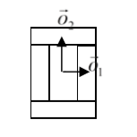
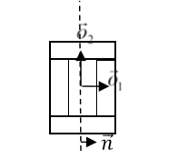
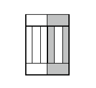

Dividing Clusters (aka compartmental cells)
===========================================

Related: `Compartmentalized Cells, ContactInternal Plugin, and related XML <compartments.html>`_

In compartmental models, a single cell is actually composed of several compartments.
Each compartment is somewhat like an individual cell in that its behaviors
can be specified independently, yet all the compartments can be treated as a single entity called a "cluster." 
A cluster is a collection of compartment cells with the same ``clusterId``. If you use "simple" (non-compartmentalized) cells, then you can check that each such cell has a distinct id and clusterId. 
An example simulation can be found in ``CompuCellPythonTutorial/clusterMitosis``.

Let’s look at how we can divide "compact," that is, "blob-shaped," clusters.

.. code-block:: python

    from cc3d.core.PySteppables import *

    class MitosisSteppableClusters(MitosisSteppableClustersBase):

        def __init__(self, frequency=1):
            MitosisSteppableClustersBase.__init__(self, frequency)

        def step(self, mcs):

            for cell in self.cell_list:
                cluster_cell_list = self.get_cluster_cells(cell.clusterId)
                print("DISPLAYING CELL IDS OF CLUSTER ", cell.clusterId, "CELL. ID=", cell.id)
                for cell_local in cluster_cell_list:
                    print("CLUSTER CELL ID=", cell_local.id, " type=", cell_local.type)

            mitosis_cluster_id_list = []
            for compartment_list in self.clusterList:
                # print( "cluster has size=",compartment_list.size())
                cluster_id = 0
                cluster_volume = 0
                for cell in CompartmentList(compartment_list):
                    cluster_volume += cell.volume
                    cluster_id = cell.clusterId

                # condition under which cluster mitosis takes place
                if cluster_volume > 250:
                    # instead of doing mitosis right away we store ids for clusters which should be divide.
                    # This avoids modifying cluster list while we iterate through it
                    mitosis_cluster_id_list.append(cluster_id)

            for cluster_id in mitosis_cluster_id_list:

                self.divide_cluster_random_orientation(cluster_id)

                # # other valid options - to change mitosis mode leave one of the below lines uncommented
                # self.divide_cluster_orientation_vector_based(cluster_id, 1, 0, 0)
                # self.divide_cluster_along_major_axis(cluster_id)
                # self.divide_cluster_along_minor_axis(cluster_id)

        def update_attributes(self):
            # compartments in the parent and child clusters are
            # listed in the same order so attribute changes require simple iteration through compartment list
            compartment_list_parent = self.get_cluster_cells(self.parent_cell.clusterId)

            for i in range(len(compartment_list_parent)):
                compartment_list_parent[i].targetVolume /= 2.0
            self.clone_parent_cluster_2_child_cluster()

The steppable is quite similar to the mitosis steppable which works for
non-compartmental cells. This time, after mitosis happens, you
have to reassign properties of ``children`` compartments and of ``parent``
compartments which usually means iterating over a list of compartments.
Conveniently, this iteration is quite simple, and ``SteppableBasePy`` class
has a convenience function called ``get_cluster_cells`` which returns a list of cells
belonging to a cluster with a given clusterId:

.. code-block:: python

    compartment_list_parent = self.get_cluster_cells(self.parent_cell.clusterId)

The call above returns a list of cells in a cluster with ``clusterId``
specified by ``self.parent_cell.clusterId``. In the subsequent for-loop, we
iterate over a list of cells in the parent cluster and assign appropriate
values of volume constraint parameters. Notice that
``compartment_list_parent`` is indexable (ie. we can access directly any
element of the list provided our index is not out of bounds).

.. code-block:: python

    for i in range(len(compartment_list_parent)):
        compartment_list_parent[i].targetVolume /= 2.0

Notice that nowhere in the update attribute function we have modified
cell types. This is because, by default, the cluster mitosis module assigns
cell types to all the cells of the child cluster and it does it in such a
way that the child cell looks like a quasi-clone of the parent cell.

The next call in the ``update_attributes`` function is
``self.clone_parent_cluster_2_child_cluster()``. This copies all the attributes
of the cells in the parent cluster to the corresponding cells in the
child cluster. If you would like to copy attributes from parent to child
cell skipping select ones you may use the following code:

.. code-block:: python

    compartment_list_parent = self.get_cluster_cells(self.parent_cell.clusterId)

    compartment_lis_child = self.get_cluster_cells(self.child_cell.clusterId)

    self.clone_cluster_attributes(source_cell_cluster=compartment_list_parent,
                                target_cell_cluster=compartment_list_child,
                                no_clone_key_dict_list=['ATTR_NAME_1', 'ATTR_NAME_2'])

where ``clone_cluster_attributes`` function allows specification of this
attributes are not to be copied (in our case ``cell.dict`` members
``ATTR_NAME_1`` and ``ATTR_NAME_2`` will not be copied).

Finally, if you prefer manually setting the parent and child cells, you
would use the following code:

.. code-block:: python

    class MitosisSteppableClusters(MitosisSteppableClustersBase):

        def __init__(self, frequency=1):
            MitosisSteppableClustersBase.__init__(self, frequency)

        def step(self, mcs):

            for cell in self.cell_list:
                cluster_cell_list = self.get_cluster_cells(cell.clusterId)
                print("DISPLAYING CELL IDS OF CLUSTER ", cell.clusterId, "CELL. ID=", cell.id)
                for cell_local in cluster_cell_list:
                    print("CLUSTER CELL ID=", cell_local.id, " type=", cell_local.type)

            mitosis_cluster_id_list = []
            for compartment_list in self.clusterList:
                # print( "cluster has size=",compartment_list.size())
                cluster_id = 0
                cluster_volume = 0
                for cell in CompartmentList(compartment_list):
                    cluster_volume += cell.volume
                    cluster_id = cell.clusterId

                # condition under which cluster mitosis takes place
                if cluster_volume > 250:
                    # instead of doing mitosis right away we store ids for clusters which should be divide.
                    # This avoids modifying cluster list while we iterate through it
                    mitosis_cluster_id_list.append(cluster_id)

            for cluster_id in mitosis_cluster_id_list:

                self.divide_cluster_random_orientation(cluster_id)

                # # other valid options - to change mitosis mode leave one of the below lines uncommented
                # self.divide_cluster_orientation_vector_based(cluster_id, 1, 0, 0)
                # self.divide_cluster_along_major_axis(cluster_id)
                # self.divide_cluster_along_minor_axis(cluster_id)

        def updateAttributes(self):

            parent_cell = self.mitosisSteppable.parentCell
            child_cell = self.mitosisSteppable.childCell

            compartment_list_child = self.get_cluster_cells(child_ell.clusterId)
            compartment_list_parent = self.get_cluster_cells(parent_cell.clusterId)

            for i in range(len(compartment_list_child)):
                compartment_list_parent[i].targetVolume /= 2.0

                compartment_list_child[i].targetVolume = compartment_list_parent[i].targetVolume
                compartment_list_child[i].lambdaVolume = compartment_list_parent[i].lambdaVolume

A Python helper for mitosis is available from Twedit++'s code snippets:
``CC3D Python->Mitosis``.

How It Works
***************************

While dividing non-clustered cells is straightforward, doing the same
for clustered cells is more challenging. To divide non-clustered cells
using the directional mitosis algorithm, we construct a line or a plane
passing through the center of mass of a cell and pixels of the cell on one side of the line/plane
end up in the child cell and the rest stays in the parent cell. 
Be sure to use the `PixelTracker plugin <pixel_tracking_plugins.html>`_ with mitosis to enable this pixel manipulation. 
The orientation
of the line/plane can be either specified by the user, or we can use CC3D's
built-in feature to calculate the orientation of the principal
axes and divide either along the minor or major axis.

With compartmental cells, things get more complicated because: 1)
Compartmental cells are composed of many subcells. 2) There can be
different topologies of clusters. Some clusters may look "snake-like"
and some might be compactly packed blobs of subcells. The algorithm
which we implemented in CC3D works in the following way:

1) We first construct a set of pixels containing every pixel belonging
   to a cluster cell. You may think of it as a single “regular” cell.

2) We store volumes of compartments so that we know how big compartments
   should be after mitosis (they will be half of the original volume)

3) We calculate the center of mass of the entire cluster and calculate the vector
   offsets between the center of mass of a cluster and the center of mass of
   particular compartments as in the figure below:

|compartments_fig_7|

**Figure 7**. Vectors :math:`\vec{o}_1` and :math:`\vec{o}_2` show offsets between center of mass of a
cluster and center of mass particular compartments.

4) We pick a division line/plane for parent and child cells with offsets between cluster center of mass (after mitosis)
and center of masses of clusters. We do it according to the formula:

.. math::
   :nowrap:

   \begin{eqnarray}
      \vec{p} = \vec{o} - \frac{1}{2}(\vec{o} \cdot \vec{n})\vec{n}
   \end{eqnarray}

where :math:`\vec{p}` denotes offset after mitosis from the center of mass of child (parent) clusters, :math:`\vec{o}` is the orientation vector before mitosis (see
picture above), and :math:`\vec{n}` is a normalized vector perpendicular to division
line/plane. If we try to divide the cluster along a dashed line as in the picture below:

|compartments_fig_8|

**Figure 8**. Division of cell along dashed line. Notice the orientation of :math:`\vec{n}` .
The offsets after the mitosis for child and parent cell will be
:math:`\vec{p}_1=\frac{1}{2}\vec{o}_1` and :math:`\vec{p}_2=\vec{o}_2` as
expected because both parent and child cells will retain their heights,
but these cells will also become twice as narrow. 

|compartments_fig_9|

**Figure 9**.Child and parent cells after mitosis. 
The parent cell is the one with gray outer compartments. 

The formula given above is heuristic. It gives a fairly simple way of
assigning pixels of child/parent clusters to cellular compartments.
It is not perfect, but the idea is to get the approximate shape of the
cell after the mitosis, and, as the simulation runs, the cell shape will
readjust based on constraints such as adhesion of `focal point
plasticity <focal_point_plasticity.html>`_. Before continuing with mitosis, we check if the center of
masses of the compartments belong to child/parent clusters. If the
center of masses are outside their target pixels, we abandon mitosis
and wait for readjustment of the cell shape, at which point the mitosis
algorithm will pass this sanity check. For certain “exotic” shapes
of cluster shapes, this mitosis algorithm may not work well or
at all. In this case, we would have to write a specialized mitosis
algorithm.

5) We divide clusters and knowing offsets from the child/parent cluster
center of mass we assign pixels to particular compartments. The
assignment is based on the distance of the particular pixel to the center of
masses of clusters. The pixel is assigned to the compartment if
its distance to the center of mass of the compartment is the smallest
as compared to distances between centroids of other compartments. If
the given compartment has reached its target volume and other compartments
are underpopulated, we would assign pixels to other compartments based
on the closest distance criterion. Although this method may result in
some deviation from perfect 50-50 division of compartment volume, the cells will typically readjust their volume after a few MCS.

   |compartments_fig_10|

**Figure 10.** CC3D example of compartmental cell division. See also
*Demos/CompuCellPythonTutorial/clusterMitosis.*

