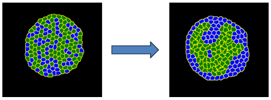

Examples: Cell Sorting
===========================

Try a live demo here: https://nanohub.org/tools/cc3dcellsort

Related: `Contact Plugin <contact_plugin.html>`_

**********************************************

In a randomly mixed aggregate of two embryonic cell types, cells of the same type form clusters, which gradually merge until one cell type forms a sphere in the center of the aggregate, with the other type surrounding it. 

We call this phenomenon cell sorting, and we say that the outer cell type engulfs the inner cell type. 
Cell sorting enables each cell to slide into place according to how easily it maintains contact with surrounding cells. 

Steinberg's Differential Adhesion Hypothesis states:

#. Cell types have a consistent hierarchy of adhesion energies per unit of surface area when they come into contact with their own and other cell types.
#. The cell's adhesivity depends on the number and type of cell adhesion molecules in its membrane. In our simulation, this can be abstracted into a scalar interface value
#. Cells fluctuate randomly within an aggregate
#. Cells don't grow or change their properties during sorting
#. Less adhesive cell types engulf more adhesive cell types

**Tip:** It's important to note that cells can only interact with their immediate vicinity (based on NeighborOrder). 
A cell cannot "see" far away to know that it needs to move closer to a cell to adhere to it.
Thus, it's possible to get unwanted pockets from cell sorting where some cells become trapped (that is, engulfed by the other cell type).

-----------------------------------------------------

Here is one possible set of values for contact energy that will achieve cell sorting:

.. code-block:: xml

    <Plugin Name="Contact">
        <Plugin Name="Contact">
        <Energy Type1="Medium" Type2="Medium">0.0</Energy>
        <Energy Type1="CellA" Type2="CellA">16.0</Energy>
        <Energy Type1="CellB" Type2="CellB">2.0</Energy>
        <Energy Type1="CellA" Type2="CellB">11.0</Energy>
        <Energy Type1="CellA" Type2="Medium">16.0</Energy>
        <Energy Type1="CellB" Type2="Medium">16.0</Energy>
        <NeighborOrder>2</NeighborOrder>
    </Plugin>

Notice that ``CellB`` cells will be most likely to adhere because of the value ``2.0``. 
Meanwhile, ``CellA`` has an equal affinity with other ``CellA`` cells and the Medium; this helps it form a thin membrane around the exterior. 
Finally, the CellA-to-CellB affinity is somewhere between 2 and 16. 
We picked 11.0. 
Choosing contact energy often comes down to trial and error to get the behavior you want. 
