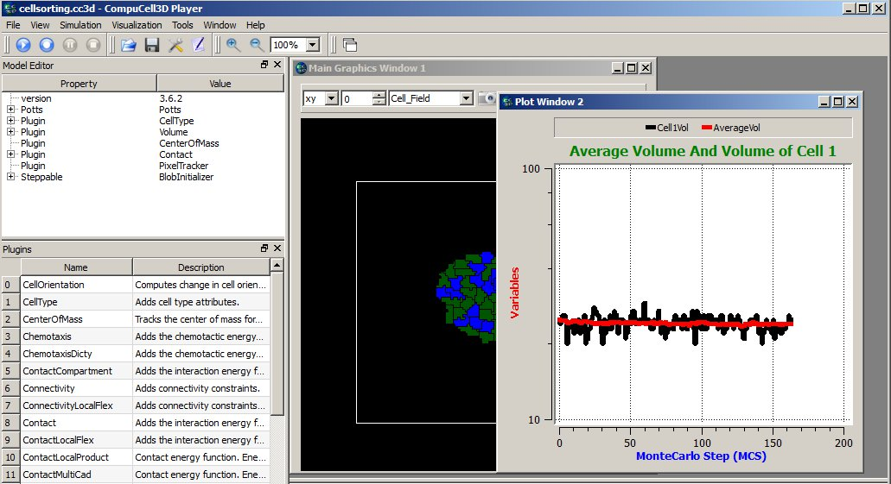

Adding Plots to the Simulation
==============================

Some modelers like to monitor simulation progress by displaying “live”
plots that characterize the current state of the simulation. In CC3D, it is
very easy to add to the Player windows. The best way to add plots is via
Twedit++ CC3D Python->Scientific Plots menu. Take a look at this example code
to get a flavor of what is involved when you want to work with plots in
CC3D:

.. code-block:: python

    class CellSortingSteppable(SteppableBasePy):
        def __init__(self, frequency=1):
            SteppableBasePy.__init__(self, frequency)

        def start(self):
            self.plot_win = self.add_new_plot_window(
                title='Average Volume And Volume of Cell 1',
                x_axis_title='MonteCarlo Step (MCS)',
                y_axis_title='Variables',
                x_scale_type='linear',
                y_scale_type='log',
                grid=True # only in 3.7.6 or higher
            )

            self.plot_win.add_plot("AverageVol", style='Dots', color='red', size=5)
            self.plot_win.add_plot('Cell1Vol', style='Steps', color='black', size=5)

        def step(self, mcs):

            avg_vol = 0.0
            number_of_cells = 0

            for cell in self.cell_list:
                avg_vol += cell.volume
                number_of_cells += 1

            avg_vol /= float(number_of_cells)

            cell1 = self.fetch_cell_by_id(1)
            print(cell1)

            # name of the data series, x, y
            self.plot_win.add_data_point('AverageVol', mcs, avg_vol)
            # name of the data series, x, y
            self.plot_win.add_data_point('Cell1Vol', mcs, cell1.volume)

In the ``start`` function, we create a plot window (``self.plot_win``) – the arguments of
this function are self-explanatory. After we have a plot window object
(``self.plot_win``), we add data to it at every time step. Here, we will plot two
time-series data, one showing the average volume of all cells and one
showing the instantaneous volume of a cell with id 1:

.. code-block:: python

      self.plot_win.add_plot('AverageVol', style='Dots', color='red', size=5)
      self.plot_win.add_plot('Cell1Vol', style='Steps', color='black', size=5)

The first argument is the name of the data series. This name
has two purposes – **1.** It is used in the legend to identify data points
and **2.** It is used as an identifier when appending new data. We can also
specify a logarithmic axis by using ``y_scale_type='log'`` as in the example
above. 

Calling ``add_plot`` multiple times will produce independent plots as long as you name them distinctly. 

In the ``step`` function, we calculate the average volume of all cells and
extract the instantaneous volume of the cell with id ``1``. 
Then, we add that result to the time series:

.. code-block:: python

      # name of the data series, x, y
      self.plot_win.add_data_point('AverageVol', mcs, avg_vol)
      # name of the data series, x, y
      self.plot_win.add_data_point('Cell1Vol', mcs, cell1.volume)

Notice that we are using data series identifiers (``AverageVol`` and
``Cell1Vol``) to add new data. The second argument in the above function
calls is the current Monte Carlo Step (mcs) whereas the third is an actual
quantity that we want to plot on the Y axis. We are done at this point.

The results of the above code may look something like this:

|image12|

Figure 13 Displaying plot window in the CC3D Player with 2 time-series
data.

**Styling**: If you need prettier plots, we recommend saving the data
you need to plot to a separate CSV file, then use a framework like
Seaborn or Matplotlib to refine your plots. 
Plots provided in CC3D are used mainly as a convenience feature and to monitor the current state of the simulation.

Histograms
----------

When using a histogram, you plot a list of data at each time step rather than a single value. 
Numpy has the tools to make this task
relatively simple. An example ``scientificHistBarPlots`` in
CompuCellPythonTutorial demonstrates the use of histograms. Let us look
at the example steppable (you can also find relevant code snippets in
``CC3D Python-> Scientific Plots`` menu):

.. code-block:: python

   from cc3d.core.PySteppables import *
   import random
   import numpy as np
   from pathlib import Path

   class HistPlotSteppable(SteppableBasePy):
       def __init__(self, frequency=1):
           SteppableBasePy.__init__(self, frequency)
           self.plot_win = None

       def start(self):

           # initialize setting for Histogram
           self.plot_win = self.add_new_plot_window(title='Histogram of Cell Volumes', x_axis_title='Number of Cells',
                                                    y_axis_title='Volume Size in Pixels')
           # alpha is transparency 0 is transparent, 255 is opaque
           self.plot_win.add_histogram_plot(plot_name='Hist 1', color='green', alpha=100)
           self.plot_win.add_histogram_plot(plot_name='Hist 2', color='red', alpha=100)
           self.plot_win.add_histogram_plot(plot_name='Hist 3', color='blue')

       def step(self, mcs):

           vol_list = []
           for cell in self.cell_list:
               vol_list.append(cell.volume)

           gauss = np.random.normal(0.0, 1.0, size=(100,))

           self.plot_win.add_histogram(plot_name='Hist 1', value_array=gauss, number_of_bins=10)
           self.plot_win.add_histogram(plot_name='Hist 2', value_array=vol_list, number_of_bins=10)
           self.plot_win.add_histogram(plot_name='Hist 3', value_array=vol_list, number_of_bins=50)

           if self.output_dir is not None:
               output_path = Path(self.output_dir).joinpath("HistPlots_" + str(mcs) + ".txt")
               self.plot_win.save_plot_as_data(output_path, CSV_FORMAT)

               png_output_path = Path(self.output_dir).joinpath("HistPlots_" + str(mcs) + ".png")

               # here we specify size of the image saved - default is 400 x 400
               self.plot_win.save_plot_as_png(png_output_path, 1000, 1000)

In the start function, we call ``self.add_new_plot_window`` to add a new plot
window -``self.plot_win``- to the Player. Subsequently, we specify the display
properties of different data series (histograms). Notice that we can
specify opacity using the ``alpha`` parameter.

In the step function, we first iterate over each cell and append their
volumes to the Python list. Later, we plot a histogram of the array using a very
simple call:

.. code-block:: python

    self.plot_win.add_histogram(plot_name='Hist 2', value_array=vol_list, number_of_bins=10)

Parameters:
 * ``value_array``: holds an unordered collection of data at one time step, such as the volume of 100 cells. 
 * ``number_of_bins``: controls how many "bars" will appear, which can make the plot look more coarse- or fine-grained.

Example: Create a Histogram from a Random Distribution
--------------------------------------------------------------------------------

The following snippet:

.. code-block:: python

        gauss = []
        for i in  range(100):
            gauss.append(random.gauss(0,1))

        (n2, bins2) = numpy.histogram(gauss, bins=10)

declares gauss as Python list and appends to it 100 random numbers which
are taken from Gaussian distribution centered at 0.0 and having standard
deviation equal to 1.0. We histogram those values using the following
code:

.. code-block:: python

    self.plot_win.add_histogram(plot_name='Hist 1' , value_array = gauss ,number_of_bins=10)

When we look at the code in the ``start`` function we will see that this
data series will be displayed using green bars.

Save Plot as an Image
----------------------------------------

At the end of the steppable, we can output the histogram plot as a PNG image file
using:

.. code-block:: python

    self.plot_win.save_plot_as_png(png_output_path, 1000, 1000)

The last two arguments of this function represent the ``x`` and ``y`` sizes of the image. 

The image file will be written in the simulation output directory.

.. note::

   As of writing this manual, we do not support scaling of the plot image output. This might change in a future release. However, we strongly recommend that you save all the data you plot in a separate file and post-process it in a full-featured plotting program.

Save Plot as CSV Data File
----------------------------------------

Finally, for any plot, we can output plotted data in the form of a text
file. All we need to do is to call ``save_plot_as_data`` from the plot windows
object:

.. code-block:: python

    output_path = "HistPlots_"+str(mcs)+".txt"
    self.plot_win.save_plot_as_data(output_path, CSV_FORMAT)

This file will be written in the simulation output directory. You can
use it later to post-process plot data using external plotting software.

How to Improve Plot Performance
----------------------------------------

Create a separate steppable specifically for plotting. 
In your Main Python Script, increase the `frequency <steppable_frequency.html>`_ property of the plot steppable so that it updates less often.

Of course, this plot will not look as smooth for demonstrations; 
it's just an efficient monitoring tool.

.. code-block:: python

    from cc3d import CompuCellSetup
    
    from MyProjectSteppables import MyMainSteppable
    CompuCellSetup.register_steppable(steppable=MyMainSteppable(frequency=1))

    from MyProjectSteppables import UpdatePlotsSteppable
    CompuCellSetup.register_steppable(steppable=UpdatePlotsSteppable(frequency=200))

    CompuCellSetup.run()
