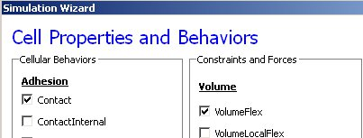

How to use Python in CompuCell3D
================================

The most convenient way to start Python scripting in CC3D is by learning Twedit++. With just few clicks you will be able to create a template of working CC3D simulation which then you can customize to fit your needs. Additionally, each CC3D installation includes examples of simple simulations that demonstrate usage of most important CC3D features and studying these will give you a lot of insight into how to build Python scripts in CC3D.

**Hint:** Twedit++ has CC3D Python Menu which greatly simplifies Python coding in CC3D. Make sure to familiarize yourself with this conveninent tool.

Every CC3D simulation that uses Python consists of the, so called, main Python script. The structure of this script is fairly “rigid” (templated) which implies that, unless you know exactly what you are doing, you should make changes in this script only in few disctinc places, leaveing the rest of the template untouched. The goal of the main Python script is to setup a CC3D simulation and make sure that all modules are initialized in the correct order. Typically, the only place where you, as a user, will modify this script is towards the end of the script where you register your extension modules (steppables and plugins).

Another task of main Python script is to load CC3DML file which contains initial description of cellular behaviors. You may ask, why we need CC3DML file when we are using Python. Wasn’t the goal of Python to replace CC3DML? There are two answers to this question short and long. The short answer is that CC3DML provides the description of INITIAL cell behaviors and we will modify those behaviors as simulation runs using Python. But we still need a starting point for our simulation and this is precisely what CC3DML file provides. If you, however, dislike XML, and would rather not use separate file you can easily convert CC3DML into equivalent Python function – all you have to do is to use Twedit++ context menu. We will come back to this topic later. For now, let’s assume that we will still load CC3DML along with main Python script.

Let us start with simple example. We assume that you have already read “Introduction to CompuCell3D” manual and know how to use Twedit++ Simulation Wizard to create simple CC3D simulation. For completeness, however,  we include here basic steps that you need to follow to generate simulation code using Twedit++.

To invoke the simulation wizard to create a simulation, we click ``CC3DProject->New CC3D Project`` in the menu bar. In the initial screen we specify the name of the model (cellsorting), its storage directory - ``C:\CC3DProjects`` and whether we will store the model as pure CC3DML, Python and CC3DML or pure Python. Here we will use Python and CC3DML.

**Remark:** Simulation code for cellsorting will be generated in ``C:\CC3DProjects\cellsorting``. On Linux/OSX/Unix systems it will be generated in ``<your home directory>/ CC3DProjects/cellsorting``

.. figure:: images/wizard_twedit.png
    :alt: Figure 1 Invoking the CompuCell3D Simulation Wizard from Twedit++.

    Figure 1 Invoking the CompuCell3D Simulation Wizard from Twedit++.

On the next page of the Wizard we specify GGH global parameters, including cell-lattice dimensions, the cell fluctuation amplitude, the duration of the simulation in Monte-Carlo steps and the initial cell-lattice configuration.
In this example, we specify a ``100x100x1`` cell-lattice, i.e., a 2D model, a fluctuation amplitude of 10, a simulation duration of 10000 MCS and a pixel-copy range of 2. ``BlobInitializer`` initializes the simulation with a disk of cells of specified size.

.. figure:: images/image2.jpeg
    :alt: Figure 2 Specification of basic cell-sorting properties in Simulation Wizard.

    Figure 2 Specification of basic cell-sorting properties in Simulation Wizard.

On the next Wizard page we name the cell types in the model. We will use
two cells types: Condensing (more cohesive) and NonCondensing (less
cohesive). CC3D by default includes a special generalized-cell type
Medium with unconstrained volume which fills otherwise unspecified space
in the cell-lattice.

.. figure:: images/image3.jpeg
    :alt: Figure 3 Specification of cell-sorting cell types in Simulation Wizard.

    Figure 3 Specification of cell-sorting cell types in Simulation Wizard.

We skip the Chemical Field page of the Wizard and move to the Cell
Behaviors and Properties page. Here we select the biological behaviors
we will include in our model. **Objects in CC3D have no properties or
behaviors unless we specify then explicitly**. Since cell sorting
depends on differential adhesion between cells, we select the Contact
Adhesion module from the Adhesion section and give the cells a defined
volume using the Volume Constraint module.

    Figure 4 Selection of cell-sorting cell behaviors in Simulation Wizard. [1]_

We skip the next page related to Python scripting, after which
Twedit++-CC3D generates the draft simulation code. Double clicking on
``cellsorting.cc3d`` opens both the CC3DML (``cellsorting.xml``) and Python
scripts for the model.

The structure of generated CC3D simulation code is stored in .cc3d file
(``C:\\CC3DProjects\\cellsorting``):

.. code-block:: xml

    <Simulation version="3.6.2">

        <XMLScript Type="XMLScript">Simulation/cellsorting.xml</XMLScript>

        <PythonScript Type="PythonScript">Simulation/cellsorting.py</PythonScript>

        <Resource Type="Python">Simulation/cellsortingSteppables.py</Resource>

    </Simulation>

``Cellsorting.cc3d`` stores names of the files files that actually implement
the simulation, and most importantly it tells you that both
``cellsorting.xml``, ``cellsorting.py`` and ``cellsortingSteppables.py`` are part of
the same simulation. CompuCell3D analyzes .cc3d file and when it sees
``<PythonScript>`` tag it knows that users will be using Python scripting.
In such situation CompuCell3D opens Python script specified in .cc3d
file (here ``cellsorting.py``) and if user specified CC3DML script using
``<XMLScript>`` tag it loads this CC3DML file as well. In other words, .cc3d
file is used to link Python simulation files together in an unbigous
way. It also creates “root directory” for simulation so that in the
Python or XML code modelrs can refer to file resources using partial
paths i.e. if you store additional files in the Simulation directory you
can refer to them via ``Simulation\\your_file_name`` instead of typing full
path e.g. ``C:\\CC3DProjects\\cellsorting\\Simulation\\your\_file\_name`` .
For more discussion on this topic please see CompuCell Manual.

Let’s first look at a generated Python code:

File: ``C:\\CC3DProjects\\cellsorting\\Simulation\\cellsorting.py``

.. code-block:: python
    :linenos:
    :emphasize-lines: 1,5
    import sys

    from os import environ

    from os import getcwd

    import string

    sys.path.append(environ["PYTHON\_MODULE\_PATH"])

    import CompuCellSetup

    sim,simthread = CompuCellSetup.getCoreSimulationObjects()

    CompuCellSetup.initializeSimulationObjects(sim,simthread)

    #Add Python steppables here

    steppableRegistry=CompuCellSetup.getSteppableRegistry()

    from cellsortingSteppables import cellsortingSteppable

    steppableInstance=cellsortingSteppable(sim,\_frequency=1)

    steppableRegistry.registerSteppable(steppableInstance)

    CompuCellSetup.mainLoop(sim,simthread,steppableRegistry)

The first line line provides access to standard functions and variables
needed to manipulate the Python runtime environment. The next two lines (2, 3),

The import sys line provides access to standard functions and variables
needed to manipulate the Python runtime environment. The next two lines,

from os import environ

from os import getcwd

import environ and getcwd housekeeping functions into the current
*namespace* (*i.e.*, current script) and are included in all our Python
programs. In the next three lines,

import string

sys.path.append(environ["PYTHON\_MODULE\_PATH"])

import CompuCellSetup

we import the string module, which contains convenience functions for
performing operations on strings of characters, set the search path for
Python modules and import the CompuCellSetup module, which provides a
set of convenience functions that simplify initialization of CompuCell3D
simulations.

Next, we create and initialize the core CompuCell3D modules:

sim,simthread = CompuCellSetup.getCoreSimulationObjects()

CompuCellSetup.initializeSimulationObjects(sim,simthread)

We then create a steppable **registry** (a Python **container** that
stores steppables, *i.e.*, a list of all steppables that the Python code
can access) and pass it to the function that runs the simulation. We
also create and register cellsortingSteppable:

steppableRegistry=CompuCellSetup.getSteppableRegistry()

from cellsortingSteppables import cellsortingSteppable

steppableInstance=cellsortingSteppable(sim,\_frequency=1)

steppableRegistry.registerSteppable(steppableInstance)

CompuCellSetup.mainLoop(sim,simthread,steppableRegistry)

Once we open .cc3d file in CompuCell3D the simulation begins to run.When
you look at he console output from this simulation it will look
something like:

|image4|

Figure 5 Printing cell ids using Python script

You may wonder where strings cell.id=1 come from but when you look at
C:\\CC3DProjects\\cellsorting\\Simulation\\cellsortingSteppables.py
file, it becomes obvious:

from PySteppables import \*

import CompuCell

import sys

class cellsortingSteppable(SteppableBasePy):

def \_\_init\_\_(self,\_simulator,\_frequency=1):

SteppableBasePy.\_\_init\_\_(self,\_simulator,\_frequency)

def start(self):

# any code in the start function runs before MCS=0

pass

def step(self,mcs):

#type here the code that will run every \_frequency MCS

for cell in self.cellList:

print "cell.id=",cell.id

def finish(self):

# Finish Function gets called after the last MCS

pass

Inside step function we have the following code snippet:

for cell in self.cellList:

print "cell.id=",cell.id

which prints to the screen id of every cell in the simulation. The step
function is called every Monte Carlo Step (MCS) and therefore after
completion of each MCS you see a list of all cell ids. In addition to
step function you can see start and finish functions which have empty
bodies. Start function is called after simulation have been initialized
but before first MCS. Finish function is called immediately after last
MCS.When writing Pyton extension modules you have flexibility to
implement any combination of these 3 functions (start, step, finish).You
can, of course, leave them unimplemented in which case they will have no
effect on the simulation.

Let’s rephrase it again because this is the essence of Python scripting
inside CC3D - each steppable will contain by default 3 functions:

1) start(self)

2) step(self,mcs)

3) finish(self)

Those 3 functions are imported , via inheritance, from SteppableBasePy
(which in turn imports SteppablePy). The nice feature of inheritance is
that oncve you import functions from base class you are free to redefine
their content in the child class. We can redefine any combination of
these functions. Had we not redefined e.g. finish functions then at the
end simulation the implementation from SteppableBasePy of finish
function would get called (which as you can see is an empty function) .

.. math::

   (a + b)^2 = a^2 + 2ab + b^2

   (a - b)^2 = a^2 - 2ab + b^2

got here

.. [1]
   We have graphically edited screenshots of Wizard pages to save space.
