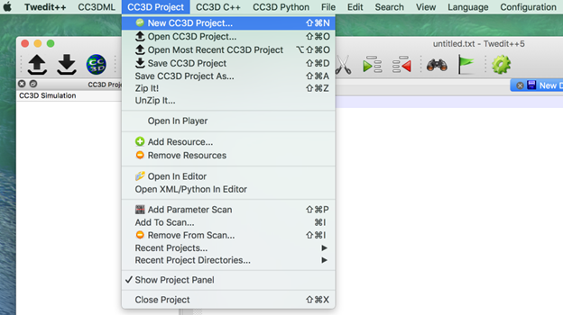
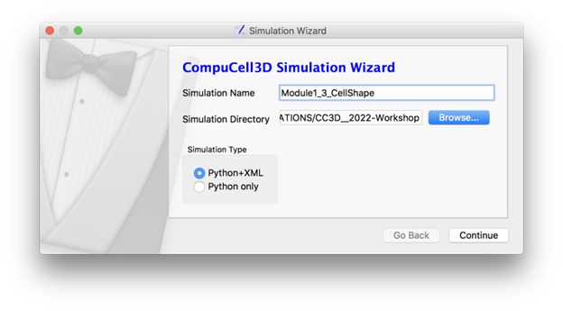
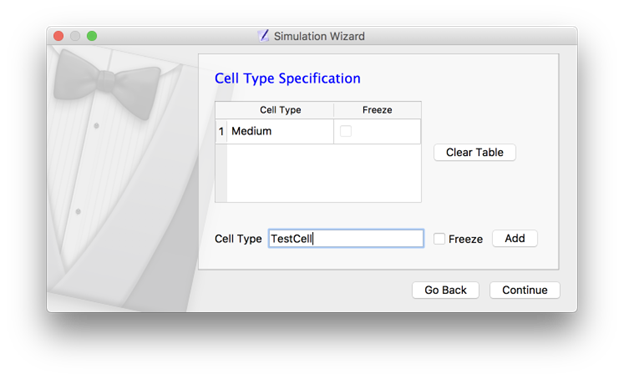
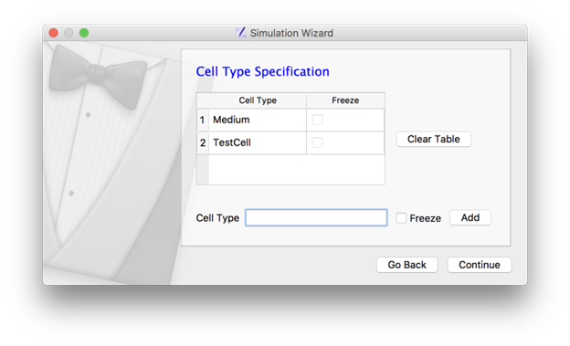
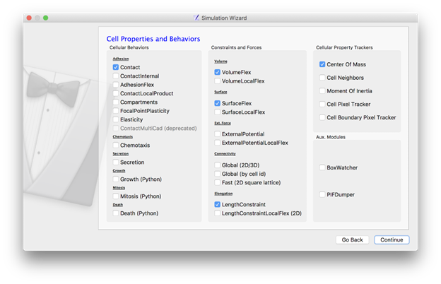
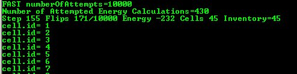

How to use Python in CompuCell3D
================================

Learning Objectives:
   - Set up your first simulation project
   - Take a tour of Twedit++

*****************************************************

Twedit++ makes it easy to write template Python scripts for CC3D with just a few clicks.
Click on either "CC3DML" (CompuCell3D XML) or "CC3D Python", then hover over the menu to find a code snippet. 
It will insert the code wherever your cursor is.

Additionally, each CC3D installation includes a Demos folder with simple simulations.
Studying these will give you a lot of insight into how to build Python scripts in CC3D.

**Which Files Do I edit?**

- **Python Steppables:** The Python code you write will live here. Use this to define custom behaviors that occur as the simulation progresses. The next lesson explains the "steppable" concept more. 

- **Main Python Script:** This sets up the steppables you write, and, typically, you do not need to edit it much. 

- **XML Script:** The CC3DML (CompuCell3D XML) file mostly holds built-in behaviors where less customization is desired. It also contains "initializer" code used to create cells in the beginning. 

Main Python Script
-------------------------------

Every CC3D simulation that uses Python consists of the so-called main Python script. The structure of this script is fairly “rigid” (templated) which implies that, unless you know exactly what you are doing, you should make changes in this script only in a few distinct places, leaving the rest of the template untouched. The goal of the main Python script is to set up a CC3D simulation and make sure that all modules are initialized in the correct order. Typically, the only place where you will modify this script is towards the end of the script where you register your extension modules (steppables and plugins).

Another task of the main Python script is to load the CC3DML file which contains an initial description of cellular behaviors. 

XML Script
-------------------------------

CC3DML provides an *initial* description of cell behaviors, and we will modify those behaviors as simulation runs using Python. 
Many behaviors that can be defined in CC3DML are also available in Python if you prefer to have greater customization. 
All you have to do is to use Twedit++'s snippet menu.

Example: How to Set up a Project
--------------------------------------------------------

To create a new project, click ``CC3DProject->New CC3D Project`` in the menu bar. 
In the first screen of the Simulation Wizard, we specify the name of the model (cellsorting), its storage directory (``C:\CC3DProjects``), and whether we will store the model as pure CC3DML (CC3D XML), Python and CC3DML, or pure Python. 
We recommend always using both Python and XML.

**Remark:** Simulation code for cellsorting will be generated in ``C:\CC3DProjects\cellsorting``. On Linux/OSX/Unix systems, it will be generated in ``<your home directory>/CC3DProjects/cellsorting``

    Figure 1 Select ``CC3DProject->New CC3D Project``

    Figure 1.1 Choose Python+XML in Simulation Wizard.

On the next page of the Wizard, we specify GGH global parameters, including cell-lattice dimensions, the cell fluctuation amplitude, the duration of the simulation in Monte-Carlo steps, and the initial cell-lattice configuration.
In this example, we specify a ``100x100x1`` cell-lattice, *i.e.*, a 2D model, a `fluctuation amplitude (temperature) <potts.html#fluctuation-amplitude>`_ of 10, a simulation duration of 10000 MCS, and a `neighbor order <potts.html#neighbor-order>`_ of 2. ``BlobInitializer`` initializes the simulation with a disk of cells of a specified size.

.. figure:: images/new_sim_wizard_step2.png
    :alt: Figure 2 Specification of basic cell-sorting properties in Simulation Wizard. Change NeighborOrder to ``2``.

    Figure 2 Specification of basic cell-sorting properties in Simulation Wizard. Change NeighborOrder to ``2``.

On the next Wizard page, we name the cell types in the model. We will use
two cell types: Condensing (more cohesive) and NonCondensing (less
cohesive). By default, CC3D includes a special generalized cell type,
**Medium**, with unconstrained volume which fills otherwise unspecified space
in the cell lattice.

    Figure 3 Add a cell type by writing in the name and then clicking 'Add'.

We **skip** the Chemical Field page of the Wizard and move to the Cell
Behaviors and Properties page. Here, we select the biological behaviors
we will include in our model. **Objects in CC3D have no properties or
behaviors unless we specify them explicitly**. Since cell sorting depends on differential adhesion between cells, we select the 
**Contact Adhesion** module from the Adhesion section and give the cells a defined
volume using the **VolumeFlex Constraint** module.

    Figure 4 Selection of cell-sorting cell behaviors in Simulation Wizard. [1]_

Finally, Twedit++ generates the draft simulation code. Double-click on
``cellsorting.cc3d`` to open both the CC3DML (``cellsorting.xml``) and Python
scripts for the model.

The names of the files for the newly-generated CC3D simulation code are stored in the .cc3d file
(``C:\\CC3DProjects\\cellsorting``). 
Whenever you want to **re-open the project**, you should **select the .cc3d file**. 

Besides that, you generally will not need to touch the .cc3d file since CC3D reads it to link the project files together automatically. 
When CC3D sees a ``<PythonScript>`` tag in that file, it knows that you are using Python scripting. 
Likewise, the tag ``<XMLScript>`` signifies that you are using XML. 

---------------------------------------------------------------------

Let’s first look at a generated Python code:

File: ``C:\CC3DProjects\cellsorting\Simulation\cellsorting.py``

.. code-block:: python
    :linenos:

        from cc3d import CompuCellSetup
        from cellsortingSteppables import cellsortingSteppable

        CompuCellSetup.register_steppable(steppable=cellsortingSteppable(frequency=1))

        CompuCellSetup.run()

At the top of the simulation's Main Python Script, we import ``CompuCellSetup`` module from the ``cc3d`` package.
The ``CompuCellSetup`` module has a few helpful functions that are used in setting up the simulation
and starting execution of the CC3D model.

Next, we import newly generated steppable

.. code-block:: python

        from cellsortingSteppables import cellsortingSteppable

.. note::

    If the module from which we import a steppable (here ``cellsortingSteppables``) or the steppable class (here ``cellsortingSteppable``) itself contains the word ``steppable`` (capitalization is not important), we can put ``.`` in front of the module: ``from .cellsortingSteppables import cellsortingSteppable``. This is not necessary, but some development environments (e.g. PyCharm) will autocomplete syntax. This is quite helpful and speeds up the development process.

After this, we register the steppable by instantiating it using the constructor and specifying the frequency with
which it will be called

.. code-block::

    CompuCellSetup.register_steppable(steppable=cellsortingSteppable(frequency=1))

Finally, we start simulation using

.. code-block:: python

    CompuCellSetup.run()

Exercise: Run the Simulation and Print Cell IDs
-----------------------------------------------------------------------

Once we open the .cc3d file in CompuCell3D Player, the simulation begins to run. When
you look at the console output from this simulation, it will look
something like this:

|image4|

Figure 5 Printing cell IDs using Python script

By default, the ``step`` function inside ``cellsortingSteppables.py`` prints the ID of every cell on every time step.

.. code-block:: python

    from cc3d.core.PySteppables import *

    class cellsortingSteppable(SteppableBasePy):

        def __init__(self,frequency=1):
            SteppableBasePy.__init__(self,frequency)

        def start(self):
            """
            any code in the start function runs before MCS=0
            """

        def step(self,mcs):
            """
            type here the code that will run every frequency MCS
            :param mcs: current Monte Carlo step
            """

            for cell in self.cell_list:
                print("cell.id=",cell.id)

        def finish(self):
            """
            Finish Function is called after the last MCS
            """

Inside the step function, we have the following code snippet:

.. code-block:: python

        for cell in self.cell_list:
            print("cell.id=",cell.id)

It prints the ID of every cell in the simulation. 
The step function is called after every Monte Carlo Step (MCS), so you will see
the list print many times. 

**Exercise:** Add an ``if`` statement so that this only prints the cell ID if ``mcs`` is less than 10. 

Essential Python Functions
-----------------------------------------------------------------------

In addition to the step function, you can see ``start`` and ``finish`` functions, which are explained in the next module (`SteppableBasePy class <SteppableBasePy_class.html>`_).

When writing Python extension modules, you have the flexibility to
implement any combination of these 3 functions (``start``, ``step``, and ``finish``).
You can, of course, leave them empty.

These 3 functions form the essence of Python scripting in CC3D:

#. ``start(self)``

#. ``step(self,mcs)``

#. ``finish(self)``

.. [1]
   We cropped the screenshots of Wizard pages to save space.

-------------------------------------------------------------------------

Next Module: `What is a Steppable? (SteppableBasePy class) <SteppableBasePy_class.html>`_.