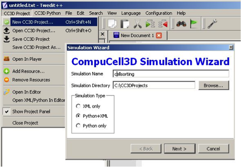
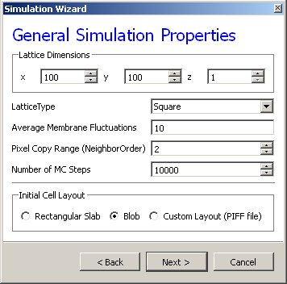

How to use Python in CompuCell3D
================================

The most convenient way to start Python scripting in CC3D is by learning Twedit++. With just few clicks you will be able to create a template of working CC3D simulation which then you can customize to fit your needs. Additionally, each CC3D installation includes examples of simple simulations that demonstrate usage of most important CC3D features and studying these will give you a lot of insight into how to build Python scripts in CC3D.

**Hint:** Twedit++ has CC3D Python Menu which greatly simplifies Python coding in CC3D. Make sure to familiarize yourself with this conveninent tool.

Every CC3D simulation that uses Python consists of the, so called, main Python script. The structure of this script is fairly “rigid” (templated) which implies that, unless you know exactly what you are doing, you should make changes in this script only in few disctinc places, leaveing the rest of the template untouched. The goal of the main Python script is to setup a CC3D simulation and make sure that all modules are initialized in the correct order. Typically, the only place where you, as a user, will modify this script is towards the end of the script where you register your extension modules (steppables and plugins).

Another task of main Python script is to load CC3DML file which contains initial description of cellular behaviors. You may ask, why we need CC3DML file when we are using Python. Wasn’t the goal of Python to replace CC3DML? There are two answers to this question short and long. The short answer is that CC3DML provides the description of INITIAL cell behaviors and we will modify those behaviors as simulation runs using Python. But we still need a starting point for our simulation and this is precisely what CC3DML file provides. If you, however, dislike XML, and would rather not use separate file you can easily convert CC3DML into equivalent Python function – all you have to do is to use Twedit++ context menu. We will come back to this topic later. For now, let’s assume that we will still load CC3DML along with main Python script.

Let us start with simple example. We assume that you have already read “Introduction to CompuCell3D” manual and know how to use Twedit++ Simulation Wizard to create simple CC3D simulation. For completeness, however,  we include here basic steps that you need to follow to generate simulation code using Twedit++.

To invoke the simulation wizard to create a simulation, we click ``CC3DProject->New CC3D Project`` in the menu bar. In the initial screen we specify the name of the model (cellsorting), its storage directory - ``C:\CC3DProjects`` and whether we will store the model as pure CC3DML, Python and CC3DML or pure Python. Here we will use Python and CC3DML.

**Remark:** Simulation code for cellsorting will be generated in ``C:\CC3DProjects\cellsorting``. On Linux/OSX/Unix systems it will be generated in ``<your home directory>/ CC3DProjects/cellsorting``

    Figure 1 Invoking the CompuCell3D Simulation Wizard from Twedit++.

On the next page of the Wizard we specify GGH global parameters, including cell-lattice dimensions, the cell fluctuation amplitude, the duration of the simulation in Monte-Carlo steps and the initial cell-lattice configuration.
In this example, we specify a ``100x100x1`` cell-lattice, i.e., a 2D model, a fluctuation amplitude of 10, a simulation duration of 10000 MCS and a pixel-copy range of 2. ``BlobInitializer`` initializes the simulation with a disk of cells of specified size.

    Figure 2 Specification of basic cell-sorting properties in Simulation Wizard.

On the next Wizard page we name the cell types in the model. We will use
two cells types: Condensing (more cohesive) and NonCondensing (less
cohesive). CC3D by default includes a special generalized-cell type
Medium with unconstrained volume which fills otherwise unspecified space
in the cell-lattice.

.. figure:: images/image3.jpeg
    :alt: Figure 3 Specification of cell-sorting cell types in Simulation Wizard.

    Figure 3 Specification of cell-sorting cell types in Simulation Wizard.

.. math::

   (a + b)^2 = a^2 + 2ab + b^2

   (a - b)^2 = a^2 - 2ab + b^2

got here