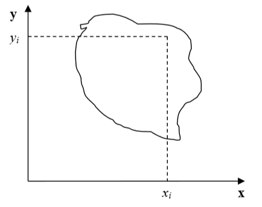
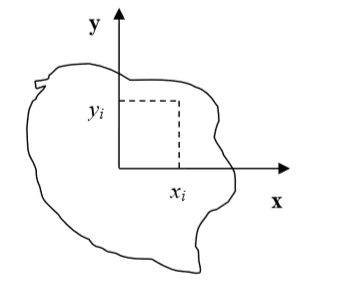
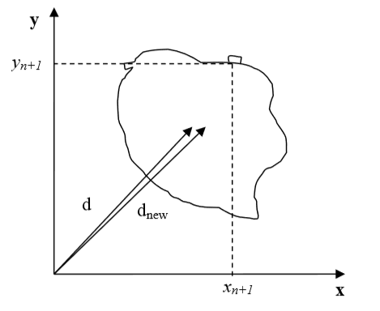

Calculating Inertia Tensor in CC3D
-------------------------------------

Related: `Calculating the Shape Constraint of a Cell – the Elongation Term <calculating_elongation_term.html>`_ and `MomentOfInertia Plugin <moment_of_inertia.html>`_

Learning Objectives:
   - Learn how CC3D calculates diagonal and off-diagonal inertia tensors

Prerequisite: `Wikipedia: What is a Moment of Inertia? <https://en.wikipedia.org/wiki/Moment_of_inertia>`_

*****************************************************

For each cell, the inertia tensor is defined as follows:

.. math::
   :nowrap:

   \begin{eqnarray}

    I = \begin{bmatrix}
    \sum_i y_i^2+z_i^2 & -\sum_i x_i y_i & -\sum_i x_i z_i \\
    -\sum_i x_i y_i & \sum_i x_i^2+z_i^2 & -\sum_i y_i z_i \\
    -\sum_i x_i z_i & -\sum_i  y_i z_i & \sum_i x_i^2+y_i^2 \\
    \end{bmatrix}
   \end{eqnarray}

where index :math:`i` denotes ``i-th`` pixel of a given cell and :math:`x_i`,
:math:`y_i` and :math:`z_i` are coordinates of that pixel in a given
coordinate frame.

|inertia_tensor_fig3|

**Figure 3:** Cell and coordinate system passing through the center of mass of a cell.
Notice that as the cell changes shape, the position of the center of mass moves.

|inertia_tensor_fig4|

**Figure 4:** Cell and its coordinate frame in which we calculate inertia tensor

In Figure 4, we show one possible coordinate frame in which one can
calculate the inertia tensor. If the coordinate frame is fixed calculating
components of inertia tensor for cell gaining or losing one pixel is
quite easy. We will be adding and subtracting terms like :math:`y_i^2+z_i^2` or :math:`x_i z_i`.

However, in CompuCell3D, we are mostly interested in knowing the tensor of
inertia of a cell with respect to the ``xyz`` coordinate frame with origin at
the center of mass (*COM*) of a given cell as shown in Figure 3. Now, to
calculate this tensor, we cannot simply add or subtract terms :math:`y_i^2+z_i^2` or :math:`x_i z_i` to
account for a lost or gained pixel. If a cell gains or loses a pixel, its
``COM`` coordinates change. If so, then all the :math:`x_i`,:math:`y_i`, :math:`z_i`
coordinates that appear in the inertia tensor
expression will have different values. Thus, for each change in cell shape
(gain or loss of pixel) we would have to recalculate the inertia tensor from
scratch. This would be quite time consuming and would require us to keep
track of all the pixels belonging to a given cell. It turns out, however,
that there is a better way of keeping track of inertia tensor for cells.

We will be using the parallel axis theorem to do the calculations. The parallel
axis theorem states that if :math:`I_{COM}` is a moment of inertia with
respect to the axis passing through the center of mass, then we can calculate
moment of inertia with respect to any parallel axis to the one passing
through the COM by using the following formula:

.. math::
   :nowrap:

   \begin{eqnarray}
        I_{x'x'} = I_{xx} + Md^2
   \end{eqnarray}

where :math:`I_{xx}` denotes moment of inertia with respect to ``x`` axis passing through
center of mass, :math:`I_{x'x'}` is a moment of inertia with respect to some other axis parallel to
the ``x`` , ``d`` is the distance between the axes two and ``M`` is mass of the cell.

Let us now draw a picture of a cell gaining one pixel:

|inertia_tensor_fig5|

**Figure 5:** Cell gaining one pixel denotes a distance from the origin of a fixed frame
of reference to the center of mass of a cell before the cell gains a new pixel.
:math:`d_{new}` denotes the same distance but after the cell gains a new pixel

Now, using the parallel axis theorem, we can write an expression for the moment
of inertia after the cell gains one pixel:

.. math::
   :nowrap:

   \begin{eqnarray}
        I_{xx}^{new} = I_{x'x'}^{new} - (V+1)d_{new}^2
   \end{eqnarray}

where, as before, :math:`I_{xx}^{new}` denotes the moment of inertia of a cell with a new pixel with
respect to ``x`` axis passing through the center of mass, :math:`I_{x'x'}^{new}` is a moment of
inertia with respect to an axis parallel to the ``x`` axis that passes through the 
center of mass, :math:`d_{new}` is the distance between the axes, and
:math:`V+1` is the volume of the cell **after** it gained one pixel. Now, let us
rewrite the above equation by adding and subtracting the :math:`Vd^2` term:

.. math::
   :nowrap:

   \begin{eqnarray}
        I_{xx}^{new} = I_{x'x'}^{old} + y_{n+1}^2 + z_{n+1}^2 - Vd^2 + Vd^2 (V+1)d_{new}^2 \\
        = I_{x'x'}^{old} - Vd^2 + y_{n+1}^2 + z_{n+1}^2 + Vd^2 (V+1)d_{new}^2 \\
        I_{xx}^{old} - Vd^2 + y_{n+1}^2 + z_{n+1}^2 + Vd^2 (V+1)d_{new}^2
   \end{eqnarray}

Therefore, we have found an expression for the moment of inertia passing
through the center of mass of the cell with the additional pixel. Note that
this expression involves a moment of inertia for the old cell (*i.e*.
the original cell, not the one with extra pixel). When we add a new pixel,
we know its coordinates and we can also easily calculate :math:`d_new` .
Thus, when we need to calculate the moment of inertia for a new cell,
instead of performing summation as given in the definition of the
inertia tensor, we can use a much simpler expression.

*****************************************************

This was a diagonal term of the inertia tensor. What about off-diagonal
terms? Let us write an explicit expression for :math:`I_{xy}` :

.. math::
   :nowrap:

   \begin{eqnarray}
        I_{xy} = -\sum_i^N (x_i-x_{com})(y_i-y_{com}) = -\sum_i^N x_i y_i + x_{COM}\sum_i^Ny_i + y_{COM}\sum_i^Nx_i - x_{COM}y_{COM}\sum_i^N \\
        =  -\sum_i^N x_i y_i + x_{COM}Vy_{COM} + y_{COM}Vx_{COM} - x_{COM}y_{COM} V \\
        = -\sum_i^N x_i y_i + V x_{COM}y_{COM}
   \end{eqnarray}

where :math:`x_{COM}`, :math:`y_{COM}` denote ``x`` and ``y`` center of mass positions of the cell,
:math:`V` denotes cell volume. In the above formula, we have used the fact that:

.. math::
   :nowrap:

   \begin{eqnarray}
      x_{COM} = \frac{\sum_i x_i}{V} \implies \sum_i x_i =  x_{COM} V
   \end{eqnarray}

and similarly for the ``y`` coordinate.

Now, for the new cell with an additional pixel, we have the following
relation:

.. math::
   :nowrap:

   \begin{eqnarray}
      I_{xy}^{new} = - \sum_i^{N+1} x_i y_i + (V+1)x^{new}_{COM}y^{new}_{COM} \\
      = - \sum_i^{N} x_i y_i +  V x_{COM}y_{COM} -   x_{COM}Vy_{COM} + (V+1)x^{new}_{COM}y^{new}_{COM} - x_{N+1}y_{n+1} \\
      = I_{xy}^{old} - V x_{COM}y_{COM} + (V+1)x^{new}_{COM}y^{new}_{COM} - x_{N+1}y_{n+1}
   \end{eqnarray}

where we have added and subtracted :math:`V x_{COM}y_{COM}` to be able to form :math:`I_{xy}^{old}- \sum_i^{N} x_i y_i+ V x_{COM}y_{COM}`
on the right hand side of the expression for :math:`I_{xy}^{new}` . As was the case for the diagonal element,
calculating an off-diagonal of the inertia tensor involves ::math`I_{xy}^{old}` and the 
center of mass of the cell before and after gaining a new pixel. All those
quantities are either known *a priori* (::math`I_{xy}^{old}`) or can be easily calculated
(center of mass position after gaining one pixel).

We have shown how we can calculate the tensor of inertia for a
given cell with respect to a coordinate frame with origin at a cell's
center of mass, without evaluating full sums. Such "local" calculations
greatly speed up simulations.

