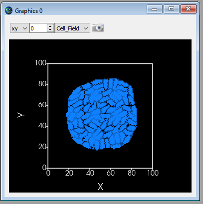

LengthConstraint Plugin
-----------------------

This plugin imposes an elongation constraint on the cell. It
“measures” a cell along its “axis of elongation” and ensures that the cell
length along the elongation axis is close to the target length. For detailed
description of this algorithm in 2D see Roeland Merks' paper “Cell
elongation is a key to in silico replication of in vitro vasculogenesis
and subsequent remodeling” Developmental Biology **289** (2006) 44-54).
This plugin is usually used in conjunction with the Connectivity Plugin or
ConnectivityGlobal Plugin. 

The syntax is as follows:

.. code-block:: xml

    <Plugin Name="LengthConstraint">
        <LengthEnergyParameters CellType="Body1" TargetLength="30" LambdaLength="5"/>
    </Plugin>

``LambdaLength`` determines the degree of cell length oscillation around
``TargetLength`` parameter. The higher ``LambdaLength`` the less freedom a cell
will have to deviate from ``TargetLength``.

In the 3D case, we use the following syntax:

.. code-block:: xml

    <Plugin Name="LengthConstraint">
         <LengthEnergyParameters CellType="Body1" TargetLength="20" MinorTargetLength="5" LambdaLength="100" />
    </Plugin>

Notice a new attribute called ``MinorTargetLength``. In 3D it is not
sufficient to constrain the "length" of the cell you also need to
constrain the "width" of the cell along an axis perpendicular to the major axis
of the cell. This "width" is referred to as ``MinorTargetLength``.

The parameters are assigned using Python – see *Demos/elongationFlexTest* example.

To control length constraint individually for each cell we may use
Python scripting to assign ``LambdaLength``, ``TartgetLength`` and in 3D
``MinorTargetLength``. In Python steppable we typically would write the
following code:

.. code-block:: python

    self.lengthConstraintPlugin.setLengthConstraintData(cell,10,20)

which sets length constraint for ``cell`` by setting ``LambdaLength=10`` and
``TargetLength=20``. In 3D we may specify`` MinorTargetLength`` (we set it to 5)
by adding 4\ :sup:`th` parameter to the above call:

.. code-block:: python

    self.lengthConstraintPlugin.setLengthConstraintData(cell,10,20,5)

.. note::

    If we use CC3DML specification of length constraint for
    certain cell types and in Python we set this constraint individually for
    a single cell then the local definition of the constraint has priority
    over definitions for the cell type.

If, in the simulation, we will be setting length constraints for only a few
individual cells then it is best to manipulate the constraint parameters
from the Python script. In this case, in the CC3DML we only have to
declare that we will use a length constraint plugin and we may skip the
definition by-type definitions:

.. code-block:: xml

    <Plugin Name="LengthConstraint"/>

.. note::

    **IMPORTANT**: When using target length, plugins it is important to use
    the connectivity constraint. This constraint will check if a given pixel
    copy breaks cell connectivity. If it does, the plugin will add a large
    energy penalty (defined by a user) to change energy effectively,
    prohibiting such pixel copy. In the case of 2D on square lattice
    checking cell connectivity can be done locally and thus is very fast.
    In 3D the connectivity algorithm is a bit slower but its performance is
    acceptable. Therefore if you need large cell elongations you should always use connectivity in order to
    prevent cell fragmentation

Here's how a cluster of elongated cells might look:

