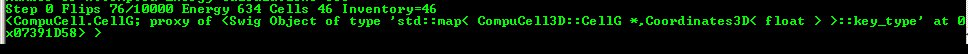

Looping over select cell types. Finding cell in the inventory.
===============================================================

We have already see how to iterate over list of all cells. However,
quite often we need to iterate over a subset of all cells e.g. cells of
a given type. The code snippet below demonstrates howto accomplish such
task (in Twedit++ go to ``CC3D Python->Visit->All Cells of Given Type``):

.. code-block:: python

    for cell in self.cell_list_by_type(self.CONDENSING):
        print("id=", cell.id, " type=", cell.type)

As you can see ``self.cell_list`` is replaced with
``self.cell_list_by_type(self.CONDENSING)`` which limits the integration to only
those cells which are of type Condensing. We can also choose several
cell types to be included in the iteration. For example the following
snippet

.. code-block:: python

    for cell in self.cell_list_by_type(self.CONDENSING, self.NONCONDENSING):
        print("id=", cell.id, " type=", cell.type)

will make CC3D visit cells of type Condensing and NonCondensing. The
general syntax is:

.. code-block:: python

    self.cell_list_by_type(cellType1, cellType2, ...)

Occasionally we may want to fetch from a cell inventory a cell object
with specific a cell id. This is how we do it (``CC3D Python -> Cell Manipulation->Fetch Cell By Id``):

.. code-block:: python

    cell = self.fetch_cell_by_id(10)
    print(cell)

The output of this code will look as shown below:

|image11|

Figure 12 Fetching cell with specified id

Function ``self.fetch_cell_by_id`` will return cell object with
specified cell id if such object exists in the cell inventory. Otherwise
it will return ``Null`` pointer or ``None`` object. In fact, to fully identify a
cell in CC3D we need to use cell id and cluster. However, when we are
not using compartmentalized cells single id , as shown above,
insufficient. We will come back to cell ids and cluster ids later in
this manual.

