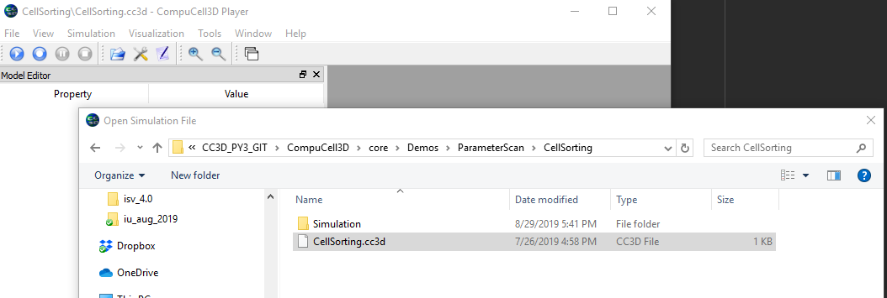
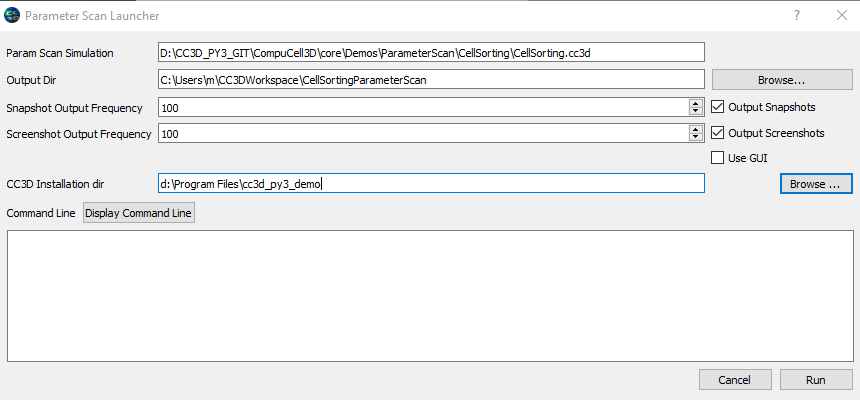
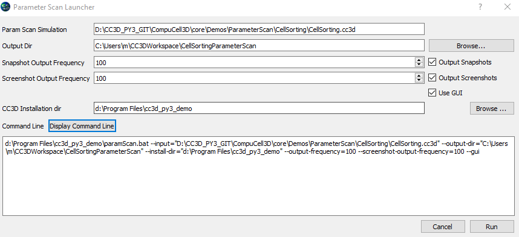

Parameter Scans
===============

.. note::

   Specification of parameter scans in version 4.x.x is different than in earlier versions. In particular old parameter scan simulations will not run in 4.x but as you will see the new way of specifying paramter scans is much simpler and less laborious than in previous implementations.

When building biomedical simulations it is a common practice to explore
parameter space to search for optimal solution or to study the
robustness of parameter set at hand. In the past researchers have used
(or abused) Python to run multiple replicas of the same simulation with
different parameter set for each run. Because this approach usually
involved writing some kind of Python wrapper on top of existing CC3D
code, more often than not it led to hard-to-understand codes which were
difficult to share and were hard to access by non-programmers.

Current version of CC3D attempts to solve these issues by offering users
ability to create and run parameter scans directly from CC3D GUI’s or
from command line. The way in which parameter scan simulation is run is
exactly the same as for “regular”, single-run simulation.

Implementation of parameter scans requires users to write simple JSON
file with parameter scan specification and replacing
actual values in the CC3DML or Python scripts with template markers.
Let us look at the example simulation in ``Demos/ParameterScan/CellSorting``.
The parameter scan specification file ``ParameterScanSpecs.json`` looks as follows:

.. code-block:: json

   {
       "version":"4.0.0",
       "parameter_list":{
           "y_dim":{
               "values":[65,110,120]
           },
           "steps":{
               "values":[2,3,4,5,6]
           },
           "MYVAR":{
               "values":[0,1,2]
           },
           "MYVAR1":{
               "values":["'abc1,abc2'","'abc'"]
           }
       }
   }

the syntax is fairly simple and if you look closely it is essentially syntax of nested Python dictionaries
At the top-level we specify ``version`` and ``parameter_list`` entries. The latter one stores several entries
each for the parameter we wish to scan.. in our example we will be changing parameter ``y_dim`` - assigning
values from the following list: ``[65,110,120]``, parameter ``steps`` with values  specified by ``[2,3,4,5,6]``,
``MYVAR`` , that will take values from list ``[0,1,2]`` and ``MYVAR1`` , taking values from ``["'abc1,abc2'","'abc'"]``. As you can see, the values we assign can be either numbers or strings.

Next, we need to indicate which parameters in the CC3DML and Python files are to be replaced with values
specified in ``ParameterScanSpecs.json``. Let's start with analysing CC3DML script:

.. code-block:: xml

   <CompuCell3D version="4.0.0">

      <Potts>
         <Dimensions x="100" y="{{y_dim}}" z="1"/>
         <Steps>{{steps}}</Steps>
         <Temperature>10.0</Temperature>
         <NeighborOrder>2</NeighborOrder>
      </Potts>

   ...
   </CompuCell3D>

Here in the ``Potts`` section we can see two labels that appeared in ``ParameterScanSpecs.json`` - ``{{y_dim}}`` and
``{{steps}}``.  they are surrounded in double curly braces to allow templating engine to make substitutions i.e. ``{{y_dim}}`` will be replaced with appropriate value from ``[65,110,120]`` list and, similarly, ``{{steps}}``
will take values from ``[2,3,4,5,6]``.

The remaining two parameters ``MYVAR`` and ``MYVAR1`` will be used to make substitutions in Python steppable script:

.. code-block:: python

   from cc3d.core.PySteppables import *

   MYVAR={{MYVAR}}
   MYVAR1={{MYVAR1}}

   class CellSortingSteppable(SteppableBasePy):

       def __init__(self,frequency=1):
           SteppableBasePy.__init__(self,frequency)

       def step(self,mcs):
           #type here the code that will run every _frequency MCS
           global MYVAR

           print ('MYVAR=',MYVAR)
           for cell in self.cell_list:
               if cell.type==self.DARK:
                   # Make sure ExternalPotential plugin is loaded
                   cell.lambdaVecX=-0.5 # force component pointing along X axis - towards positive X's

When the parameter scan runs CC3D keeps track of which combinations of parameters to apply at a given moment.

Running Parameter Scans
------------------------

To run parameter scans you typically need to execute a command that calls ``paramScan`` script. Those commands
are not the easiest things to type because thy can be lengthy. For this reason Player has a very convenient tool
that let's you open simulation with parameter scan directly from the Player and then you can either copy command
and run it in a separate terminal or simply run the scan directly from the Player.

.. note::

    Parameter scan can execute in parallel. To do so open multiple terminals and execute THE SAME parameter scan command in all o them. ``paramScan`` script will take care of distributing runs tasks properly.

.. note::

    We recommend that you always run parameter scan from a separate terminal. This is because it is easier to kill it (by closing terminal) than accomplishing the same task from Player.

To run a parameter scan you open up a parameter scan ``.cc3d`` project in the Player:

Next, when you click "Play" or "Step" buttons on the PLayer's tool bar you will get the following po-pup dialog:

This dialog gives you options to configure how parameter scan gets executed:

``Param Scan Simulation`` - here you specify the full path to the ``.cc3d`` project that is in fact a parameter scan

``Output Dir`` -  you can manually select a folder where the output of the parameter scan gets written. By default
CC3D will choose a path that is based on globally-configured simulation output folder and the name of the parameter
scan ``.cc3d`` project

``Snapshot Output Frequency`` - specifies how ofter snapshots (vtk files that you can replay in the Player later)
will be taken. The check box next to the spin-box disables snapshot taking altogether.

``Screenshot Output Frequency`` - specifies how ofter screenshots will be taken (provided you configured screenshots
for your param scan project). The check box next to the spin-box disables screenshot taking altogether.

``Use Gui`` -  this checkbox will cause that every simulation that is part of the parameter scan will be executed in
the Player.

``CC3D Installation Dir`` - specifies where CC3D is installed. this field is populated by CC3D but you can modify it
if you really want to use a different installation folder for CC3D

Once you are happy with your configurations you press "Display Command Line" button and in the text box below you will
see the command line text for ``paramScan`` script.

At this point you have two options

1. Copy the command line text and paste it in the terminal

2. Press ``Run`` button at the bottom of the dialog

In both cases parameter scan will start running

.. warning::

    Pasting long command lines on Windows may not work as expected. For historical reasons some terminals on windows limit the total size of the pasted text to 255 characteers. In this situation you probably want to run parameter scan from the Player or try to find console application on windows that does not have such limitation. For example if you install Miniconda or Anaconda on windows and use Anaconda Prompt it will open a console that will behave correctly

Although it is easiest to use Player to launch parameter scans, we also present the options that ``paramScan`` script
takes. Just remember to use appropriate script ending for you operating system - ``paramScan.bat`` (windows),
``paramScan.sh`` (linux) or ``paramScan.command`` (osx):

.. code-block:: console

   paramScan.command --input=<path to the CC3D project file (*.cc3d)> --output-dir=<path to the output folder to store parameter scan results> --output-frequency=<simulation snapshot output frequency> --screenshot-output-frequency=<screenshot output frequency> --gui --install-dir=<CC3D install directory>

for example to run above simulation on OSX one could type

.. code-block:: console

   ./paramScan.command --input=/Users/m/Demo2/CC3D_4.0.0/Demos/ParameterScan/CellSorting/CellSorting.cc3d --output-dir=/Users/m/CC3DWorkspace/ParameterScanOUtput --output-frequency=2 --screenshot-output-frequency=2 --gui --install-dir=/Users/m/Demo2/CC3D_4.0.0

.. note::

   You may easily run parameter scans in parallel. Simply execute above command from different terminals and CC3D will synchronize multiple instances of ``paramScan`` scripts and as a result you will run several simulations in parallel which will come handy once you are scanning many values of parameters

Using numpy To Specify Parameter Lists
--------------------------------------

In the above example we used simple Python list syntax to specify list of parameters. this works for simple caes but
 when you are dealing with a more sophisticated cases when you require e.g. points to be distributed logarithmically
 then you woudl need to pregenerate such list in external program (e.g. Python console) and copy/paste values into parameter scan file. Fortunately CC3D allows you o use numpy syntax directly in parameter scan specification file:

 .. code-block:: json

   {
       "version":"4.0.0",
       "parameter_list":{
           "y_dim":{
               "code":"np.arange(165,220,3, dtype=int)"
           },
           "steps":{
               "code":"list(range(5,11,1))"
           },
           "MYVAR":{
               "code":"np.linspace(0,2.3, 10)"
           },
           "MYVAR1":{
               "values":["'abc1,abc2'","'abc'"]
           }
       }
   }

The structure of the file looks the same but when we replace ``values`` with ``code`` we can type
actual numpy statement and it will be evaluated by CC3D. Clearly , as shown above, you can mix-and-match
which parameters are specified using numpy statement and which ones are specified using simple Python lists.

