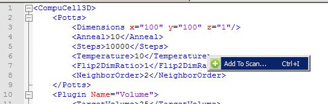
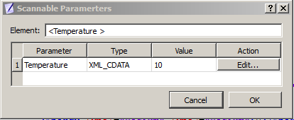
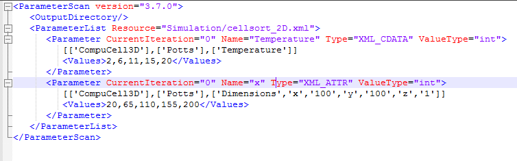

Parameter Scans
===============

When building biomedical simulations it is a common practice to explore
parameter space to search for optimal solution or to study the
robustness of parameter set at hand. In the past researchers have used
(or abused) Python to run multiple replicas of the same simulation with
different parameter set for each run. Because this approach usually
involved writing some kind of Python wrapper on top of existing CC3D
code, more often than not it led to hard-to-understand codes which were
difficult to share and were hard to access by non-programmers.

Current version of CC3D attempts to solve these issues by offering users
ability to create and run parameter scans directly from CC3D GUI’s or
from command line. The way in which parameter scan simulation is run is
exactly the same as for “regular”, single-run simulation.

To describe parameter scan users use Twedit++ to generate an XML file
which describes the parameter scan. This XML file is referenced from
.cc3d file (see example below) and this is how CC3D figures out that it
has to scan parameter space:

.. code-block:: xml

    <Simulation version="3.5.1">
       <XMLScript Type="XMLScript">Simulation/CellSorting.xml</XMLScript>
       <PythonScript Type="PythonScript">Simulation/CellSorting.py</PythonScript>
       <Resource Type="Python">Simulation/CellSortingSteppables.py</Resource>
       <ParameterScan Type="ParameterScan">Simulation/ParameterScanSpecs.xml</ParameterScan>
    </Simulation>

As compared to "regular" ``.cc3d`` file the one we show above has extra line
with ParameterScan XML element.

Clearly if we comment this line we can run the simulation in a
single-run mode. This is great advantage of introducing additional XML
file for parameter scans – the simulation code (CC3DML, Python scripts)
is unmodified and can be run as-is in case modelers decide to turn off
scanning of the parameter space.

Setting up Parameter Scan Using Twedit++
----------------------------------------

To setup up parameter scan we open any valid .cc3d project file in
Twedit++:

|image22|

We right-click on the project and select ``Add Parameter Scan`` option:

|image23|

Notice that ``Parameter Scan`` appears as a part of the ``.cc3d`` project. To
add a parameter from the CC3DML to the parameter scan we right-click on
the CC3DML file and select ``Open Scan Editor``:

|image24|

Notice that Twedit++ opens up a new tab called ``Parameter Scan Tmp File``.
This is read-only file that you use to select parameters for scanning
purposes. To do that, you click in the desired place of this file. For
example if you want to to run simulation with different ``Temperature``
parameters you click in the line with ``Temperature`` parameter and then
righ-click to get access to ``Add To Scan…`` option:

|image25|

After you choose this option Twedit++ displays parameter scan
configuration dialog:

|image26|

This dialog displays all parameters in the given XML element which can
change. In our case of a simple XML element we have only oneway to
change the element and it is through its value (10). When we click edit
we get to next dialog

|image27|

Where we fill minimum, maximum value, select value type (we picked
integer but we could have picked float as well) and generate values
(given by the ``Number Of Steps``) according to given distribution (here we
picked linear which means we generate 5 equally spaced values between 2
and 20 inclusive). When we open parameter scan XML file we see that our
choices made in the GUI got translated into XML format:

|image28|

To add more parameters we position the cursor in the desired location in
the ``Parameter Scan Tmp File`` tab, right click to select ``Add To Scan…``
option and follow steps outlined above. When we select more complicated
element e.g. ``<Dimensions>`` we will get the following parameter
configuration dialog:

|image29|

Notice that for this element there are 3 values which can change when we
pick , say ``y``, and generate values in the next pop-up widget we will end
up with the following parameter scan XML file:

|image30|

As you can tell this XML file gets updated automatically so users do not
need to type XML file.

Adding Python parameters to parameter scan is even easier. We open up
Python file using Open Scan Editor option:

|image31|

Later we go to the ``Parameter Scan Tmp File`` tab which now has Python code
open in the read-only mode and right click on any global variable to add
it to the parameter scan. We have only one global variable defined in
our demo script (``MYVAR``) so in the entire script only one line which
defines ``MYVAR`` can be used to ope up Parameter scan dialog:

|image32|

As a result ``Generate Parameter Values`` dialog will pop up and we use it
in exactly the same way we used it for the XML parameters:

|image33|

After this step our parameter scan XML file looks as follows:

|image34|

Finally we can also edit the output directory of the parameter scan
results by manually editing the parameter scan XML. Here we set it to

``<OutputDirectory>InfoPrinter\_ParameterScan</OutputDirectory>``

|image35|

Running Parameter Scans
-----------------------

As you can see defining parameters scans is quite easy. Running
simulation is easy as well and you have two options. The most
straightforward (but probably not the best – keep reading to find the
recommended way of running) is to open up the project in the Player and
run it:

|image36|

Notice that the title bar of the player informs you that you are running
parameter scan . It also displays number of the parameter simulation
that is currently being executed. (``Iteration: 2``). The results of the
parameter scans are written to the ``Simulation Output`` directory :

|image37|

In my case it is ``c:/Users/m/CC3DWorkspace``, the default setting for
simulation output directory is is ``<your home directory>/CC3DWorkspace``.

When we look into this directory we will see that it contains
subdirectories corresponding to the consecutive simulation runs – each
such simulation corresponds to a different set of parameters:

|image38|

Since at the moment CC3D is performing exhaustive parameter scan you have
to be careful with the number of parameters you scan and number of
values each parameter can assume. Simply put the total number of
simulation to run when doing exhaustive parameter scan is equal to a
producs of number of values of each parameter. Scanning 10 parameters
with 10 values each will require 10 billion simulations. This is a large
number and it will take quite a lot of time before all results are
ready.

**Important:** When parameter scan runs it modifies ``ParameterScan.xml``
file. In particular it record current iteration for each parameter. To
rerun parameter scan again from the beginning you need to set
CurrentIteration values for each parameter to 0. You can do it manually
or use Twedit++ option Reset Parameter Scan:

|image39|

In a nutshell this is all it takes to run parameter scan in CC3D 3.7.1.
We will add more options to this feature but at least now you can probe
your parameter scans without writing clumsy-looking Python wrappers.

The recommended way of running parameter scan is via script called
paramScan.sh . paramScan.sh takes same command line arguments as
``compucell3d.sh`` or ``runScript.sh`` (notice on windows we use ``.bat`` extension
and on OSX ``.command``). Here is the syntax:

.. code-block:: shell

    paramScan.sh –i <cc3d project file> --guiScan –maxNumberOfRuns=20 [remaining command line options used in ``compucell3d.sh`` or ``runScript.sh``]

``--guiScan`` – will ensure that ``paramScan.sh`` will be run using Player. If
you do not use this option the parameter scan will internally use
``runScrip.sh``, hence no gui, which is often preferred way of running
multiple jobs on clusters. With ``-–guiScan`` enabled ``paramScan.sh`` calls
``compucell3d.sh`` internally so you can pass any options you would normally
use with ``compucell3d.sh``. When ``–-guiScan`` is disabled ``paramScan.sh`` calls
``runScript.sh`` so you any options you would normally use with
``runScript.sh``.

``--maxNumberOfRuns`` - using this option you can stop parameter scan after
given number of simulations. By default the parameter scan will run
until all the simulation have been finished. This option is most helpful
during debugging stage

``[remaining command line options used in compucell3d.sh or runScript.sh]``
– here you simply pass additional options you would use with - see
explanation of the ``-–guiScan`` switch for explanation

Example commands:
-----------------

.. code-block:: shell

    paramScan.sh –i vascular.cc3d --noOutput

.. code-block:: shell

    paramScan.sh –i vascular.cc3d --guiScan

The benefit of using ``paramScan.sh`` is that it is fault tolerant. LEt's say,
your simulation crashes in the middle because e.g. somewhere in the
Python script you divide by 0. ``paramScan.sh`` will handle this situation
and start new subsequent simulation. If you used Player or runScript.sh
directly to run parameter scan the parameter scan would simply stop in
that situation. When you do large runs on clusters you might want to
keep running scan even if some of the simulations run into trouble. This
is why using paramScan.sh is preferred way of running parameter scans,
starting with 3.7.3 version.

You may also find example command to run parameter scan in Twedit++:
``CC3D Python->Parameter Scan Command Line``.

Parameter Scan Configuration Details
------------------------------------

Let us now discuss how we describe parameter scan for parameters defined
in the CC3DML file. In our example we will be scanning parameters
defined in the Potts section:

.. code-block:: xml

    <CompuCell3D version="3.6.2">
       <Potts>
          <Dimensions x="100" y="100" z="1"/>
          <Steps>10</Steps>
          <Temperature>10.0</Temperature>
          <NeighborOrder>2</NeighborOrder>
       </Potts>

Let us look into XML file describing parameter scan itself (note that
you do not need to type this code manually – Twedit++ will generate it
for you with just few clicks):

.. code-block:: xml

    <ParameterScan version="3.7.0">
       <OutputDirectory>CellSorting_ParameterScan</OutputDirectory>
       <ParameterList Resource="Simulation/CellSorting.xml">
          <Parameter CurrentIteration="0" Name="y" Type="XML_ATTR" ValueType="float">
             [['CompuCell3D','version','3.6.2'],['Potts'],['Dimensions','x','100','y','100','z','1']]
             <Values>65.0,110.0,120.0</Values>
          </Parameter>
          <Parameter CurrentIteration="0" Name="Steps" Type="XML_CDATA" ValueType="int">
             [['CompuCell3D','version','3.6.2'],['Potts'],['Steps']]
             <Values>1,2,3,4,5,6</Values>
          </Parameter>
       </ParameterList>
       <ParameterList Resource="Simulation/CellSortingSteppables.py">
          <Parameter CurrentIteration="0" Name="MYVAR" Type="PYTHON_GLOBAL" ValueType="int">
             <Values>0,1,2</Values>
          </Parameter>
          <Parameter CurrentIteration="0" Name="MYVAR1" Type="PYTHON_GLOBAL" ValueType="string">
             <Values>"abc1,abc2","abc"</Values>
          </Parameter>
       </ParameterList>
    </ParameterScan>

``<OutputDirectory>CellSorting_ParameterScan</OutputDirectory>`` is the
first child of the root XML element (``<ParameterScan version="3.7.0">``).
It specifies the name of the directory where CC3D will store the results
of the scan. As it is always the convention in CC3D this directory name
is relative to the simulation output path (default setting
``<your_home_directory>/CC3DWorkspace``).

The next two elements are "container elements" (``<ParameterList>``) where
we store description for each parameter we want to scan. We have
separate container element for each file in the .cc3d simulation. Here,
we scan parameters defined in two files ``Simulation/CellSorting.xml`` and
``Simulation/CellSortingSteppables.py``. Consequently we have two container
XML elements:

.. code-block:: xml

    <ParameterList Resource="Simulation/CellSorting.xml">

and
.. code-block:: xml

    <ParameterList Resource="Simulation/CellSortingSteppables.py">

Each sub-element of ``<ParameterList>`` is an element how one particular
parameter will be scanned. Let us concentrate first on the XML
parameters.

.. code-block:: xml

      <Parameter CurrentIteration="1" Name="y" Type="XML_ATTR" ValueType="float">
         [['CompuCell3D','version','3.6.2'],['Potts'],['Dimensions','x','100','y','100','z','1']]
         <Values>65.0,110.0,120.0</Values>
      </Parameter>

Each ``<Parameter>`` element has ``CurrentIteration`` attribute which determines
an index of the current value of the parameters. In this example this
index has value 1, hence it points to second element of the list
``<Values>``. In this case the value of the parameter will be ``110.0`` . The
name of the parameter in the XML file which will assume value of ``110.0``
is ``y`` as indicated by ``Name="y"`` attribute. The parameter ``y`` is an attribute
of the

.. code-block:: xml

    ``<Dimensions x="100" y="100" z="1"/>``

element of the CC3DML file as shown above.For this reason, in the
parameter scan XML file we set the type of this parameter to be
``XML_ATTR`` (``Type="XML_ATTR"``) and we also set its value-type to be float
(``ValueType="float"``). While dimensions are integer numbers we purposely
set it to float to demonstrate that it is up to the modeler to assign
correct value type in the ``<Parameter>`` element. In this case no harm will
be done as the float will be converted to integer during parsing but in
general one has to be aware that specifying incorrect value type may
result in malfunctioning simulation.

The value of the ``<Parameter>`` element:

.. code-block:: xml

    [['CompuCell3D','version','3.6.2'],['Potts'],['Dimensions','x','100','y','100','z','1']]

Determines XML access path that allows CC3D to locate correct parameter
y in the CC3DML file. For details on how to construct access path please
check Steering section of this manual. The only change as compare to
steering is that we include ``['CompuCell3D','version','3.6.2']`` as a
root element and the entire access path is contains in list bracket
Python operators:

.. code-block:: xml

    [[RootSpec],[Child1Spec],[Child1\_1 spec],…]

As compared to XML parameter scan specification, specifying Python
parameter scan is much simpler. This is because In Python we only allow
global parameters to be scanned. Consequently each of the <Parameter>
elements will have structure similar to the one below:

.. code-block:: xml

    <Parameter CurrentIteration="0" Name="MYVAR" Type="PYTHON_GLOBAL" ValueType="int">
        <Values>0,1,2</Values>
    </Parameter>

Here the parameter that we will scan has name ``MYVAR``, is of value-type
integer (``int``) and its type is ``PYTHON_GLOBAL``.

For completeness we include Python code snippet which lists ``MYVAR``:

.. code-block:: python

    from PySteppables import *
    import CompuCell
    import sys

    MYVAR = 10
    MYVAR1 = 'new str'

    class CellSortingSteppable(SteppableBasePy):
        def __init__(self, _simulator, _frequency=1):
            SteppableBasePy.__init__(self, _simulator, _frequency)

        def step(self, mcs):
            global MYVAR
            print 'MYVAR=', MYVAR
            for cell in self.cellList:
                if cell.type == self.DARK:
                    cell.lambdaVecX = -0.5

.. |image22| image:: images/image33.png
   :width: 2.81250in
   :height: 3.03125in

.. |image29| image:: images/image40.png
   :width: 4.27083in
   :height: 2.03125in

.. |image32| image:: images/image43.png
   :width: 3.72917in
   :height: 1.43750in
.. |image33| image:: images/image44.png
   :width: 2.83333in
   :height: 2.46875in

