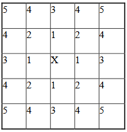

Potts Algorithm: How It Works
=================================

Learning Objectives:
   - Understand how the Potts algorithm determines cell shape by controlling their pixels

*****************************************************

The first section of the .xml file defines the global parameters of the
lattice and the simulation. 
Your file may look much simpler than this.

.. code-block:: xml

        <Potts>
            <Dimensions x="101" y="101" z="1"/>
            <Anneal>0</Anneal>
            <Steps>1000</Steps>
            <FluctuationAmplitude>5</FluctuationAmplitude>
            <Flip2DimRatio>1</Flip2DimRatio>
            <Boundary_y>Periodic</Boundary_y>
            <Boundary_x>Periodic</Boundary_x>
            <NeighborOrder>2</NeighborOrder>
            <DebugOutputFrequency>20</DebugOutputFrequency>
            <RandomSeed>167473</RandomSeed>
            <EnergyFunctionCalculator Type="Statistics">
                <OutputFileName Frequency="10">statData.txt</OutputFileName>
                <OutputCoreFileNameSpinFlips Frequency="1" GatherResults="" OutputAccepted="" OutputRejected="" OutputTotal=""/>
            </EnergyFunctionCalculator>
        </Potts>

This section appears at the beginning of the configuration file. 
The line reading ``<Dimensions x="101" y="101" z="1"/>`` declares the dimensions of the
lattice to be 101 by 101 by 1 pixels. 
Since z is small, this lattice is two-dimensional. 
Lattice sites are 0-indexed, which means that we count them from 0 to 100 when
accessing them in Python. 

.. _anneal:

``<Steps>1000</Steps>`` tells CompuCell how
long the simulation lasts in Monte Carlos Steps (MCS). After executing this number of steps, CompuCell can simulate with zero temperature for an additional
period. In our case, it will run for ``<Anneal>10</Anneal>`` extra steps.

.. _fluctuation-amplitude:

Fluctuation Amplitude (Temperature)
-------------------------------------------------------------------

The ``FluctuationAmplitude``/``Temperature`` parameter determines the intrinsic fluctuation or
motility of each cell membrane.
Try setting a high ``Temperature`` value in XML. 
You should see much more activity from pixel changes.
Conversely, a low ``Temperature`` will 

.. note::

   ``FluctuationAmplitude`` is a ``Temperature``
   parameter in classical GGH Model formulation. We have decided to use
   ``FluctuationAmplitude`` term instead of temperature because using the word
   ``Temperature`` to describe the intrinsic motility of cell membranes was quite
   confusing.

In the above example, fluctuation amplitude applies to all cells in the
simulation. To define fluctuation amplitude separately for each cell
type, we use the following syntax. 
Each value must be non-negative.

.. code-block:: xml

    <FluctuationAmplitude>
        <FluctuationAmplitudeParameters CellType="Condensing" FluctuationAmplitude="10"/>
        <FluctuationAmplitudeParameters CellType="NonCondensing" FluctuationAmplitude="5"/>
    </FluctuationAmplitude>

When CompuCell3D encounters the expanded definition of ``FluctuationAmplitude``,
it will use it in place of a global definition like this one:

.. code-block:: xml

    <FluctuationAmplitude>5</FluctuationAmplitude>

Alternatively, you can use Python to set the fluctuation
amplitude individually for each cell:

.. code-block:: python

    for cell in self.cellList:
        if cell.type==1:
            cell.fluctAmpl=20

When determining which value of fluctuation amplitude to use, CompuCell
prioritizes Python definitions. Otherwise, if ``fluctAmpl`` was not set by Python, it will try to use the CC3DML for fluctuation amplitude by cell types. 
Lastly, it will resort to a globally defined fluctuation amplitude
(``Temperature``). Thus, it is perfectly fine to use a combination of these techniques.

In the Glazier-Graner-Hogeweg (GGH) Model, the fluctuation amplitude is determined by taking into
account the fluctuation amplitude of a *"source"* (expanding) cell and a
*"destination"* cell (the one that will be overwritten). 

Currently, CompuCell3D supports functions used to calculate resultant fluctuation amplitude (those functions take as argument fluctuation amplitude of "source" and "destination" cells and return fluctuation amplitude that is used in
calculation of pixel-copy acceptance). The 3 functions are ``Min``, ``Max``, and
``ArithmeticAverage`` and we can set them using the following option of the
Potts section:

.. code-block:: xml

    <Potts>
         <FluctuationAmplitudeFunctionName>Min</FluctuationAmplitudeFunctionName>
         …
    </Potts>

By default, we use the ``Min`` function. Notice that if you use the global
fluctuation amplitude definition ``Temperature``, it does not really matter
which function you use. The differences arise when *"source"* and
*"destination"* cells have different fluctuation amplitudes.

The above concepts are best illustrated by the following example:

.. code-block:: xml

 <Potts>
   <Dimensions x="100" y="100" z="1"/>
   <Steps>10000</Steps>
   <FluctuationAmplitude>5</FluctuationAmplitude>
   <FluctuationAmplitudeFunctionName>ArithmeticAverage</FluctuationAmplitudeFunctionName>
   <NeighborOrder>2</NeighborOrder>
 </Potts>

Where in the CC3DML section we define global fluctuation amplitude and
we also use ``ArithmeticAverage`` function to determine resultant
fluctuation amplitude for the pixel copy.

Try this Python script to see how fluctuation amplitude affects
the membranes of cells. 
This code assigns a different ``fluctAmpl`` value depending on
which of 4 quadrants each cell is located in. 

.. code-block:: python

    class FluctuationAmplitude(SteppableBasePy):
        def __init__(self, _simulator, _frequency=1):
            SteppableBasePy.__init__(self, _simulator, _frequency)

            self.quarters = [[0, 0, 50, 50], [0, 50, 50, 100], [50, 50, 100, 100], [50, 0, 100, 50]]

            self.steppableCallCounter = 0

        def step(self, mcs):

            quarterIndex = self.steppableCallCounter % 4
            quarter = self.quarters[quarterIndex]

            for cell in self.cellList:

                if cell.xCOM >= quarter[0] and cell.yCOM >= quarter[1] and cell.xCOM < quarter[2] and cell.yCOM < quarter[3]:
                    cell.fluctAmpl = 50
                else:
                    # this means CompuCell3D will use globally defined FluctuationAmplitude
                    cell.fluctAmpl = -1

            self.steppableCallCounter += 1

Remember, negative values of ``fluctuationAmplitude`` are ignored.
Here, ``cell.fluctAmpl = -1`` is a hint to CC3D to use fluctuation amplitude defined in the
CC3DML.

Let us revisit our original example of the ``Potts`` section CC3DML:

.. code-block:: xml

        <Potts>
            <Dimensions x="101" y="101" z="1"/>
            <Anneal>0</Anneal>
            <Steps>1000</Steps>
            <FluctuationAmplitude>5</FluctuationAmplitude>
            <Flip2DimRatio>1</Flip2DimRatio>
            <Boundary_y>Periodic</Boundary_y>
            <Boundary_x>Periodic</Boundary_x>
            <NeighborOrder>2</NeighborOrder>
            <DebugOutputFrequency>20</DebugOutputFrequency>
            <RandomSeed>167473</RandomSeed>
            <EnergyFunctionCalculator Type="Statistics">
                <OutputFileName Frequency="10">statData.txt</OutputFileName>
                <OutputCoreFileNameSpinFlips Frequency="1" GatherResults="" OutputAccepted="" OutputRejected="" OutputTotal=""/>
            </EnergyFunctionCalculator>
        </Potts>

Based on our discussion about the difference between pixel-flip attempts and
MCS (see "Introduction to CompuCell3D"), we can specify how many pixel
copies should be attempted in every MCS. We specify this number
indirectly by specifying the ``Flip2DimRatio`` by using

.. code-block:: xml

    <Flip2DimRatio>1</Flip2DimRatio>

which tells CompuCell that it should
make ``1 times number of lattice sites`` attempts per MCS – in our case one MCS
is 101x101x1 pixel-copy attempts. To set ``2.5 x 101 x 101 x 1`` pixel-copy
attempts per MCS you would write:

.. code-block:: xml

    <Flip2DimRatio>2.5</Flip2DimRatio>

.. _neighbor-order:

The line beginning with ``<NeighborOrder>2</NeighborOrder>`` specifies the neighbor order.
Neighbor order controls how many nearby pixels the Potts algorithm will check
each time it needs to do a pixel copy attempt. 
Think of the neighbors as a circular area around each pixel. 
If you set a higher neighbor order, you may have smoother cells but less performance.

In the previous example, the pixel neighbors are ranked according to their distance from a reference pixel (*i.e.* the one
you are measuring a distance from). Thus, we can group the 1\ :sup:`st`,  2\ :sup:`nd`, and 3\ :sup:`rd` nearest neighbors for every pixel in the lattice. Using 1\ :sup:`st` nearest neighbor
interactions may cause unwanted artifacts due to lattice anisotropy. The longer the interaction range,
(*i.e.* 2\ :sup:`nd`, 3\ :sup:`rd` or higher ``NeighborOrder``), the more isotropic the
simulation and the slower it runs. In addition, if the interaction range
is comparable to the cell size, you may generate unexpected effects,
since non-adjacent cells will contact each other.

On a hex lattice, those problems seem to be less severe and there
1\ :sup:`st` or 2\ :sup:`nd` nearest neighbor usually are sufficient.

    Ranking of pixel neighbors on square 2D lattice

The Potts section also contains tags called ``<Boundary_y>`` and
``<Boundary_x>``. These tags impose boundary conditions on the lattice. In
this case, the ``x`` and ``y`` axes are **periodic**.

For example:

.. code-block:: xml

    <Boundary_x>Periodic</Boundary_x>

.. _periodic-boundary:

**Periodic Boundary Conditions**: cause the edges of the simulation area to "wrap around." For example, a pixel at (``x=0 , y=1, z=1``)
will neighbor the pixel at (``x=100, y=1, z=1``). We recommend using periodic boundaries when you want to simulate a large area of tissue while keeping your lattice small. 

.. _no-flux-boundary:

**'no-flux' Boundary Conditions**: is the opposite of periodic, so the lattice remains a finite area. This is the default. 

Boundary conditions are independent in each XYZ direction, so you can specify any combination of them you like.

--------------------------------------------------

**DebugOutputFrequency**: is used to tell CompuCell3D how often it should
output text information about the status of the simulation. This tag is
optional.

**RandomSeed**: is used to initialize the random number generator. 
You do not need this tag unless you want every simulation to behave exactly
the same, which is not recommended. See `Stochasticity and RandomSeed <random_seed.html>`_ for more details.

**EnergyFunctionCalculator**: allows you to output statistical data, such as the changes in energy from the simulation, to text files for further analysis. See `How to Output Energy Changes <energy_function_calculator.html>`_ for more details. 

--------------------------------------------------

One option of the Potts section that we have not used here is the
ability to customize acceptance function for Metropolis algorithm:

.. code-block:: xml

    <Offset>-0.1</Offset>
    <KBoltzman>1.2</KBoltzman>

This ensures that pixel copy attempts that increase the energy of the
system are accepted with probability

.. math::
   :nowrap:

   \begin{eqnarray}
        P = e^{(-\Delta E - \delta)/kT}
   \end{eqnarray}

where :math:`δ` and :math:`k` are specified by ``Offset`` and ``KBoltzman`` tags, respectively.
By default, :math:`δ=0` and :math:`k=1`. (That is, Offset is 0 and KBoltzman is 1). 

As an alternative to the exponential acceptance function, you may use a
simplified version, which is essentially 1 order of expansion of the
exponential:

.. math::
   :nowrap:

   \begin{eqnarray}
        P = 1 - \frac{E-\delta}{kT}
   \end{eqnarray}

To be able to use this function, all you need to do is to add the
following line in the Potts section:

.. code-block:: xml

    <AcceptanceFunctionName>FirstOrderExpansion</AcceptanceFunctionName>
