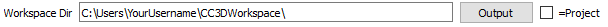
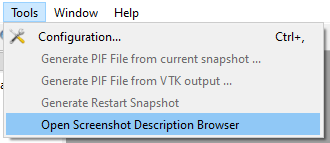
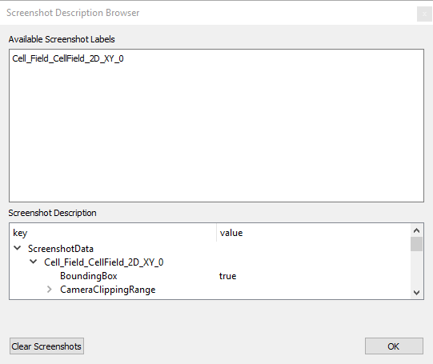

How to Automatically Take Screenshots
-----------------------------------------

.. image:: https://img.youtube.com/vi/0ABZP6Vey1I/maxresdefault.jpg
    :alt: IMAGE ALT TEXT HERE
    :target: https://youtu.be/0ABZP6Vey1I

Notice how one option allows you to edit how often to save screen shots:

.. image:: images/screenshot_save_frequency.png

And another customizes how often to save visualizations, such as line charts:

.. image:: images/screenshot_visualization_frequency.png

Finally, you can specify where to save the images. 
Checking the box for '**=Project**' makes the screenshots save inside your CC3D project folder.

After performing these steps, Player will be set to record screen shots each time you run your simulation.

Optional: Editing the Camera Position 
^^^^^^^^^^^^^^^^^^^^^^^^^^^^^^^^^^^^^^^^

Once you have completed the above tutorial, you can open the settings panel like this:

In this panel, you can edit the settings by double-clicking on the values. 

This data is also saved to ``C:/<screenshot directory you chose>/screenshot_data/screenshots.json``, 
but you should not need to edit this file manually.

Troubleshooting
^^^^^^^^^^^^^^^^^^^^^^^^^^^^^^^^^^^^^

1. Ensure that your simulation is paused before editing the Configuration. (Click Step |Step|  to start it.)
2. Create the directory you want to save to if it does already not exist.
3. If the screen shots do not appear, you should ensure that your computer has full write permissions for the chosen directory.

