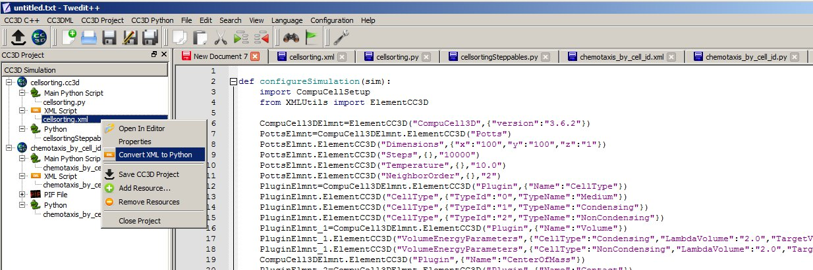

Replacing CC3DML with equivalent Python syntax
==============================================

Some modelers prefer using Python only and skipping XML entirely. CC3D
has special Python syntax that allows users to replace CC3DML with
Python code. Manual conversion is possible but as you can predict quite
tedious. Fortunately Twedit++ has nice shortcuts that converts existing
CC3DML (and for that matter any XML) into equivalent Python syntax that
can be easily incorporated into CC3D code. In Twedit++ all you have to
is is to right click XML file in the project panel and you will see
option Convert XML To Python. When you choose this option Twedit++ will
gegerate Python syntax which can replace your XML:

|image16|

Figure 17 Generating Python code that replaces XML in Twedit++.

If we look at the XML code:

.. code-block:: xml

    <CompuCell3D version="3.6.2">

       <Potts>
          <Dimensions x="100" y="100" z="1"/>
          <Steps>10000</Steps>
          <Temperature>10.0</Temperature>
          <NeighborOrder>2</NeighborOrder>
       </Potts>

       <Plugin Name="CellType">
          <CellType TypeId="0" TypeName="Medium"/>
          <CellType TypeId="1" TypeName="Condensing"/>
          <CellType TypeId="2" TypeName="NonCondensing"/>
       </Plugin>

       <Plugin Name="Volume">
          <VolumeEnergyParameters CellType="Condensing"
          LambdaVolume="2.0" TargetVolume="25"/>
          <VolumeEnergyParameters CellType="NonCondensing"
          LambdaVolume="2.0" TargetVolume="25"/>
       </Plugin>

And then at equivalent Python code:

.. code-block:: python

    def configureSimulation():

        from cc3d.core.XMLUtils import ElementCC3D

        CompuCell3DElmnt = ElementCC3D("CompuCell3D", {"version": "4.0.0"})
        PottsElmnt = CompuCell3DElmnt.ElementCC3D("Potts")
        PottsElmnt.ElementCC3D("Dimensions", {"x": "100", "y": "100", "z": "1"})
        PottsElmnt.ElementCC3D("Steps", {}, "10000")
        PottsElmnt.ElementCC3D("Temperature", {}, "10.0")
        PottsElmnt.ElementCC3D("NeighborOrder", {}, "2")
        PluginElmnt = CompuCell3DElmnt.ElementCC3D("Plugin", {"Name": "CellType"})
        PluginElmnt.ElementCC3D("CellType", {"TypeId": "0", "TypeName": "Medium"})
        PluginElmnt.ElementCC3D("CellType", {"TypeId": "1", "TypeName": "Condensing"})
        PluginElmnt.ElementCC3D("CellType", {"TypeId": "2", "TypeName": "NonCondensing"})
        PluginElmnt_1 = CompuCell3DElmnt.ElementCC3D("Plugin", {"Name": "Volume"})
        PluginElmnt_1.ElementCC3D("VolumeEnergyParameters",
                                  {"CellType": "Condensing", "LambdaVolume": "2.0", "TargetVolume": "25"})
        PluginElmnt_1.ElementCC3D("VolumeEnergyParameters",
                                  {"CellType": "NonCondensing", "LambdaVolume": "2.0", "TargetVolume": "25"})

We can see that there is one-to-one correspondence. We begin by creating
top level element CompuCell3D:

.. code-block:: python

    CompuCell3DElmnt = ElementCC3D("CompuCell3D", {"version": "4.0.0"})

We attach a child element (``Potts``) to CompuCell3D element and a return
value of this call is object representing Potts element:

.. code-block:: python
    PottsElmnt = CompuCell3DElmnt.ElementCC3D('Potts')

We looks at the XML and notice that ``Potts`` element has several child
elements – e.g. ``Dimensions``, ``Temperature`` etc… We attach all of these
child elements to ``Potts`` element:

.. code-block:: python

    PottsElmnt.ElementCC3D("Dimensions", {"x": "100", "y": "100", "z": "1"})
    PottsElmnt.ElementCC3D("Temperature", {}, "10.0")

We hope you see the pattern. The general rule is this. To create root
element you use function ``ElementCC3D`` from ``XMLUtils` – see how we created
``CompuCell3D`` element. When you want to attach child element we call
ElementCC3D member function of the parent element e.g.:

.. code-block:: python

    PluginElmnt = CompuCell3DElmnt.ElementCC3D("Plugin", {"Name": "CellType"})

This syntax can bepresented in a more general form:

.. code-block:: python

    childElementObject = parentElementObject.ElementCC3D(Name_Of_Element, {attributes}, Element_Value)

Each call to ``ElementCC3D`` returns ``ElementCC3D`` object. When we call
ElementCC3D to create root element (here ``CompuCell3D``) this call will
return root element object. When we call ``ElementCC3D`` to attach child
element this call returns child element object.

Notice that at the end of the autogenerated Python code replacing XML we
have function the following line:

.. code-block:: python

    CompuCellSetup.setSimulationXMLDescription(CompuCell3DElmnt)

This line is actually very important and it passes root element of the
CC3DML to the CompuCell3D core code for initialization. It is
interesting that by passing just one node (one object representing single
XML element – here ``CompuCell3D``) we are are actually passing entire XML.
As you probably can guess, this is because we are dealing with recursive
data structure.

Notice as well that our code sits inside configureSimulation function,
We need to call this function from Python main script to ensure that XML
replacement code gets processed. See
``Demos/CompuCellPythonTutorial/PythonOnlySimulations`` for examples of a
working code:

.. code-block:: python

   from cc3d import CompuCellSetup

   def configure_simulation():
       from cc3d.core.XMLUtils import ElementCC3D

       cc3d = ElementCC3D("CompuCell3D")
       potts = cc3d.ElementCC3D("Potts")
       potts.ElementCC3D("Dimensions", {"x": 100, "y": 100, "z": 1})

       ...

       CompuCellSetup.setSimulationXMLDescription(cc3d)

   configure_simulation()

   CompuCellSetup.run()

The actual placement of configureSimulation function in the main script
matters. It has to be called right before

.. code-block:: python

    CompuCellSetup.run()

**Finally, one important remark:** Twedit++ has CC3DML helper menu which
pastes ready-to-use CC3DML code for all available modules. This means that
when you work with XML and you want to add cell types, insert syntax for
new modules etc… You can do it with a single click. When you work with
Python syntax replacing XML, all modifications to the autogenerated code
must be made manually.

