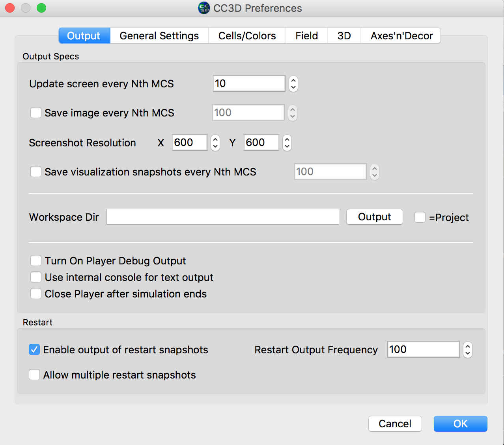

Restarting Simulations
======================

Very often when you run CC3D simulations you would like to save the
state of the simulation and later restart it from the place where you
interrupted it. For example let’s say that you are running vascularized
tumor simulation on a ``500x500x500`` lattice. After the simulated tumor
reaches certain size or mass you may want to simulate various treatment
strategies. Instead of running full simulations from the beginning and
``turning on`` treatment at specific MCS you may run a simulation up to
the point when tumor reaches required mass and then start new set of
simulations. This would save you a lot of computational time. Another
advantage of the ability to restart simulations at arbitrary time point
is when you run your job on a cluster or cloud and there is a risk that
your simulation may get interrupted. In this case you could periodically
save state of the simulation and then restart it from the latest
snapshot. CompuCell3D makes all such tasks very easy. The only thing you need to do is
to click ``Enable output of restart snapshots``

|image_saving_snapshots|

Alternatively if you run simulation using command line script ``runScript`` you need to pass the following argument
to your command line:

.. code-block:: console

   --restart-snapshot-frequency=<restart snapshot output frequency>

CompuCell3D will write simulation snapshots to the restart folder. You can navigate to the output folder and load
such simulation as if it were a regular one

.. warning::

   When you run simulation from restart snapshot ``start`` functions of steppables are not called. Therefore you need to take steps to ensure that any type of initialization that might still be required gets executed in the step function. Let's study example below:

Supose that in  our original simulation we create plots inside start function, clearly the plots are
not created during the restart and since ``step`` function refers to plot window
object the error arises. Take a look at our original code and see if you
can follow what I explained here:

.. code-block:: python

   class SBMLSolverOscilatorDemoSteppable(SteppableBasePy):

       def __init__(self, frequency=10):
           SteppableBasePy.__init__(self, frequency)
           self.pW = None

       def start(self):
           self.pW = self.add_new_plot_window(title='S1 concentration', x_axis_title='MonteCarlo Step (MCS)',
                                              y_axis_title='Variables')
           self.pW.addPlot('S1', _style='Dots', _color='red', _size=5)

           # iterating over all cells in simulation
           for cell in self.cell_list:
               # you can access/manipulate cell properties here
               cell.targetVolume = 25
               cell.lambdaVolume = 2.0
            ...

        def step(self, mcs):
            ...

            self.timestep_sbml()

A simple fix (not necessarily optimal one) would be to introduce a new
function ``initialize_plots`` that first checks if ``self.pW`` plot window
object is None and if so it creates a plot otherwise it exits. Of course
for this to work ``self.pW`` will need to be declared in the steppable
constructor ``__init__`` (constructors of steppables are called during
``restart`` initialization)

Here is the code – changes are highlighted using bold code:

.. code-block:: python

   class SBMLSolverOscilatorDemoSteppable(SteppableBasePy):

       def __init__(self, frequency=10):
           SteppableBasePy.__init__(self, frequency)
           self.pW = None

       def initialize_plots(self):
         if self.pW:
            return

           self.pW = self.add_new_plot_window(title='S1 concentration', x_axis_title='MonteCarlo Step (MCS)',
                                              y_axis_title='Variables')
           self.pW.addPlot('S1', _style='Dots', _color='red', _size=5)

       def start(self):
           self.initialize_plots()

           # iterating over all cells in simulation
           for cell in self.cell_list:
               # you can access/manipulate cell properties here
               cell.targetVolume = 25
               cell.lambdaVolume = 2.0

            ...

        def step(self, mcs):
            ...
            self.initialize_plots()
            self.timestep_sbml()

To wrap up, setting up simulation restart is quite easy in CC3D. Making
sure that simulation restarts properly may require you to slightly
modify your code to account for the fact that start functions of
steppables are not called during restart.

