Restarting Simulations
======================

Very often when you run CC3D simulations you would like to save the
state of the simulation and later restart it from the place where you
interrupted it. For example let’s say that you are running vascularized
tumor simulation on a ``500x500x500`` lattice. After the simulated tumor
reaches certain size or mass you may want to simulate various treatment
strategies. Instead of running full simulations from the beginning and
``turning on`` treatment at specific MCS you may run a simulation up to
the point when tumor reaches required mass and then start new set of
simulations. This would save you a lot of computational time. Another
advantage of the ability to restart simulations at arbitrary time point
is when you run your job on a cluster or cloud and there is a risk that
your simulation may get interrupted. In this case you could periodically
save state of the simulation and then restart it from the latest
snapshot. CompuCell3D makes all such tasks very easy as you will shortly
see. First let’s learn how to set up a simulation that can save itself
and later restart:

Open Twedit++ and open the simulation you’d like to serialize and the
restart. For example let’s choose ``SBMLSolverOscillatorDemo.cc3d``:

|image40|

Here we right-click on project tab (``SBMLSolverOscillatorDemo.cc3d``) and
choose ``Add Serializer…`` . In the pop-up window we change snapshot
``Output Frequency`` to ``100`` , click Allow Serialization and click OK:

|image41|

At this point our simulation is set up to take complete snapshots every
100 MCS.

**Important:** If you want to keep every single snapshot you need to
click ``Allow multiple restart snapshots`` otherwise only the most recent
snapshot will be kept on the hard drive

Before we proceed we need to save the simulation by right clicking on
project tab (``SBMLSolverOscillatorDemo.cc3d``) and choosing Save CC3D
Project:

|image42|

Notice how ``Serializer`` was added at the bottom of our CC3D project. If
you right-click on it you can make changes to serialization
configurations. Just remember to ``Save CC3D Project`` when you are done.

If we run our project in Player it will run as usual except that every
100 MCS it will save complete restart snapshot of itself to the hard
drive. If you wonder where the snapshots will go open op CC3D Player
settings and look at the Output Tab (as you can tell all the output will
go to ``/Users/m/CC3DWorkspace``):

|image43|

Here is the screenshot of the simulation that we ran up to 300 MCS:

|image44|

Let’s take a look at the content of Simulation output directory
(``/Users/m/CC3DWorkspace``):

|image45|

As you can see, CC3D saved time-stamped simulation output directory
``/Users/m/CC3DWorkspace/SBMLSolverOscilatorDemo_cc3d_07_04_2016_13_09_19/``
and inside it you can find ``restart_00300`` folder that contains all the
information needed to restart the simulation at ``t = 300 MCS``. To restart
the simulation we need to do one important step - open in Twedit++ saved
simulation (``SBMLSovlerOscillatorDemo.cc3d``) from restart folder
``/Users/m/CC3DWorkspace/SBMLSolverOscilatorDemo_cc3d_07_04_2016_13_09_19/restart_00300``
, disable serialization and enable restart:

**Important**: At this step we are modifying simulation from the restart
folder NOT the original simulation that we started with and **NOT** the
simulation stored in the top-level output folder
- ``/Users/m/CC3DWorkspace/SBMLSolverOscilatorDemo_cc3d_07_04_2016_13_09_19/``

Here we go:

|image46|

Notice, at the top of the Twedit++ window, that we are working with the
saved snapshot of the simulation stored in the restart\_00300 sub-folder.
We will edit Serializer settings of the .cc3d project stored in this
sub-folder to allow restart and disable serialization. As before after we
make changes we need to remember to save our project:

|image47|

If you are curious what happened here when we change serialization
settings you may open ``.cc3d`` project before and after you make changes
and you will see that with serialization enabled our ``.cc3d`` project looks
as follows:

.. code-block:: xml

    <Simulation version="3.5.1">
       <XMLScript Type="XMLScript">Simulation/SBMLSolverOscilatorDemo.xml</XMLScript>
       <PythonScript Type="PythonScript">Simulation/SBMLSolverOscilatorDemo.py</PythonScript>
       <Resource Type="Python">Simulation/SBMLSolverOscilatorDemoSteppables.py</Resource>
       <Resource Type="SBML">Simulation/oscli.sbml</Resource>
       <SerializeSimulation AllowMultipleRestartDirectories="False" FileFormat="text" OutputFrequency="100"/>
    </Simulation>

but after the change the last line will get replaced to allow restart:

.. code-block:: xml

    <Simulation version="3.5.1">
       <XMLScript Type="XMLScript">Simulation/SBMLSolverOscilatorDemo.xml</XMLScript>
       <PythonScript Type="PythonScript">Simulation/SBMLSolverOscilatorDemo.py</PythonScript>
       <Resource Type="Python">Simulation/SBMLSolverOscilatorDemoSteppables.py</Resource>
       <Resource Type="SBML">Simulation/oscli.sbml</Resource>
       <RestartSimulation RestartDirectory="restart"/>
    </Simulation>

If you do not like clicking you can easily ope up your favorite editor
and modify content of the .cc3d project file to allow saving of restart
snapshots and to allow restarting from the snapshots.

Let’s see what happens if we run our project form the snapshot saved snapshot.
In Player we navigate to ``/Users/m/CC3DWorkspace/SBMLSolverOscilatorDemo_cc3d_07_04_2016_13_09_19/restart_00300``
and open ``SBMLSolverOscillatorDemo.cc3d``:

|image48|

We got an error which is quite easy to explain. During the restart ``start``
functions of steppables are run. Because in our original
simulation we create plots inside start function, clearly the plots are
not created during the restart and since ``step`` function refers to plot window
object the error arises. Take a look at our original code and see if you
can follow what I explained here:

.. code-block:: python

    class SBMLSolverOscilatorDemoSteppable(SteppableBasePy):
        def __init__(self, _simulator, _frequency=10):
            SteppableBasePy.__init__(self, _simulator, _frequency)

        def start(self):
            self.pW = self.addNewPlotWindow(_title='S1 concentration', \
                                            _xAxisTitle='MonteCarlo Step (MCS)', _yAxisTitle='Variables')
            self.pW.addPlot('S1', _style='Dots', _color='red', _size=5)

            # iterating over all cells in simulation
            for cell in self.cellList:
                # you can access/manipulate cell properties here
                cell.targetVolume = 25
                cell.lambdaVolume = 2.0

            ...

        def step(self, mcs):
            ...

            self.pW.showAllPlots()
            self.timestepSBML()

A simple fix (not necessarily optimal one) would be to introduce a new
function ``initialize_plots`` that first checks if ``self.pW`` plot window
object is None and if so it creates a plot otherwise it exits. Of course
for this to work ``self.pW`` will need to be declared in the steppable
constructor ``__init__`` (constructors of steppables are called during
``restart`` initialization)

Here is the code – changes are highlighted using bold code:

.. code-block:: python

    class SBMLSolverOscilatorDemoSteppable(SteppableBasePy):

        def __init__(self,_simulator,_frequency=10):
            SteppableBasePy.__init__(self,_simulator,_frequency)
            self.pW = None

        def initialize_plots(self):
            if self.pW:
                return

            self.pW=self.addNewPlotWindow(_title='S1 concentration',
            _xAxisTitle='MonteCarlo Step (MCS)',_yAxisTitle='Variables')
            self.pW.addPlot('S1',_style='Dots',_color='red',_size=5)

        def start(self):
            self.initialize_plots()

            # iterating over all cells in simulation
            for cell in self.cellList:
                # you can access/manipulate cell properties here
                cell.targetVolume=25
                cell.lambdaVolume=2.0

            ...

        def step(self,mcs):

            self.initialize_plots()

            ...

            self.pW.showAllPlots()
            self.timestepSBML()

To wrap up, setting up simulation restart is quite easy in CC3D. Making
sure that simulation restarts properly may require you to slightly
modify your code to account for the fact that start functions of
steppables are not called during restart.

After we make all those changes in our simulation code and rerun it we
will get the following:

|image49|

Notice that the cell layout is identical to the one we got at ``t = 300`` MCS
and that out plot restarts at ``t = 300 MCS``. If we let simulation run for a
few more MCS you will see that the ``S1`` concentration will start falling
as it would if we had continued our original run:

|image50|

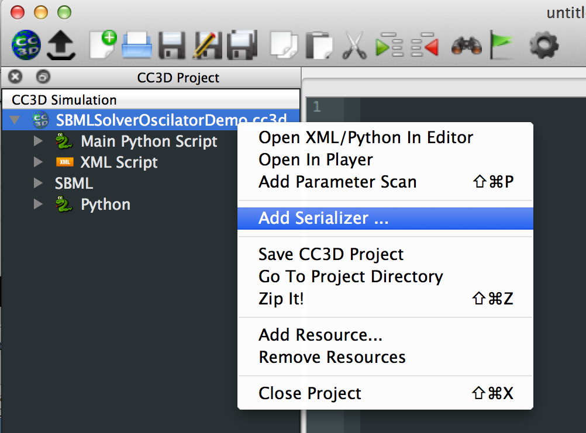
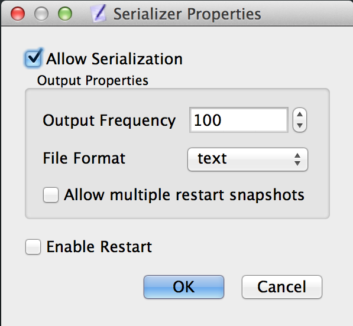
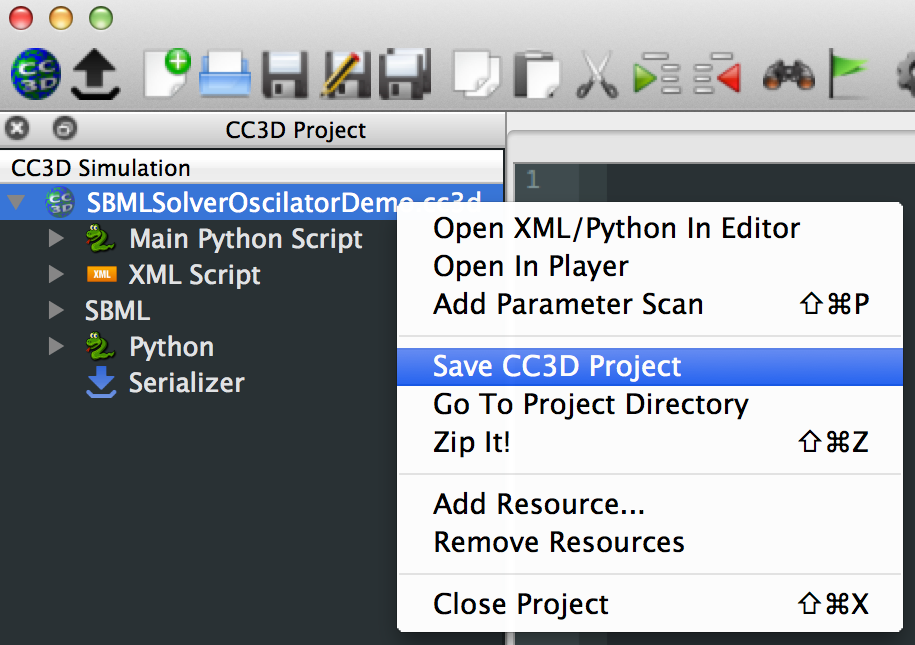
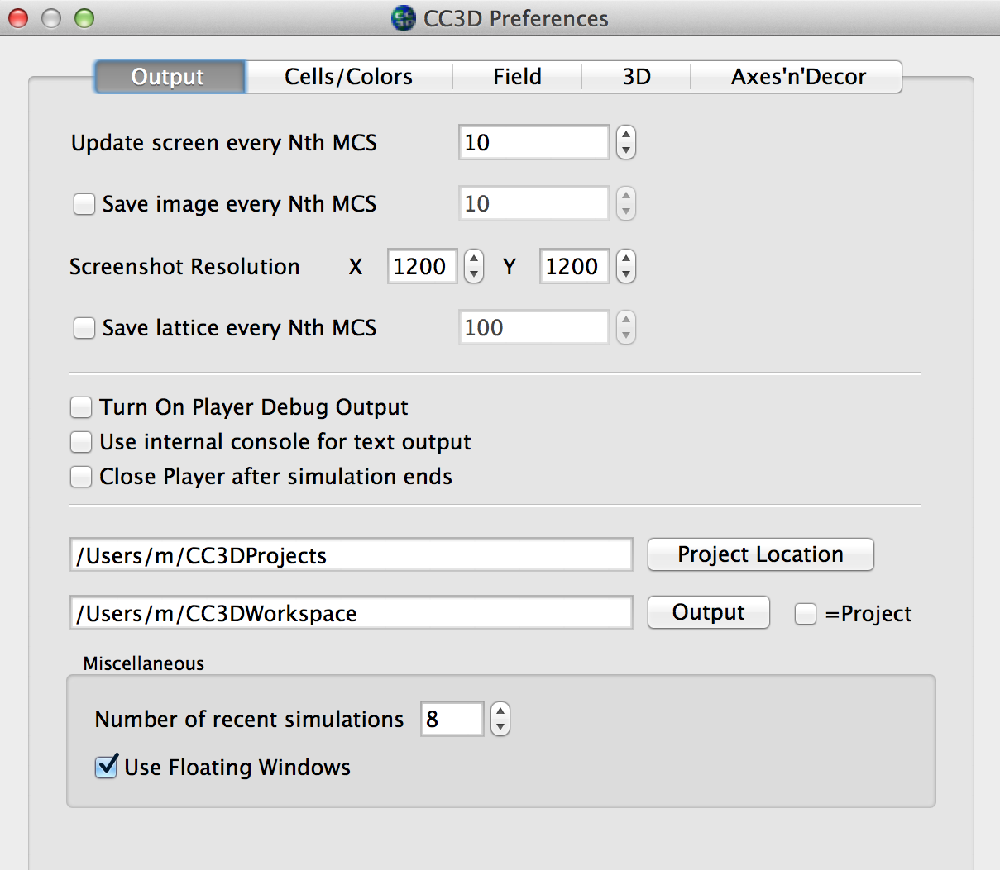
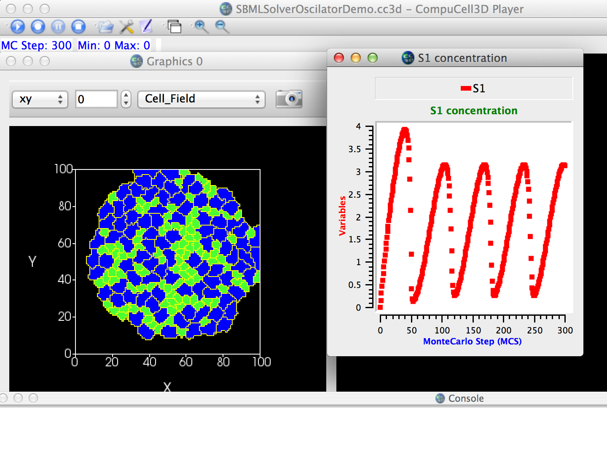
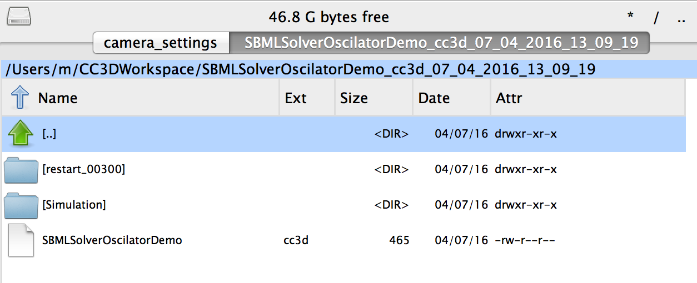
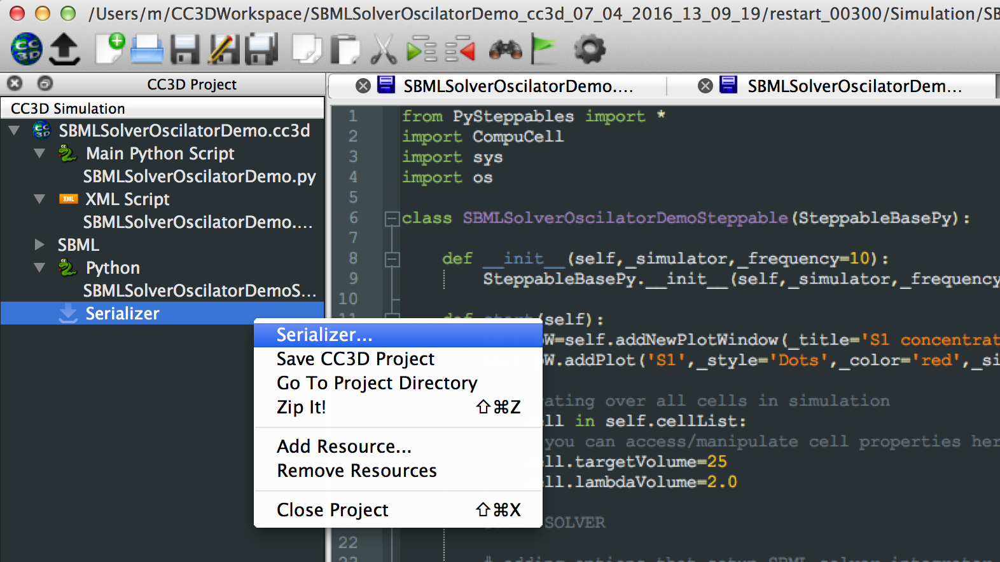
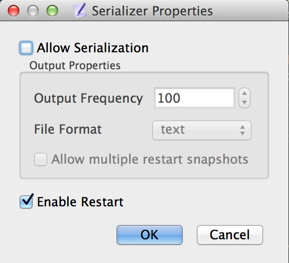
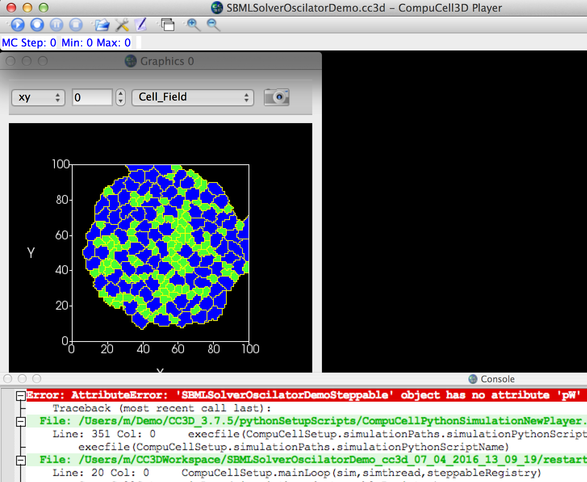
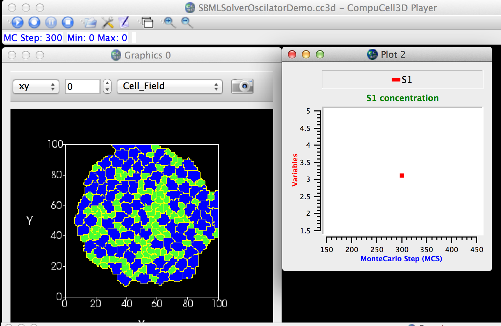
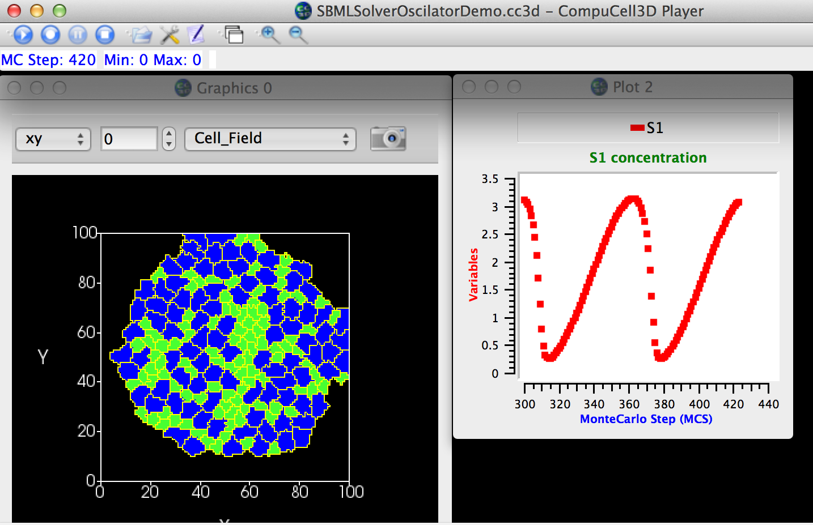
