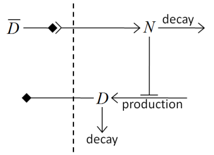

SBML Solver
===========

When you study biology, sooner or later, you encounter pathway diagrams,
gene expression networks, **Physiologicaly Based Pharmacokinetics (PBPK)**
whole body diagrams, *etc...* Often, these can be mathematically represented
in the form of Ordinary Differential Equations (ODEs). There are many
ODE solvers available and you can write your own. However the solution
we like most is called ``SBML Solver``. Before going any further let us
explain briefly what **SBML** itself is. **SBML** stands for **Systems Biology Markup Language**.
It was proposed around year 2000 by a few scientists from
Caltech (Mike Hucka, Herbert Sauro, Andrew Finney). According to
Wikipedia, SBML is a representation format, based on XML, for
communicating and storing computational models of biological processes.
In practice SBML focuses on reaction kinetics models but can also be
used to code these models that can be described in the form of ODEs such
as e.g. PBPK, population models etc…

Being a multi-cell modeling platform CC3D allows users to associate
multiple SBML model solvers with a single cell or create “free floating”
SBML model solvers. The CC3D Python syntax that deals with the SBML
models is referred to as "SBML Solver". Internally SBML Solver relies on
C++ libRoadRunner developed by Herbert Sauro's team. libRoadRunner in turn
is based on the C# code written by Frank Bergmann. CC3D uses
libRoadRunner as the engine to solve systems of ODEs. All SBML Solver
functionality is available via SteppableBasePy member functions.
Twedit++ provides nice shortcuts that help users write valid code while
tapping into SBML Solver functionality. See ``CC3DPython->SBML Solver`` menu
for options available.

Let us look at the example steppable that uses SBML Solver:

.. code-block:: python

   from cc3d.core.PySteppables import *

   class SBMLSolverSteppable(SteppableBasePy):
       def __init__(self, frequency=1):
           SteppableBasePy.__init__(self, frequency)

       def start(self):
           # adding options that setup SBML solver integrator
           # these are optional but useful when encountering integration instabilities

           options = {'relative': 1e-10, 'absolute': 1e-12}
           self.set_sbml_global_options(options)

           model_file = 'Simulation/test_1.xml'

           initial_conditions = {}
           initial_conditions['S1'] = 0.00020
           initial_conditions['S2'] = 0.000002

           self.add_sbml_to_cell_ids(model_file=model_file, model_name='dp',
           cell_ids=list(range(1, 11)), step_size=0.5, initial_conditions=initial_conditions)

           self.add_free_floating_sbml(model_file=model_file, model_name='Medium_dp', step_size=0.5,
                                       initial_conditions=initial_conditions)
           self.add_free_floating_sbml(model_file=model_file, model_name='Medium_dp1', step_size=0.5,
                                       initial_conditions=initial_conditions)

           self.add_free_floating_sbml(model_file=model_file, model_name='Medium_dp2')
           self.add_free_floating_sbml(model_file=model_file, model_name='Medium_dp3')
           self.add_free_floating_sbml(model_file=model_file, model_name='Medium_dp4')

           cell_20 = self.fetch_cell_by_id(20)

           self.add_sbml_to_cell(model_file=model_file, model_name='dp', cell=cell_20, integrator='gillespie')

       def step(self, mcs):
           self.timestep_sbml()

           cell_20 = self.fetch_cell_by_id(20)
           print('cell_20, dp=', cell_20.sbml.dp.values())

           print('Free Floating Medium_dp2', self.sbml.Medium_dp2.values())
           if mcs == 3:
               Medium_dp2 = self.sbml.Medium_dp2
               Medium_dp2['S1'] = 10
               Medium_dp2['S2'] = 0.5

           if mcs == 5:
               self.delete_sbml_from_cell_ids(model_name='dp', cell_ids=list(range(1, 11)))

           if mcs == 7:
               cell_25 = self.fetch_cell_by_id(25)
               self.copy_sbml_simulators(from_cell=cell_20, to_cell=cell_25)

In the start function we specify the path to the SBML model (here we use
partial path ``Simulation/test_1.xml`` because ``test_1.xml`` is in our CC3D
Simulation project directory) and also create a python dictionary that has
initial conditions for the SBML model. This particular model has two
floating species : ``S1`` and ``S2`` and our dictionary – ``initialConditions`` -
stores the initial concentration of these species to 0.0002 and 0.000002
respectively:

.. code-block:: python

   model_file = 'Simulation/test_1.xml'
   initial_conditions = {}
   initial_conditions['S1'] = 0.00020
   initial_conditions['S2'] = 0.000002

.. note::

   We can initialize each SBML Solver using different initial conditions. When we forget to specify initial conditions the SBML code usually has initial conditions defined and they will be used as starting values.

Before we discuss ``add_sbml_to_cell_ids`` function let us focus on statements
that open the start function:

.. code-block:: python

   options = {'relative': 1e-10, 'absolute': 1e-12}
   self.set_sbml_global_options(options)

We set here SBML integrator options. These statements are optional,
however when your SBML model crashes with e.g. CVODE error, it often
means that your numerical tolerances (relative and absolute) or number
of integration steps in each integration interval (steps) should be
changed. Additionally you may want to enable stiff ODE solver by setting
stiff to ``True``:

.. code-block:: python

   options = {'relative': 1e-10, 'absolute': 1e-12, 'stiff': False}
   self.set_sbml_global_options(options)

After defining the options dictionary we inform CC3D to use these settings.
We do it by using as shown above. A thing to remember that new options
will apply to all SBML model that were added after calling
``set_sbml_global_options``. This means that usually you want to ensure that
SBML integration options setting should be the first thing you do in your
Python steppable file. If you want ot retrieve options simply type:

.. code-block:: python

    options = self.get_sbml_global_options()

Notice that options can be None indicating that options have not been
set (this is fine) and the default SBML integrator options will be
applied.

Let us see how we associate SBML model with several cells using ``add_sbml_to_cell_ids``:

.. code-block:: python

   self.add_sbml_to_cell_ids(model_file=model_file, model_name='dp',
   cell_ids=list(range(1, 11)), step_size=0.5, initial_conditions=initial_conditions)

This function looks relatively simple but it does quite a lot if you
look under the hood. The first argument is the path to the SBML models file. The
second one is the model alias - it is a name you choose for the model. It is an
arbitrary model identifier that you use to access the model. The third argument is a
Python list that contains cell ids to which CC3D will attach an instance
of the SBML Solver.

.. note::
   Each cell will get a separate SBML solver object. SBML Solver objects are associated with cells, while free floating SBML Solvers are independent.

The fourth argument specifies the size of the integration step – here we
use a value of ``0.5`` time unit. The fifth argument passes the optional initial conditions
dictionary.

Each SBML Solver function that associates models with a cell or adds a
free floating model calls libRoadRunner functions that parse SBML and
translate it to very fast LLVM code. Everything happens
automatically and produces optimized solvers which are much faster than
solvers that rely on some kind of interpreters.

The next five function calls to ``self.add_free_floating_sbml`` create instances of
SBML Solvers which are not associated with cells but, as you can see,
have distinct names. Unique naming of free floating models is required because
when we want to refer to such a solver to extract model values we will do so using the model name.
The reason all models attached to cells have same name is that when we
refer to such a model we pass the cell object and a name, which uniquely
identify the model. Notice that the last three calls to
``self.add_free_floating_sbml`` do specify neither step size (we use the default step
size of 1.0 time unit) nor initial conditions (we use whatever defaults are
in the SBML code).

Finally, the last two lines of the start function demonstrates how to add an SBML
Solver object to a single cell and select a non-default SBML Solver integrator:

.. code-block:: python

   cell_20 = self.fetch_cell_by_id(20)
   self.add_sbml_to_cell(model_file=model_file, model_name='dp', cell=cell_20, integrator='gillespie')

Instead of a passing list of cell ids we pass a cell object (``cell_20``). All integrators
supported by libRoadRunner are available using the keyword ``integrator``, which includes
CVODE (default), Gillespie (``integrator='gillespie'``), Euler (``integrator='euler'``),
Runge-Kutta (``integrator='rk4'``) and Gillespie Direct Method (``integrator='rk45'``).
For more information on the details of available integrators, visit the
`libRoadRunner online documentation <https://libroadrunner.readthedocs.io/en/latest/PythonAPIReference/cls_Integrator.html?highlight=integrator#rk4>`_.
The ``integrator`` keyword argument is optional to, and available in, all functions
that create a SBML Solver instance.

We can also associate SBML model with certain cell types using the
following syntax:

.. code-block:: python

   self.add_sbml_to_cell_types(model_file=model_file, model_name='dp', cell_types=[self.NONCONDENSING],
                                    step_size=step_size, initial_conditions=initial_conditions)

This time instead of passing a list of cell ids we pass list of cell
types.

Let us move on to the step function. The first call we see there is
``self.timestep_sbml``. This function carries out integration of all SBML
Solver instances defined in the simulation. The integration step can be
different for different SBML Solver instances (as shown in our example).

To check the values of model species after the integration step we can call
e.g.

.. code-block:: python

   print('Free Floating Medium_dp2', self.sbml.Medium_dp2.values())

These functions check and print model variables for the free floating model
called ``Medium_dp2``.

The next set of function calls:

.. code-block:: python

   if mcs == 3:
      Medium_dp2 = self.sbml.Medium_dp2
      Medium_dp2['S1'] = 10
      Medium_dp2['S2'] = 0.5

set a new state for the free floating model called ``Medium_dp2``. If we
wanted to print the state of the model ``dp`` belonging to the cell object called
``cell_20`` we would use the following syntax:

.. code-block:: python

    print('cell_20, dp=', cell_20.sbml.dp.values())

To assign new values to ``dp`` model variables for ``cell_20`` we use the
following syntax:

.. code-block:: python

    cell_20.sbml.dp['S1'] = 10
    cell_20.sbml.dp['S2'] = 0.5

.. note::

   We access a free-floating SBML Solver via ``self.sbml.MODEL_ALIAS`` syntax whereas SBML Solvers associated with a particular cell are accessed using a reference to the cell objects e.g. ``cell_20.sbml.MODEL_ALIAS``

Another useful operation within SBML Solver capabilities is deletion of
models. This is handy when at a certain point in your simulation you no
longer need to solve ODEs described in the SBML model. This is the
syntax that deletes a named SBML Solver model from specific cell ids:

.. code-block:: python

    self.delete_sbml_from_cell_ids(model_name='dp', cell_ids=list(range(1, 11)))

As you probably suspect, we can delete a named SBML Solver model from cell
types:

.. code-block:: python

    self.delete_sbml_from_cell_types(model_name='dp' ,cell_types=range[self.A,self.B])

from a single cell:

.. code-block:: python

    self.delete_sbml_from_cell(model_name='dp',cell=cell_20)

or delete a free floating SBML Solver object:

.. code-block:: python

    self.delete_free_floating_sbml(model_name='Medium_dp2'))

.. note::
   When cells get deleted all SBML Solver models attached to them are deleted automatically. You do not need to call ``delete_sbml`` functions in such a case.

Sometimes you may encounter a need to clone all SBML models from one
cell to another (e.g. in the mitosis ``updateAttributes`` function where you
clone SBML Solver objects from a parent cell to a child cell). SBML Solver
lets you do that very easily:

.. code-block:: python

   cell_10 = self.fetch_cell_by_id(10)
   cell_25 = self.fetch_cell_by_id(25)
   self.copy_sbml_simulators(from_cell=cell_10, to_cell=cell_25)

What happens here is that source cell (``from_cell``) provides SBML Solver
object templates and based on these templates new SBML Solver objects
are gets created and CC3D assigns them to target cell (``to_cell``). All
the state variables in the target SBML Solver objects are the same as
values in the source objects.

If you want to copy only select models you would use the following
syntax:

.. code-block:: python

   cell_10 = self.fetch_cell_by_id(10)
   cell_25 = self.fetch_cell_by_id(25)
   self.copy_sbml_simulators(from_cell=cell_10, to_cell=cell_25, sbml_names=['dp'])

As you can see there is a third argument - a Python list that specifies
which models to copy by name. Here we are copying only ``dp`` models. All other
models associated with the parent cells will not be copied.

This example demonstrates most important capabilities of SBML Solver.
The next example shows a slightly more complex simulation where we reset
initial condition of the SBML model before each integration step
(``Demos/SBMLSolverExamples/DeltaNotch``).

A full description of the Delta-Notch simulation is in the introduction to
CompuCell3D Manual. The Delta-Notch example demonstrates multi-cellular
implementation of Delta-Notch mutual inhibitory coupling. In this
juxtacrine signaling process, a cell’s level of membrane-bound Delta
depends on its intracellular level of activated Notch, which in turn
depends on the average level of membrane-bound Delta of its neighbors.
In such a situation, the Delta-Notch dynamics of the cells in a tissue
sheet will depend on the rate of cell rearrangement and the fluctuations
it induces. While the example does not explore the richness due to the
coupling of sub-cellular networks with inter-cellular networks and cell
behaviors, it already shows how different such behaviors can be from
those of their non-spatial simplifications. We begin with the ODE Delta-Notch
patterning model of Collier in which juxtacrine signaling controls the
internal levels of the cells’ Delta and Notch proteins. The base model
neglects the complexity of the interaction due to changing spatial relationships
in a real tissue:

.. math::
   :nowrap:

   \begin{eqnarray}
      \frac{dD}{dt}  & = & \left ( \nu \times \frac{1}{1+b N^h} -D \right )  \\
      \frac{dN}{dt} & = & \frac{\bar{D}^k}{a + \bar{D}^k} -N
   \end{eqnarray}

where :math:`D` and :math:`N` are the concentrations of activated Delta and
Notch proteins inside a cell, respecively, :math:`\bar{D}` is the average
concentration of activated Delta protein at the surface of the cell’s neighbors,
and :math:`a` and :math:`b` are saturation constants, and are Hill coefficients,
and :math:`\nu` is a constant that gives the relative lifetimes of Delta and Notch proteins.

|image17|

Figure 18 Diagram of Delta-Notch feedback regulation between and within
cells.

For the sake of simplicity let us assume that we downloaded the SBML model
implementing the Delta-Notch ODEs. How do we use such SBML model in CC3D?
Here is the code:

.. code-block:: python

   from random import uniform
   from cc3d.core.PySteppables import *

   class DeltaNotchClass(SteppableBasePy):
       def __init__(self, frequency=1):
           SteppableBasePy.__init__(self, frequency)

       def start(self):

           # adding options that setup SBML solver integrator
           # these are optional but useful when encounteting integration instabilities
           options = {'relative': 1e-10, 'absolute': 1e-12}
           self.set_sbml_global_options(options)

           model_file = 'Simulation/DN_Collier.sbml'
           self.add_sbml_to_cell_types(model_file=model_file, model_name='DN', cell_types=[self.TYPEA], step_size=0.2)

           for cell in self.cell_list:
               dn_model = cell.sbml.DN

               dn_model['D'] = uniform(0.9, 1.0)
               dn_model['N'] = uniform(0.9, 1.0)

               cell.dict['D'] = dn_model['D']
               cell.dict['N'] = dn_model['N']

       def step(self, mcs):

           for cell in self.cell_list:
               delta_tot = 0.0
               nn = 0
               for neighbor, commonSurfaceArea in self.get_cell_neighbor_data_list(cell):
                   if neighbor:
                       nn += 1

                       delta_tot += neighbor.sbml.DN['D']
               if nn > 0:
                   D_avg = delta_tot / nn

               cell.sbml.DN['Davg'] = D_avg
               cell.dict['D'] = D_avg
               cell.dict['N'] = cell.sbml.DN['N']

           self.timestep_sbml()

In the ``start`` function we add SBML model (``Simulation/DN_Collier.sbml``) to
all cells of type ``A`` (it is the only cell type in this simulation besides
``Medium``). Later in the for loop we initialize ``D`` and ``N`` species from the
SBML model using random values so that each cell has a different SBML model starting
state. We also store the initial SBML model in a cell dictionary for
visualization purposes – see the full code in
``Demos/SBMLSolverExamples/DeltaNotch``. In the ``step`` function for each
cell we visit its neighbors and sum the value of Delta in the neighboring
cells. We divide this value by the number of neighbors (this gives the
average Delta concentration in the neighboring cells - ``D_avg``). We pass
``D_avg`` to the SBML Solver for each cell and then carry out integration for
the next time step. Before calling ``self.timestep_sbml`` we store the
values of Delta and Notch concentrations in the cell dictionary, but we
do it for visualization purposes only. As you can see from this
example SBML Solver programing interface is convenient to use, not to
mention SBML Solver itself is a very powerful tool which allows
coupling cell-level and sub-cellular scales.

