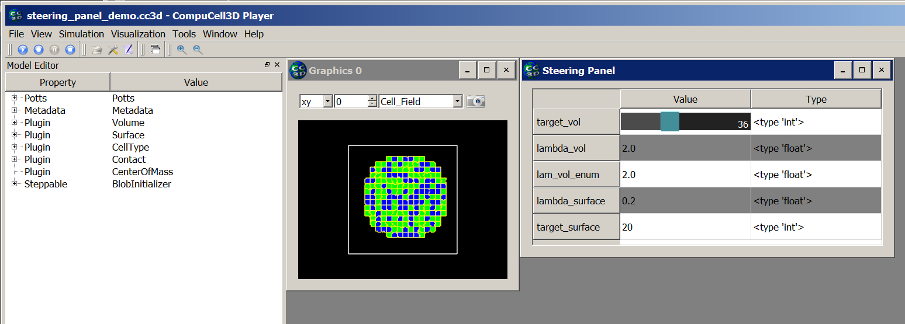
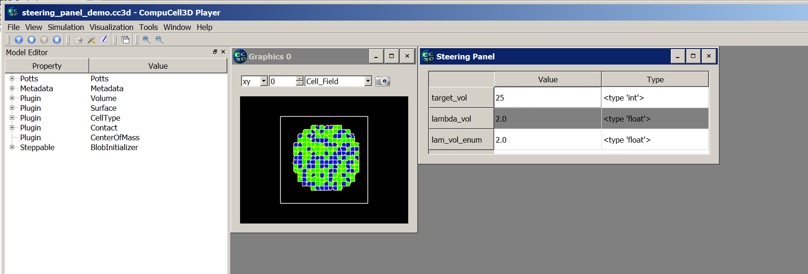
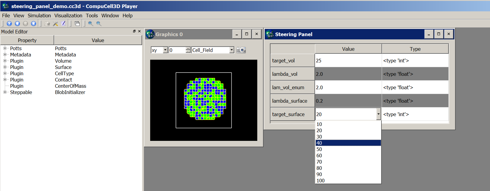
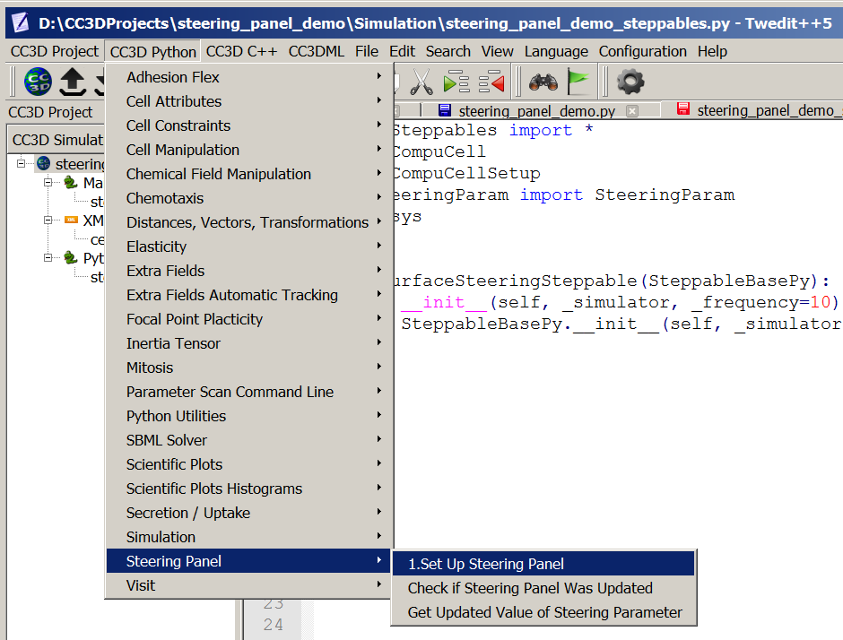

Steering – changing Python parameters using Graphical User Interface.
=================================================

In the previous section we outlined how to programmatically change CC3DML
parameters. In this section we will show you how to create a graphical panel
where you can use sliders and or pull down list to control parameters defined in the
Python scripts. this type of interaction is very desirable because you can try different
values of parameters without writing complicated procedural code that alters the parameters. It also provides you with
a very convenient way to create truly interactive simulations.

In our demo suite we have included examples (e.g. ``Demos/SteeringPanel/steering_panel_demo``) that
demonstrate how to setup such interactive simulations. In this section we will explain all coding that is necessary
to accomplish this task.

When you run open ``Demos/SteeringPanel/steering_panel_demo`` in CC3D and run it
the screen will look as follows:

|sliders_screenshot|

All the code that is necessary to get steering panel for Python parameters working will reside in Python steppable
file.

To specify steering panel we have to define ``add_steering_panel`` function to our steppable (the function has to be
called exactly that):

.. code-block:: python

    class VolumeSteeringSteppable(SteppableBasePy):
        def __init__(self, frequency=10):
            SteppableBasePy.__init__(self, frequency)

        def add_steering_panel(self):
            self.add_steering_param(name='target_vol', val=25, min_val=0, max_val=100, widget_name='slider')
            self.add_steering_param(name='lambda_vol', val=2.0, min_val=0, max_val=10.0, decimal_precision=2, widget_name='slider')
            self.add_steering_param(name='lam_vol_enum', val=2.0, min_val=0, max_val=10.0, decimal_precision=2,widget_name='slider')

The ``add_steering_panel`` function requires several arguments:

- ``name`` - specifies the label of the parameters to be displayed in the gui
- ``val`` - specifies current value of the python parameter
- ``min_val`` and ``max_val`` - specify range of parameters. those are optional and by default CC3D will pick some
  reasonable range given the ``val`` parameter. However, we recommend that you specify the allowable parameters range
- ``widget_name`` -  a string that specifies the widget via which you will be changing the parameter.
  The allowed options are: ``slider`` - it wil create a slider, ``combobox``, ``pulldown``, ``pull-down``
  will pull-down list for discrete values, and no argument will resort to a editable field where you have to
  type the parameter
- ``decimal_precision`` - specifies how many decimal places are to be displayed when changing parameters.
  Default value is ``0``

Once you add such function to the steppable and start the simulation the steering panel will pop-up but it will have
no functionality. Panel will have just 3 entries as show below:

|sliders_screenshot_1|

.. note::

    You can add steering panel from multiple steppables. In such a case CC3D will gather all parameters you defined  in the ``add_steering_panel`` function and display them in a single panel. For example, if our code has two  steppables and we add steering parameters in both of them:

.. code-block:: python

    class VolumeSteeringSteppable(SteppableBasePy):
        def __init__(self, frequency=10):
            SteppableBasePy.__init__(self, frequency)

        def add_steering_panel(self):
            self.add_steering_param(name='target_vol', val=25, min_val=0, max_val=100, widget_name='slider')
            self.add_steering_param(name='lambda_vol', val=2.0, min_val=0, max_val=10.0, decimal_precision=2, widget_name='slider')
            self.add_steering_param(name='lam_vol_enum', val=2.0, min_val=0, max_val=10.0, decimal_precision=2,widget_name='slider')

    class SurfaceSteeringSteppable(SteppableBasePy):
        def __init__(self, frequency=10):
            SteppableBasePy.__init__(self, frequency)

        def add_steering_panel(self):
            #adding slider
            self.add_steering_param(name='lambda_surface', val=0.2, min_val=0, max_val=10.0, decimal_precision=2,
                                    widget_name='slider')

            # adding combobox
            self.add_steering_param(name='target_surface', val=20, enum=[10,20,30,40,50,60,70,80,90,100],
                                    widget_name='combobox')

we will end up with a panel that looks as follows :

|sliders_screenshot_2|

Notice that the last parameter ``target_surface`` uses ``combobox`` and appropriately the widget displayed is
a pull-down-list

Now that we know how to specify steering panel let's learn how to implement interactivity. All we need to do
is to implement another function in the steppable - ``process_steering_panel_data``. Let's look at the example:

.. code-block:: python

    class VolumeSteeringSteppable(SteppableBasePy):
        def __init__(self, frequency=10):
            SteppableBasePy.__init__(self, frequency)

        def add_steering_panel(self):
            self.add_steering_param(name='target_vol', val=25, min_val=0, max_val=100, widget_name='slider')
            self.add_steering_param(name='lambda_vol', val=2.0, min_val=0, max_val=10.0, decimal_precision=2, widget_name='slider')
            self.add_steering_param(name='lam_vol_enum', val=2.0, min_val=0, max_val=10.0, decimal_precision=2,widget_name='slider')

        def process_steering_panel_data(self):
            target_vol = self.get_steering_param('target_vol')
            lambda_vol = self.get_steering_param('lambda_vol')

            for cell in self.cell_list:

                cell.targetVolume = target_vol
                cell.lambdaVolume = lambda_vol

Inside ``process_steering_panel_data`` (the function has to be called exactly that) we read the current value
indicated in the steering panel using convenience function ``get_steering_param`` . In our example we are reading
two parameter values from the panel -``target_val`` and ``lambda_val``. Once we fetched the values from the panel
we iterate over all cells and modify ``targetVolume`` and ``lambdaVolume`` parameters of every cell.

**Important**: ``process_steering_panel_data`` gets called only when the user modified the values in the
steering panel by either moving a slider, changing entry in the pull-down list or changing the parameter value
using text field. This means
that potentially expensive loops that alter parameters are not executed every MCS but only if panel entries have
changed. you can manually check if the panel values have changed by adding to your code steppable's
convenience function ``steering_param_dirty()``. You do not have to do that but just in case you would like to get
flag indicating whether panel has change or not all that's required is simple code like that:

.. code-block:: python

    def process_steering_panel_data(self):
        print('all dirty flag=', self.steering_param_dirty())

As you can see by adding two functions to the steppable - ``add_steering_panel`` and  ``process_steering_panel_data`` you
can create truly interactive simulations where you can have a direct control over simulations. Tool like that
can be especially useful in the exploratory phases of your model building where you want to quickly see what impact a
given parameter has on the overall simulation.

**Important** . You can simplify setting up of interactive steering using Twedit Python helpers menu.
Simply, go to ``CC3D Python -> Steering Panel`` menu and choose ``1. Setup Steering Panel`` option:

|twedit_steering_panel|

