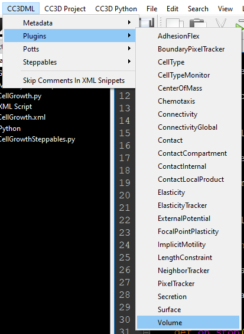

Volume and Cell Growth
============================

Related: `Global Volume and Surface Constraints [Mathematics] <global_volume_and_surface_plugins.html>`_

Relevant Examples:
    * `Example: Contact-Inhibited Cell Growth <example_contact_inhibited_cell_growth.html>`_

Properties
****************************

**cell.targetVolume**: the "goal" volume that a cell tries to shrink or grow to whenever possible

**cell.lambdaVolume**: the strength of the volume constraint; that is, how fast a cell will shrink/grow towards its targetVolume

****************************

**How to Add the Volume Plugin in XML**

* As you create your simulation, check the box for either **VolumeFlex** or **VolumeLocalFlex**.
* Otherwise, add in the XML manually with this button in **Twedit++**:

Your complete ``.xml`` file should look like this. Yours may have extra code, but that's fine. 

.. code-block:: xml

    <CompuCell3D Revision="3" Version="4.4.1">    
        <Metadata>
            <!-- Basic properties simulation -->
            <NumberOfProcessors>1</NumberOfProcessors>
            <DebugOutputFrequency>10</DebugOutputFrequency>
        </Metadata>
        
        <Potts>
            <!-- Basic properties of CPM (GGH) algorithm -->
            <Dimensions x="256" y="256" z="1"/>
            <Steps>100000</Steps>
            <Temperature>10.0</Temperature>
            <NeighborOrder>1</NeighborOrder>
        </Potts>
        
        <Plugin Name="CellType">
            <!-- Listing all cell types in the simulation -->
            <CellType TypeId="0" TypeName="Medium"/>
            <CellType TypeId="1" TypeName="CellA"/>
            <CellType TypeId="2" TypeName="CellB"/>
        </Plugin>
        
        <!-- VOLUME PLUGIN -->
        <Plugin Name="Volume">
            <VolumeEnergyParameters CellType="CellA" LambdaVolume="2.0" TargetVolume="50"/>
            <VolumeEnergyParameters CellType="CellB" LambdaVolume="2.0" TargetVolume="50"/>
        </Plugin>
        
        <Plugin Name="NeighborTracker">
            <!-- Module tracking neighboring cells of each cell -->
        </Plugin>
        
        <Plugin Name="Contact">
            <!-- Specification of adhesion energies goes here -->
        </Plugin>
        
        <Steppable Type="BlobInitializer">            
            <!-- Initial layout of cells in the form of spherical (circular in 2D) blob -->
            <Region>
                

                <Radius>51</Radius>
                <Gap>0</Gap>
                <Width>7</Width>
                <Types>CellA,CellB</Types>
            </Region>
        </Steppable>
    </CompuCell3D>

VolumeFlex vs VolumeLocalFlex
**********************************************

VolumeFlex is designed so that lambda volume and target volume are defined in XML. 
When using VolumeLocalFlex, the lambda volume and target volume must be defined in Python.
(The same is true for SurfaceLocalFlex, lambda surface, and target surface). 

**Example 1:** VolumeFlex

XML

.. code-block:: xml

    <Plugin Name="Volume">
      <VolumeEnergyParameters CellType="Somatic" LambdaVolume="2.0" TargetVolume="50"/>
      <VolumeEnergyParameters CellType="Necrotic" LambdaVolume="2.0" TargetVolume="50"/>
   </Plugin>

   
**Example 2:** (a separate project) VolumeLocalFlex

XML

.. code-block:: xml

   <Plugin Name="Volume"/>
   
Python Steppable

.. code-block:: python

    def start(self):
        for cell in self.cell_list:
            cell.targetVolume = 25
            cell.lambdaVolume = 5.0

What is Lambda?
**********************************************

Think of a simulation in CompuCell3D as a lazy person who wants to *minimize their energy usage* at all times, although they have a certain probability of going out of their way to do something.
A lazy person may have competing interests in mind at the same time.
If their "hunger" is 2 and their "sleepiness" is 100, then they will be much more likely to go to sleep than eat something. 
Likewise, CC3D is more likely to accept a lattice site copy attempt when the result will lower the simulation's total energy. 
Essentially, **lambda is a multiplier used to control a decision about the lattice**.
